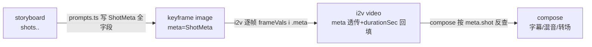
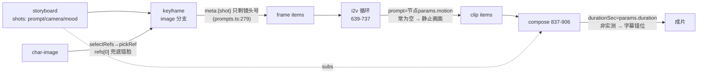
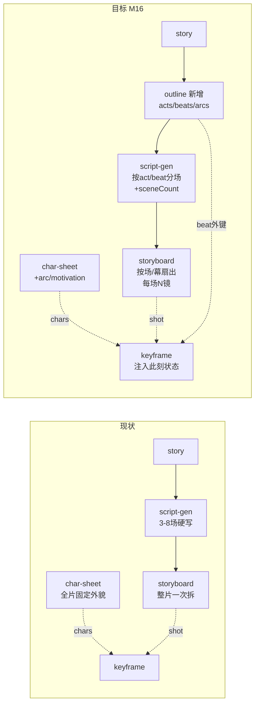

# AI 影视工坊 — 能力补齐设计方案（M14+）

> 无限画布 · 故事到影片 · 把"能跑通的链路"补齐为"出片可用的影片"

| 项 | 内容 |
|---|---|
| 文档版本 | v1.0（能力补齐方案） |
| 日期 | 2026-06-17 |
| 作者 | 资深全栈架构师 |
| 状态 | **规划中** — 承接 `ai-film-studio-design.md`（M0–M13 已落地），规划 **M14–M20** |
| 关系 | 本文是 [ai-film-studio-design.md](./ai-film-studio-design.md) 的**能力补齐续篇**；基础架构、节点通用模型、引擎/供应商抽象、里程碑 M0–M13 详见原文档，本文只写"补什么、怎么补" |
| 目标插件目录 | `mulby-plugins/plugins/ai-film-studio/` |
| 依据 | 一次 45-agent 代码审计 + 业界/学术对标（Toonflow-app 及 30+ 系统），30 条差距已对当前源码逐条核实（0 驳回） |

## 如何使用本文档

1. **按里程碑推进**：开发顺序为 M14 → M20（见 [八、里程碑路线图](#八里程碑路线图与验收m14-起现有文档已到-m13)）。每个里程碑聚焦一组优先级（P0/P1/P2）差距。
2. **以章节正文为契约**：[一、概览](#一概览与目标态)的总表只是索引；精确的类型扩展、端口/参数、伪代码与 pitfalls 一律以对应章节正文为准。
3. **先地基后上层**：[二、统一数据模型升级](#二统一数据模型升级全局基础)是后续所有章节的前置（`meta` 透传 / `charId` / `locationKey` / provider 能力位），务必先行。
4. **完成即回填**：每落地一项，在文末 [实现进度日志（Changelog M14+）](#实现进度日志changelog-m14)勾选并补充实现决策，防止遗忘。
5. **不破坏既有亮点**：i2v 首尾帧补间、真实 ffmpeg 归一合成、硬 JSON 契约+修复重试、character/scene 非 force 复用 assetId —— 这四项是已验证的正确实现，改造时不得回归。

## 目录

- [一、概览与目标态](#一概览与目标态)
- [二、统一数据模型升级（全局基础）](#二统一数据模型升级全局基础)
- [三、P0 闭环正确性（M14）](#三p0-闭环正确性m14)
- [四、复杂剧本与叙事结构（M16/M18）](#四复杂剧本与叙事结构m16)
- [五、一致性与镜头语法（M15/M17）](#五一致性与镜头语法m15m17)
- [六、音频架构（双轨）与剪辑合成（M16/M18/M19）](#六音频架构双轨与剪辑合成m18)
- [七、控制流 / 工程化 / UX](#七控制流--工程化--uxp1-6--p2-12p2-13)
- [八、里程碑路线图与验收](#八里程碑路线图与验收m14-起现有文档已到-m13)
- [九、新增 · 改造节点汇总](#九新增--改造节点汇总)
- [十、风险与兼容](#十风险与兼容)
- [十一、待定决策](#十一待定决策openquestions-汇总)
- [实现进度日志（Changelog M14+）](#实现进度日志changelog-m14)

---

## 一、概览与目标态

> 能力补齐设计方案 · 续篇 · 规划 M14+

| 项 | 内容 |
|---|---|
| 文档定位 | `docs/ai-film-studio-design.md` 的**能力补齐续篇** |
| 承接里程碑 | M0–M13 已落地(见原文档 §16 Changelog) |
| 规划里程碑 | **M14 起**(本文所有改造均落在 M14+) |
| 适用读者 | 已熟悉本插件源码的开发者(后续开发严格照此执行) |
| 核心约束 | 沿现有范式做加法、不重写引擎;与已验证的 P0/P1/P2 路线图一致 |

### 1.1 文档定位与关系

原《详细设计方案》(`ai-film-studio-design.md`)记录了从 M0 脚手架到 M13 OpenAI 兼容视频聚合预设的完整建设过程:主链路(故事→剧本→分镜→图→视频→合成)已打通,自动 N→N 扇出、项目级全局设定、硬 JSON 契约+校验+修复重试、真实 ffmpeg 归一合成、i2v 首尾帧补间、character/scene 非 force 复用 assetId 等亮点均已落地。

**本文不是对原文档的重写,而是其能力补齐续篇**:在 M13 的代码现状之上,针对"复杂工程下系统性失效"的缺口规划 **M14+** 的改造。本文与原文档的关系:

- **承接**:原文档 §5(节点体系)、§6(供应商抽象)、§7(执行引擎)、§16(Changelog 至 M13)是本文的现状基线;本文每项改造都给"现状(源码 file:line)→目标(改造)"对照。
- **不破坏**:上面列出的现有亮点全部保留,补齐改造一律为 additive(新增字段全可选、新增节点不改引擎核心)。
- **延续编号**:里程碑从 **M14** 起编排,与原文档 M0–M13 连续,落地后并入 §16 Changelog。

### 1.2 一句话现状诊断

**简单链路 demo-ready,复杂工程 not-production-ready。** 单角色、3–5 镜的短链路可以一键跑出带画面的草样;但镜头数上规模、多角色、要求成片质量时,出现三类系统性问题,各自有明确的源码级根因:

| 症状 | 一句话根因 | 关键证据(file:line) |
|---|---|---|
| **信息系统性丢失** | 上游算出的控制信号(逐镜 prompt/camera/mood/duration、对白)在节点边界被抹平,i2v 循环只读全局 `promptText` 而非逐帧 `frameVals[i].meta` | `graphStore.ts:697` 循环内 `prompt: promptText \|\| ''`;keyframe 产物 `meta` 仅 `{shot}`(`prompts.ts:279`) |
| **质量随规模反向退化** | 逐镜时长被节点参数 `duration` 抹平、字幕按下标 `clips[i]↔shots[i]` 强耦合配对,镜头一多即错位;一键模板根本没接音轨 | `durationSec = Number(params.duration ?? 5)`(`graphStore.ts:688`,非引擎实测);`buildSrt` 强下标(`subtitles.ts:53-72`);full-pipeline 模板无 tts/audio 连线(`templates.ts:49-73`) |
| **多人物错脸** | 参考图按名字模糊匹配,未命中时静默回退 `refs[0]`——把张三的脸贴到李四身上而不报警 | `pickRef` 末尾 `return refs[0]`(`graphStore.ts:1012`)、`pickRefs` 同样 `refs[0]` 兜底(`:1028`) |

### 1.3 设计总原则

补齐改造必须服从以下五条,任何方案与之冲突即驳回:

1. **沿现有范式做加法,不重写引擎。** 三大现有范式是地基,一切补齐基于它们扩展:
   - **隐式扇出**:`PortValue.items?: PortValue[]`(`graphStore.ts:36-52`)+ `expandItems`(`:967-969`),图像/视频/compose 已逐项处理。新的"循环/批量"一律用 `items[]` 数据扇出表达,**绝不引入循环边/迭代变量**(`topoOrder` 是 Kahn 无环排序,回边语义不可控)。
   - **`PortValue.meta` 透传**:`meta` 是无 schema 的 `Record<string,unknown>`,经 `job.meta → output → refsFromValues` 链路携带跨镜一致性信号。补齐控制信号一律往 `meta` 加键,下游已在读 `meta`。
   - **硬 JSON 契约 + 校验 + 修复重试**:`validateNodeJson` + `buildRepairPrompt`。新增文本节点(如 outline)沿用此契约,新增 case 即可。
2. **稳定 ID 优于字符串名。** 现状一致性全靠 `name` 子串匹配(`pickRef`),同名/多人物即串图。补齐引入 `charId`(角色)、`locationKey`(场景)、`shotId`/`beatId`/`actId`(叙事/镜头)作稳定主键,`name` 降级为兼容回退。`charId` **复用/回退到** `ElementRef.id`,不另起命名空间(否则 GC `gcOrphans` 按 `refAssetIds` 算引用会错乱)。
3. **控制信号端到端不丢失。** 上游一旦算出 prompt/camera/mood/motion/duration/screenDirection/dialogue,就必须经 `meta`/json 携带到真正消费它的节点(i2v/compose/subtitles),缺失才回退全局值。这是 P0/P1 的统一主线。
4. **音频双轨架构。** 视频大模型已分化为两类,音频架构必须同时支持,并让 compose 能识别"视频已自带声音":
   - **原生音频视频模型**(Veo3.1 / Sora2 / Kling3 Omni / Seedance2 / Wan2.5 / Hailuo3):把对白/SFX/ambient 文本喂入视频请求,模型直接出声。
   - **外置链路**:无声生成 + 逐角色 TTS + lipsync + 多轨 ducking 混音。
   - **compose 双路由**:按 clip 的 `hasNativeAudio` 决定跳过对白 TTS(仅选择性叠配乐 + 对原生对白做 ducking)还是走完整外置混音,避免双重对白/重复音乐。

### 1.4 目标态端到端数据流

下图是 M14+ 全部落地后的目标态。**实线 = 现有数据流(保留)**,**虚线 = 本次补齐新增的数据流**,带 ★ 的方框是**新增节点**。

```mermaid
flowchart LR
  story[故事/灵感] --> outline["★ outline 节点<br/>acts·beats·arcs"]
  outline -.actId/beatId.-> script[剧本 script-gen<br/>scenes+actId/beatId]
  story --> script
  script --> sb[分镜 storyboard<br/>shots+camera/screenDir/sfx]
  sb --> kf[关键帧 keyframe]

  charlib["角色库<br/>CharacterIdentity<br/>charId/views/voiceId"] -.charId.-> kf
  scenelib["场景库<br/>locationKey<br/>master plate"] -.locationKey.-> kf

  kf -->|frame items meta| i2v["i2v / t2v<br/>+shot 输入口<br/>+audioMode 三态"]
  sb -.shot json/camera.-> i2v

  i2v -->|clips meta:{shot}<br/>durationSec 实测| tl["★ timeline 节点<br/>EDL clips[]"]
  sb -.shots.-> tl

  script -.dialogues[].-> dlg["★ 对白配音<br/>逐角色 TTS<br/>charId→voiceId"]
  charlib -.voiceId.-> dlg
  sb -.sfx/ambient.-> sfx["★ sfx/Foley 节点"]

  i2v -.silent video.-> lip["★ lipsync 节点<br/>video+audio→video"]
  dlg -.对白音轨.-> lip

  tl -.EDL.-> compose["compose<br/>多音轨 amix+ducking<br/>识别 hasNativeAudio<br/>转场 xfade"]
  i2v --> compose
  dlg -.audio 多轨.-> merge["★ Merge zip/by-key"]
  sfx -.SFX 轨.-> merge
  bgm[配乐 bgm] -.被 duck 轨.-> merge
  merge -.flatMap.-> compose
  lip -.口型片段.-> compose
  sb -->|subs 按 shotId 反查| compose
  compose --> export[导出成片]

  fe["★ ForEach 节点<br/>json[]→items[]"] -.物化扇出.-> kf

  globals[全局设定<br/>+默认音频模式/转场] -.注入.-> script & sb & kf & i2v & dlg
```

新增数据流要点:① **meta 透传**——keyframe `meta` 扩为 `{shot,prompt,camera,mood,motion,duration}`,i2v 逐帧消费;② **charId**——角色库稳定主键贯穿 keyframe/i2v/tts;③ **locationKey**——场景主板继承,同场关键帧只取本场 master plate;④ **EDL**——timeline 显式化"顺序+时长+转场",compose 按 `clip.shotId` 反查字幕;⑤ **多音轨 + 双路由**——对白/SFX/BGM 分轨经 Merge 汇入 compose,按 `hasNativeAudio` 选择跳过或完整混音。

### 1.5 能力补齐总表

下表是全部补齐项的总索引(维度 × 现状 × 目标 × 里程碑 × 工作量),与已验证的 P0/P1/P2 路线图一一对应。工作量:S(≤0.5d)/M(0.5–2d)/L(>2d)。各项详细的"现状→目标"代码对照见后续章节。

**P0 — 闭环正确性(M14)**

| 维度 | 现状(源码) | 目标(改造) | 里程碑 | 工作量 |
|---|---|---|---|---|
| keyframe→i2v meta 断链 | keyframe `meta:{shot}`(`prompts.ts:279`);i2v 循环只用全局 `promptText`(`graphStore.ts:697`) | keyframe `meta` 扩为 `{shot,prompt,camera,mood,motion,duration}`;i2v 逐帧取 `frameVals[i].meta`,缺失才回退全局 | M14 | M |
| 一键成片无音轨 | full-pipeline 模板无 tts/audio 连线(`templates.ts:49-73`) | 模板加 `tts → compose.audio`;audio 为空时显式提示 | M14 | S |
| 逐镜时长抹平+字幕错位 | `durationSec=params.duration`(`graphStore.ts:688`,非实测) | keyframe meta 带 `duration`→i2v 逐帧写 `durationSec`;落盘后 ffprobe 回填实测时长 | M14 | M |
| 角色 refs[0] 静默错脸 | `pickRef`/`pickRefs` 末尾 `return refs[0]`(`graphStore.ts:1012/1028`) | 收紧双向 `includes`,删 `refs[0]` 兜底,未匹配上报 warning(保留 soleName 合法兜底) | M14 | S |

**P1 — 复杂工程可用性(M15–M16)**

| 维度 | 现状(源码) | 目标(改造) | 里程碑 | 工作量 |
|---|---|---|---|---|
| i2v 默认空动作 prompt | 同 P0-1(`graphStore.ts:697`) | 随 P0-1 一并修复,逐帧注入 motion/camera | M15 | — |
| shot↔clip 关联键 | clip 无 shot 标识;字幕强下标(`subtitles.ts:53-72`) | i2v video item 写 `meta:{shot}`;`buildSrt` 按 `shot.id` 键匹配;merge 按 `meta.shot` 稳定排序 | M15 | M |
| 逐角色对白 TTS | tts 单文本输入,无角色音色 | character 加 `voiceId`;tts 加 `dialogues(json)` 输入口,按 `scenes[].dialogues[]` 扇出,`meta:{character,sceneIndex,shotIndex,lineIndex}` | M15 | L |
| compose 单音轨→多轨 | 单 `audioPath`+`apad`(`ffmpeg.ts:98-152`,`graphStore.ts:846`) | `inputs['audio']` flatMap 展开;ffmpeg `amix` + 对 BGM `sidechaincompress`(对白侧链 ducking)+ volume/afade | M15 | L |
| 角色身份资产 | `ElementRef` 仅 `refAssetIds[0]`(`assetStore.ts:29-40`,`graphStore.ts:1557-1578`) | `ElementRef` 加 `charId/views{front,side,back}/voiceId/variants`;`insertElementNode` 绑全部参考图+charId;keyframe/i2v/tts 按 charId 解析,name 仅回退 | M16 | L |
| 锁定 + 缓存 | 无 locked/inputHash 复用,非资产节点每次 runAll 必重跑 | `FilmNodeData` 加 `locked`(runOrder 跳过+保留 outputs)+UI 锁按钮;execNode 开头比对 `inputHash`(上游+params+提示词层+globals)命中跳过 | M16 | L |

**P2 — 质量/体验进阶(M17+)**

| 维度 | 现状(源码) | 目标(改造) | 里程碑 | 工作量 |
|---|---|---|---|---|
| outline 节点 | 无叙事结构层 | 新增 outline(text):`{acts,beats,arcs}`;script-gen 按 act/beat 分组,scene 加 actId/beatId;Save-the-Cat/Story-Circle 模板 | M17 | L |
| script-gen 目标长度 | 模板写死"3-8 场"(`promptTemplates.ts:58`) | 加 `targetLength/sceneCount`,改占位符 `{sceneHint}` | M17 | S |
| shot.location 死字段 | 仅 inspectorViews 展示;scene 图全收(`selectRefs ~1034`) | keyframe job 带 `sceneName=shot.location`;scene-image `meta.name=`规范化 location;`selectRefs` 加 sceneName 参数,场景图只取本场主板 | M17 | M |
| master plate/同场光线锁定 | scene-image 不去重、无主板 | scene-image 加 per-location 去重产主板;keyframe 模板"inherit lighting/palette";storyboard 去光线词由参考图继承 | M17 | M |
| 运镜/景别死数据 | camera/shotSize 算出即丢 | `prompts.ts` 中→英映射(远景→extreme wide、推→dolly in);keyframe 模板加 `{shotGrammar}`;i2v/t2v 加 `shot(json)` 输入口,camera 映射进 motion | M17 | M |
| 轴线/screen direction | 零建模 | storyboard 契约加 `screenDirection/reverseOf`+180°规则;同场相邻镜头翻转软告警 | M18 | M |
| 角色弧线 | character 外貌全片固定串 | character 加 `arc[{stage,state,emotion}]/motivation`;keyframe 按当前 shot 对应 beat 注入"此刻角色状态" | M18 | M |
| 原生音频/双轨 | `MediaCapability='video'\|'music'\|'tts'`(`providers/types.ts:10`);`VideoGenRequest` 无 audio(`:47-53`) | 加 `nativeAudio`/`lipsync` 能力位 + `audioControl` 描述符;i2v/t2v 加 `audioMode` 三态(native/external/silent);clip 标 `hasNativeAudio`;compose 双路由 | M18 | L |
| 口型同步 | 无 | 新增 lipsync 节点(video+audio→video),adapter 同构于 async-poll;接 Sync.so/Wav2Lip/Runway Act-Two | M19 | L |
| SFX/Foley | 无 | storyboard 加 `sfx/ambient`;新增 sfx 节点产音效轨 | M19 | M |
| 转场/match-cut | concat a=0 无转场(`ffmpeg.ts:98-152`) | `ComposeOptions` 加 `transitions[]`;`xfade` 级联替代 concat;同步修正字幕时间轴 | M19 | L |
| 时间线/EDL | 无显式时间线 | 新增 timeline 节点 `clips[]+{inSec,outSec,transition,lane}` | M19 | L |
| ForEach/Merge 控制流 | merge 仅 concat;无 ForEach | ForEach(json[]→items[]);Merge 加 zip/by-key 模式;子图用分组折叠(纯视图,不进 topoOrder) | M19 | M |
| 大图 UX | viewport 声明却从不读写(dead field) | 持久化 viewport;分组/泳道/copy-paste | M20 | M |

> 总表是索引,不是契约细节。每项的精确类型扩展、端口/参数定义、伪代码与 pitfalls 见后续对应章节;落地时严格以章节正文为准。

---

## 二、统一数据模型升级(全局基础)

> 本章是 M14 起所有能力补齐的**地基**:先把"贯穿全流程的字段约定"钉死,后续 P0/P1/P2 各章只需在此契约上"填值/取值"。核心理念——**算出即落字段,落字段即透传,透传即被消费**,杜绝现状中 `shot.location`/`camera`/`shotSize` 这类"算出即丢"的死数据。
>
> 设计原则(与现有代码风格一致):
> - **全 additive**:新字段一律可选,旧工程零迁移即可继续跑(`PortValue.meta` 已是 `Record<string,unknown>`、`FilmNodeData` 已有 `[key:string]:unknown` 索引签名)。
> - **assetId 持久、data: url 不持久**:新增的图像/音频引用一律存 `assetId`,不存 base64/`data:` url(会被 `stripValue` 砍掉)。
> - **关联用稳定外键(id),兼容用名字回退**:`charId`/`sceneId`/`shotId`/`beatId` 为主键匹配,`name` 子串匹配仅作回退,逐步从"名字模糊"升级到"id 精确"。

### 2.0 本章改动总览

| # | 子项 | 改动面 | 工作量 | 里程碑 | 服务于路线图 |
|---|---|---|---|---|---|
| 2.1 | `PortValue.meta` 透传契约(`ShotMeta`) | graphStore / prompts | M | **M14** | P0-1/P0-3/P1-2/P2-5 |
| 2.2 | `FilmNodeData` 加 `locked`/`cache`(inputHash) | graphStore / executor | M | **M14** | P1-6 |
| 2.3 | shot schema 扩展 + scene 加 `actId/beatId` | prompts / promptTemplates / validateNodeJson | M | **M14** | P2-1/P2-3/P2-5/P2-6/P2-9/P2-10 |
| 2.4 | character 节点参数 + `ElementRef`→`CharacterIdentity` | nodeDefs / assetStore / graphStore | L | **M15** | P1-3/P1-5/P2-7 |
| 2.5 | provider 能力位 + `VideoGenRequest` 音频字段 | providers/types / providers/index | M | **M15** | 双轨音频(原生 vs 外置) |

> 说明:2.1–2.3 是**纯数据契约**(M14,无供应商耦合,风险最低、必须先行);2.4–2.5 牵涉资产库迁移与供应商矩阵(M15)。各业务章节(P0-1 断链修复、P1-3 逐角色 TTS、双轨音频等)的"取值/填值"代码都引用本章定义的类型。

---

### 2.1 `PortValue` / 扇出子项的 `meta` 透传契约

#### 现状(源码)

`meta` 是无 schema 的 `Record<string,unknown>`(`graphStore.ts:50-51`),全靠各处随手写键、下游 `refsFromValues` 靠字符串猜:

```ts
// graphStore.ts:36-52 — meta 无固定结构
export interface PortValue {
  type: PortType
  // ...
  durationSec?: number       // 字幕↔片段配对的唯一时长来源
  items?: PortValue[]        // 扇出子项即 PortValue 本身(无独立 ItemValue 类型)
  meta?: Record<string, unknown>  // 现状:随手写,无约定
}
```

各生成点写入的 meta **极度贫瘠**,导致跨节点信息断链:
- keyframe(image)只写 `meta:{ shot }`(`prompts.ts:279`),`prompt/camera/mood/motion/duration/characters` 全丢;
- i2v(video)产物**完全不写 meta**(`graphStore.ts:721` 的 `items.push({ type:'video', url, mime, durationSec, localPath })`),且 `durationSec` 取自节点参数 `Number(params.duration??5)`(`graphStore.ts:688`),非引擎实测——这是字幕时间轴偏差(P0-3)与 shot↔clip 失联(P1-2)的根因;
- i2v 请求 `req` 里 `prompt` 来自节点全局 `promptText`,不逐帧取(P0-1 断链)。

> **缺口**:任务要求摘抄的 `ItemValue` 在源码中**不存在**——扇出子项复用 `PortValue` 本身,单值经 `expandItems(v)`(`graphStore.ts:967-969`)退化为 `[v]`。本契约对"单值 PortValue"与"items[] 子项"**一视同仁**:两者的 `meta` 都遵循下方 `ShotMeta`。

#### 目标(改造)

新增**类型化的 `ShotMeta`**(放 `graphStore.ts`,作为 `meta` 的约定子集;`meta` 仍是 `Record<string,unknown>` 以保持兼容):

```ts
// graphStore.ts 新增 — 镜头级元信息透传契约(keyframe→i2v→compose 全程携带)
export interface ShotMeta {
  // —— 关联键(核心,跨节点对齐) ——
  shot?: string            // 镜头 id(= storyboard shot.id),compose 字幕/EDL 按此反查 ★现状仅此一个
  sceneId?: string         // 所属场景/地点键(对齐 2.3 shot.sceneId / scene-continuity locationKey)
  charIds?: string[]       // 出场角色稳定 id(对齐 2.4 charId),精确匹配优先
  characters?: string[]    // 出场角色名(兼容回退,对齐现状 selectRefs 按 name 匹配)
  // —— 生成语义(供 i2v 逐帧复用 + compose/timeline 取数) ——
  prompt?: string          // 该镜画面提示(P0-1:i2v 逐帧取此,缺失才回退全局)
  camera?: string          // 运镜枚举键(对齐 2.3 CameraMove,i2v 映射进 motion)
  shotSize?: string        // 景别枚举键(对齐 2.3 ShotSize)
  mood?: string            // 氛围
  motion?: string          // 动作/运动描述(i2v 动作 prompt 来源,P0-1/P1-1)
  duration?: number        // 该镜目标时长秒(P0-3:keyframe 带 →i2v 写 durationSec →落盘 ffprobe 回填)
  // —— 音频(双轨,对齐 2.5 + P2-9) ——
  dialogues?: { character?: string; charId?: string; line: string; emotion?: string }[]
  sfx?: string[]
  ambient?: string
  hasNativeAudio?: boolean  // 该 clip 是否已自带声(compose 据此跳过/选择性混音,见 2.5)
}
```

`PortValue` 不改结构,仅在注释上把 `meta` 收敛到 `ShotMeta`:

```ts
export interface PortValue {
  // ...
  meta?: ShotMeta & Record<string, unknown>  // 约定遵循 ShotMeta,余项仍宽松
}
```

#### 全程透传链(现状 vs 目标)



关键改造点(各业务章引用):

```ts
// prompts.ts:265-281 keyframe — 现状只写 {shot},目标写全 ShotMeta(P0-1/P0-3/P2-5)
return list.map((shot, i) => ({
  prompt: withStyle(fillTemplate(getPrompt('image.keyframe'), { desc, chars, shotGrammar })),
  size, refName, refNames,
  meta: {                                    // ← 由 ImageJob.meta 原样透传到 PortValue.meta
    shot: String(shot.id ?? `镜头${i+1}`),
    sceneId: shot.sceneId, prompt: desc,
    camera: shot.camera, shotSize: shot.shotSize, mood: shot.mood,
    motion: shot.motion ?? shot.action, duration: Number(shot.duration ?? 5),
    characters: refNames, charIds: shot.charIds,
    dialogues: shot.dialogues, sfx: shot.sfx, ambient: shot.ambient,
  } satisfies ShotMeta,
}))

// graphStore.ts:691-721 i2v 循环 — 逐帧取 frameVals[i].meta(P0-1),durationSec 实测回填(P0-3)
const fm = (frameVals[i]?.meta ?? {}) as ShotMeta
const { url } = await runVideo({ cfg: provider, apiKey, req: {
  prompt: fm.prompt || fm.motion || promptText || '',   // ★缺失才回退全局
  imageUrl: frameUrls[i], lastImageUrl: tailUrls[i] || tailUrls[0],
  duration: fm.duration ?? Number(params.duration ?? 5),
}})
let durationSec = fm.duration ?? Number(params.duration ?? 5)
if (localPath) durationSec = (await probeDurationSec(localPath)) ?? durationSec  // ffprobe 回填实测
items.push({ type: 'video', url, mime: 'video/mp4', durationSec,
  localPath, meta: { ...fm } })                          // ★i2v 透传 meta(现状完全不写)
```

> `probeDurationSec` 为新增 ffmpeg 工具(详见 P0-3 章),本章只约定"i2v 产物必须写 `durationSec` 实测值 + 透传 `meta`"。

---

### 2.2 `FilmNodeData` 加锁定 + inputHash 缓存键

#### 现状(源码)

`FilmNodeData`(`graphStore.ts:54-65`)无锁定、无缓存:`runAll`/`runFrom` 经 `runOrder`(`graphStore.ts:1169-1201`)对每个 eligible 节点都调 `execNode(n.id)`(**非 force**),除 character/scene 复用 assetId 外,其余节点(text/image/video/tts/compose)**每次必重跑**——改一个上游就全图重渲,贵且慢。

#### 目标(改造)

`FilmNodeData` additive 加两字段(索引签名已合法,`serializeNodes` 原样持久化):

```ts
// graphStore.ts:54-65 → 新增 locked / cache
export interface FilmNodeData {
  kind: string; title: string; params: Record<string, unknown>
  status: NodeRunStatus; stream?: string; previewUrl?: string
  outputs?: Record<string, PortValue>; error?: string
  // —— 新增 ——
  locked?: boolean                          // 锁定:runAll/runFrom 跳过且保留 outputs(满意镜头不被覆盖)
  cache?: { inputHash: string; at: number } // 上次成功运行的输入指纹
  [key: string]: unknown
}
```

新增**纯函数 `computeInputHash`**(放 `services/executor.ts`,与 `gatherInputs`/`topoOrder` 同源,不调 AI):

```ts
// executor.ts 新增 — 决定一个节点是否需要重跑
export function computeInputHash(node: FilmNode, nodes: FilmNode[], edges: Edge[], globals: ProjectGlobals): string {
  return stableHash({                       // stableHash:对 key 排序的稳定序列化(JSON.stringify 顺序敏感)
    kind: node.data.kind,
    params: node.data.params,
    globals: { style: globals.style, aspectRatio: globals.aspectRatio }, // ★注入所有生成节点,必入
    promptVersion: getPromptVersionFor(node.data.kind),                  // 提示词模板覆盖变更也应失效
    upstream: fingerprintInputs(gatherInputs(node, nodes, edges)),
  })
}
// 上游指纹:只取稳定标识,绝不哈希 base64/data: url(hydrate 后会变,会令缓存每次启动即失效)
function fingerprintInputs(inputs: Record<string, PortValue[]>): unknown {
  const pick = (v: PortValue): unknown => ({
    type: v.type,
    id: v.assetId ?? v.localPath ?? (v.url && !v.url.startsWith('data:') ? v.url : undefined),
    text: v.type === 'text' ? v.text : undefined,
    json: v.type === 'json' ? v.json : undefined,
    meta: v.meta, items: v.items?.map(pick),
  })
  return Object.fromEntries(Object.entries(inputs).map(([k, arr]) => [k, arr.map(pick)]))
}
```

`runOrder` 在 `execNode` 之前插入失效/复用判定:

```ts
// graphStore.ts:1169-1201 runOrder — execNode(n.id) 之前
if (n.data.locked === true) continue                              // 1) 锁定:跳过,保留 outputs
const hash = computeInputHash(n, nodes, edges, globals)
if (n.data.cache?.inputHash === hash && n.data.outputs) {         // 2) 命中:跳过(保留 status='done')
  continue
}
await execNode(n.id)                                              // 3) 否则运行
if (get().nodes.find(x => x.id === n.id)?.data.status === 'done') // 成功后写缓存
  patchNode(n.id, { cache: { inputHash: hash, at: Date.now() } })
```

> 规则补充(避坑):① `locked` 节点虽跳过执行,其 `outputs` 仍要参与下游 `hasData` 判断,否则下游被误判"上游未产出"而 skipped。② 单节点 `runNode` 与 character/scene `force:true` **忽略缓存**(沿用现 `execNode opts.force` 语义)。③ video/tts 等带随机性节点即便 hash 命中也允许用户手动 `runNode` 重跑,不强锁。④ UI 加锁按钮(P1-6)。

---

### 2.3 shot schema 扩展 + scene 加 `actId/beatId`

#### 现状(源码)

storyboard 模板已产出 `shotSize`(远/全/中/近/特)、`camera`(推/拉/摇/移/固定)的**中文字符串**,但 `prompts.ts:265-279` 只读 `shot.prompt/description/characters/id`,其余字段**算出即丢**(任务确认 `camera/shotSize` 死数据、`location` 全代码仅 inspectorViews 展示)。script-gen scenes[] 无叙事结构归属。`validateNodeJson`(`prompts.ts:51`)仅认 `scenes/shots/characters` 非空数组。

#### 目标(改造)

**shot schema(全 additive,旧字段 `id/description/prompt/characters/duration` 保留)**:

```ts
// 引擎内规范为英文枚举键(prompt 拼英文、UI 显中文、timeline 存枚举),一处定义到处用
interface ShotItem {
  id: string
  sceneId: string                 // 关联 scene.id / locationKey(替代旧自由文本 scene,供连续性反查)
  description: string; prompt: string
  characters: string[]; charIds?: string[]; duration: number   // 旧字段保留
  // —— 镜头语法(可选) ——
  shotSize?: ShotSize; camera?: CameraMove
  screenDirection?: 'L2R' | 'R2L' | 'toward' | 'away' | 'static'  // 运动/视线方向(P2-6 轴线)
  reverseOf?: string              // 正反打:指向被反打 shotId(180° 规则,P2-6)
  transitionToNext?: Transition   // 与下一镜转场(P2-10,喂 timeline/compose)
  sfx?: string[]; ambient?: string; mood?: string                // 音频(P2-9)+氛围
}
type ShotSize = 'extreme-wide'|'wide'|'full'|'medium'|'close'|'extreme-close'
type CameraMove = 'static'|'push-in'|'pull-out'|'pan'|'tilt'|'tracking'|'crane'|'handheld'|'zoom'
type Transition = 'cut'|'dissolve'|'fade-in'|'fade-out'|'wipe'|'match-cut'

// 中英映射:单一 source(枚举→中文),中文→枚举由 Object.entries 反转生成(兼容现模板中文输出)
const SHOT_SIZE_LABELS: Record<ShotSize,string> = { 'extreme-wide':'大远景','wide':'远景','full':'全景','medium':'中景','close':'近景','extreme-close':'特写' }
const CAMERA_LABELS: Record<CameraMove,string> = { 'static':'固定','push-in':'推','pull-out':'拉','pan':'摇','tilt':'俯仰','tracking':'移','crane':'升降','handheld':'手持','zoom':'变焦' }
```

storyboard 产出后**归一化为枚举**(避免下游每处写中英 if),并在 `prompts.ts` 把语法拼进 `{shotGrammar}`(P2-5,模板加占位符):

```ts
// prompts.ts keyframe — camera/shotSize 中文→英文映射进 prompt
const grammar = [SHOT_SIZE_EN(shot.shotSize), CAMERA_EN(shot.camera)].filter(Boolean).join(', ')
// fillTemplate(getPrompt('image.keyframe'), { desc, chars, shotGrammar: grammar })
```

**scene 扩展(script-gen scenes[],additive)**:

```ts
interface SceneJsonItem {
  id: string; slug: string; location: string; time: string; summary: string
  characters: string[]; actions: string[]; dialogues: { character: string; line: string }[]
  // —— 新增,全可选,旧工程缺失即忽略 ——
  actId?: string; beatId?: string        // 钉到 outline 的幕/节拍(P2-1),供时间线/连续性排序
}
```

**`validateNodeJson` 同步**(`prompts.ts:51`):给 `outline` 加 case(校验 `acts/beats` 非空),否则修复重试(`graphStore.ts:535`,maxAttempts=2)失效;shot/scene 仍只校验 `shots/scenes` 非空(新字段可选不校验)。

> 避坑:`reverseOf`/`transitionToNext` 引用 `shotId`,LLM 易产出不存在 id 或 forward 引用,解析时校验并降级为 `cut`/丢弃;`sceneId`/`charIds` 必须与 scene/character 库同命名,storyboard system 模板须显式要求引用上游 id。

---

### 2.4 角色身份:character 节点参数 + `ElementRef` 升级

#### 现状(源码)

`ElementRef`(`assetStore.ts:29-40`)仅 `refAssetIds[]`,无稳定 `charId`/三视图/音色。`insertElementNode`(`graphStore.ts:1557-1578`)仅取 `el.refAssetIds[0]`(多图缺口),meta 只写 `{ name, kind }`。一致性匹配 `pickRef`(`graphStore.ts:1001-1016`)靠 `name` 子串双向 includes,同名角色会串图,未匹配静默回退 `refs[0]`(P0-4 错脸根因)。character 节点参数只有 `name/appearance/refPrompt`,无 `charId/voiceId`。

#### 目标(改造)

**character 节点 nodeDefs 加参数**(`nodeDefs.ts` 对应 NodeDef.params,`addNode` 据 default 初始化):

```ts
// nodeDefs.ts character.params 追加
{ key: 'charId',  label: '角色稳定ID', control: 'text', placeholder: '留空自动生成,跨镜精确匹配' },
{ key: 'voiceId', label: 'TTS 音色',  control: 'select', options: [/* provider.voices 动态 */] },
```

**`ElementRef` → `CharacterIdentity`(全 additive,老数据照常可读)**:

```ts
// assetStore.ts:29-40 升级 — 新字段全可选,charId 缺省回退 id
export interface ElementRef {
  id: string; kind: ElementKind; name: string
  description?: string; prompt?: string
  refAssetIds: string[]                    // 保留:作为 views 回退/全集
  tags?: string[]; createdAt: number; updatedAt: number
  // —— 新增稳定身份资产 ——
  charId?: string                          // 显式稳定键;缺省 = id(迁移时回填)
  views?: { front?: string; side?: string; back?: string }  // assetId(取自 refAssetIds 语义命名)
  voiceId?: string                         // TTS 音色(对齐 tts 节点 voice / provider.voices)
  variants?: { id: string; label: string; assetId: string; tags?: string[] }[]  // 换装/表情/年龄
  lora?: { provider?: string; ref: string; weight?: number }                     // 可选 LoRA
}
```

**`insertElementNode` 改造**(`graphStore.ts:1557-1578`):绑全部参考图 + `charId` 写进 meta:

```ts
// 现状只取 refAssetIds[0] + meta:{name,kind} → 目标:多图 + charId
const charId = el.charId ?? el.id          // 回退到 id,统一主键(GC gcOrphans 按 refAssetIds 算引用)
const front = el.views?.front ?? el.refAssetIds?.[0]
data.outputs = { image: {
  type: 'image', assetId: front, url: toDataUrl(a.base64, a.mime), mime: a.mime,
  items: el.refAssetIds.map(/* 全部参考图 → items[] */),
  meta: { name: el.name, charId, kind: 'character', voiceId: el.voiceId, view: 'front' },
}}
```

**消费侧升级 `pickRef`**(`graphStore.ts:1001-1016`):`charId` 精确匹配优先于 name(P0-4 收紧):

```ts
function pickRef(refs: RefImage[], name?: string, charId?: string): RefImage | null {
  if (refs.length === 0) return null
  if (charId) { const m = refs.find(r => r.charId === charId); if (m) return m }  // ★稳定 id 优先
  if (name) { /* 现有精确 name → ≥2字双向 includes */ }
  // ★P0-4:删 return refs[0] 兜底,未匹配上报 warning(soleName 合法兜底保留)
  return null
}
```

> `RefImage`(`graphStore.ts:959-964`)同步加 `charId?: string`,`refsFromValues`(`graphStore.ts:972-992`)从 `it.meta.charId` 重建。
>
> **迁移**:一次性脚本把 `charId = id`、`views` 从 `refAssetIds` 前三张推断回填。避坑:① 不另起 charId 命名空间(否则两套主键 + GC 错乱);② `views` 存 assetId 非 url(否则被 stripValue 砍);③ `variants/lora` 缺失的老角色不得在 UI/buildImagePrompts 抛错。

---

### 2.5 provider 能力位扩展 + `VideoGenRequest` 音频字段(双轨)

#### 现状(源码)

`MediaCapability = 'video'|'music'|'tts'`(`types.ts:10`)无法表达"视频自带声"。`VideoGenRequest`(`types.ts:47-53`)只有 `prompt/imageUrl/lastImageUrl/duration/size`,无音频控制。`runVideo`(`index.ts:39-65`)只回 `{url:string}`,不回音轨/时长。`MediaProviderConfig.bodyTemplate` 占位符仅 `{prompt}{imageUrl}{lastImageUrl}{model}{duration}{size}`。

#### 目标(改造)

调研已确认双轨现实:Veo3.1/Sora2/Kling3 Omni/Seedance2/Wan2.5/Hailuo3 等可**原生出声**(对白+SFX+ambient 同一前向),Runway/Sync.so/Pika 走**外置 lipsync**。能力位与请求体须同时支持两轨。

**能力枚举扩展**(`types.ts:10`,保留 `tts` 别名):

```ts
// nativeAudio:模型在视频生成同一前向产出对白/SFX/环境声;lipsync:外置音频驱动既有视频/图
export type MediaCapability = 'video' | 'music' | 'tts' | 'nativeAudio' | 'lipsync'
```

**provider 加音频控制描述符**(`MediaProviderConfig`,`types.ts:13-42`,声明式路由依据):

```ts
export interface MediaProviderConfig {
  // ... 现有字段 ...
  audioControl?: {
    audioToggleField?: string        // fal:'audio'/'generate_audio';DashScope:'input.audio_url';''=prompt-only(Veo/Sora 官方)
    supportsMultiSpeaker?: boolean    // 是否支持多角色对白
    supportedAudioLangs?: string[]    // Kling Omni 限 5 语种 / Seedance 8+
    maxAudioDurationSec?: number
    acceptsDrivingAudio?: boolean     // Wan media driving_audio / Kling voiceId / Seedance 参考音频
  }
  // bodyTemplate 占位符新增 {?audioMode==native} 条件块 + {audioPrompt} {drivingAudioUrl}
}
```

**`VideoGenRequest` 加音频字段**(`types.ts:47-53`):

```ts
export interface VideoGenRequest {
  prompt: string; imageUrl?: string; lastImageUrl?: string; duration?: number; size?: string
  // —— 新增(双轨) ——
  audioMode?: 'native' | 'external' | 'silent'   // 节点 audioMode 三态,驱动 UI + compose
  audioPrompt?: string             // SFX/环境声短语(prompt-only 家族拼进 {prompt};有开关家族进 audio 块)
  dialogue?: { speaker?: string; line: string; emotion?: string }[]  // 对白(带 speaker 标注)
  drivingAudioUrl?: string         // driving-audio 家族(Wan/Kling/Seedance);本地音频经 uploadUrl 换公开 URL
}
```

**`VideoPollResult`/clip 标注 `hasNativeAudio`**(供 compose 选择性混音,写进产物 `meta.hasNativeAudio`,见 2.1):由 `audioMode==='native' && provider.capabilities 含 'nativeAudio'` 推导,或 ffprobe 探测非静音音轨兜底。

**双轨路由决策表**(节点 `audioMode` × provider 能力):

| audioMode | provider 支持多角色 | 视频请求 | compose 行为 |
|---|---|---|---|
| `native` | 是 | 对白拼 `{prompt}` + 开 audio 开关 | 跳过 TTS/lipsync;原生音轨当 key,仅按需叠 BGM 并 ducking |
| `native` | 否 | 退化单说话人或改走 external | 同上 |
| `external` | — | `generate_audio=false`(省成本,无声) | TTS 对白 + music + SFX 多轨 `amix`+`sidechaincompress` ducking;可选 lipsync |
| `silent` | — | 关音频 | 纯无声,不混音 |

> i2v/t2v 节点加 `audioMode` select 参数(`nodeDefs.ts`);旁附成本/时延提示(native 普遍 2× 价、Kling Omni 2–3× 耗时),支持"先 silent 定剪辑 → 再 native 重渲/external 配音"两段式。lipsync 作独立节点(adapter 同构 async-poll,输入多一个 `audioUrl`)详见双轨音频章。

---

### 2.6 字段 → 消费方映射表(杜绝"算出即丢")

每个新字段**必须有明确消费方**;无消费方的字段不进契约。

| 字段 | 定义处 | 写入节点 | 消费节点/函数 | 服务于 |
|---|---|---|---|---|
| `meta.shot` | ShotMeta | keyframe `prompts.ts:279` | compose `buildSrt` 按 shot.id 反查 / merge 排序 | P1-2 |
| `meta.prompt` | ShotMeta | keyframe | i2v `req.prompt`(逐帧,缺失回退全局) | P0-1 |
| `meta.motion` | ShotMeta | keyframe(`shot.motion/action`) | i2v `req.prompt` 动作 | P0-1/P1-1 |
| `meta.duration` | ShotMeta | keyframe | i2v `durationSec` 初值 → ffprobe 回填 | P0-3 |
| `meta.camera`/`shotSize` | ShotMeta | keyframe(枚举) | keyframe prompt `{shotGrammar}` / i2v 映射 motion / timeline | P2-5 |
| `meta.charIds` | ShotMeta | keyframe/character | `pickRef` 精确匹配 / tts voiceMap / char-sheet | P0-4/P1-3/P1-5 |
| `meta.dialogues` | ShotMeta | keyframe(透传 scene) | tts 逐行扇出 / native audio `req.dialogue` | P1-3/双轨 |
| `meta.sfx`/`ambient` | ShotMeta | keyframe(透传 shot) | sfx 节点 / native `req.audioPrompt` / compose 多轨 | P2-9/双轨 |
| `meta.hasNativeAudio` | ShotMeta | i2v(由 audioMode 推导) | compose 跳过/选择性混音 | 双轨 |
| `locked` | FilmNodeData | UI 锁按钮 | runOrder 跳过保留 outputs | P1-6 |
| `cache.inputHash` | FilmNodeData | runOrder 成功后写 | runOrder 命中跳过 | P1-6 |
| `shot.sceneId` | ShotItem | storyboard | keyframe 选场景主板 / timeline / 连续性 | P2-3/P2-4 |
| `shot.reverseOf`/`screenDirection` | ShotItem | storyboard | 轴线软告警 / keyframe prompt | P2-6 |
| `shot.transitionToNext` | ShotItem | storyboard | timeline EDL / compose xfade | P2-10/P2-11 |
| `scene.actId`/`beatId` | SceneJsonItem | script-gen | timeline 排序 / char-sheet 注入节拍状态 | P2-1/P2-7 |
| `ElementRef.charId` | CharacterIdentity | element 库 | insertElementNode → meta.charId → pickRef | P0-4/P1-5 |
| `ElementRef.views` | CharacterIdentity | element 库 | insertElementNode 绑多图 / buildImagePrompts 三视图 | P1-5 |
| `ElementRef.voiceId` | CharacterIdentity | element 库 / character 参数 | tts voiceMap / native `req.dialogue` 路由 | P1-3 |
| `VideoGenRequest.audioMode` | VideoGenRequest | i2v/t2v 参数 | runVideo → adapter body / compose 混音决策 | 双轨 |
| `provider.audioControl` | MediaProviderConfig | 供应商配置 | runVideo 路由 / bodyTemplate 填充 | 双轨 |

> 验收标准:M14 完成 2.1–2.3 后,storyboard 产出的 `camera/shotSize/duration` 必须能在 keyframe prompt、i2v durationSec、compose 字幕三处被读到(用一个含运镜的工程跑通验证"不再丢字段");M15 完成 2.4–2.5 后,同名角色用 charId 区分不串图、native provider 出片 compose 不双重配音。

---

## 三、P0 闭环正确性(M14)

> 里程碑 M14(承接现有文档 M13)。本章不引入新节点类型,只修四处把"一键成片"从**无声幻灯片**修成**有声/运镜/字幕对齐**的成片:keyframe→i2v 元信息断链(P0-1)、full-pipeline 无音轨(P0-2)、逐镜时长抹平导致字幕错位(P0-3)、角色 `refs[0]` 静默错脸(P0-4)。改动均为既有函数/数据流的收紧与透传,不破坏 i2v 首尾帧补间、ffmpeg 归一合成、硬 JSON 契约、character/scene 非 force 复用四大亮点。

### 现状根因总览



四个断点的共同特征:**数据在上游已算出,到下游被丢弃或被默认值覆盖**。shot 的 `prompt/camera/mood` 在 `storyboard` 已产出,却没透传到 i2v;真实片段时长 ffmpeg 知道,却没回填;角色名能匹配,却在未命中时静默回退第一张。

| 缺口 | 现状文件:行 | 后果 |
| --- | --- | --- |
| keyframe meta 只剩 `{shot}` | `prompts.ts:279` | i2v 拿不到逐帧 prompt/运镜/时长 |
| i2v prompt 取节点参数 | `graphStore.ts:651-653,697` | 全片共用一条 motion(常空)→ 静止 |
| full-pipeline 无 tts/audio | `templates.ts:52-74` | 成片无声 |
| durationSec=节点参数 | `graphStore.ts:688,721` | 字幕时间轴与画面错位 |
| pickRef 回退 `refs[0]` | `graphStore.ts:1012` | 未匹配角色静默用错脸 |

---

### P0-1 keyframe→i2v meta 断链:逐帧 prompt/运镜/时长透传(M)

**现状问题**
`buildImagePrompts` 的 keyframe 分支(`prompts.ts:261-281`)已能拿到 `shot.prompt`(英文生成提示)、`shot.camera`(推/拉/摇)、`shot.mood`(氛围)、`shot.duration`(秒),但产出的 `ImageJob.meta` 只写了镜头号:

```ts
// prompts.ts:279 现状
meta: { shot: shot.id ? String(shot.id) : `镜头${i + 1}` },
```

`image` 分支把 `job.meta` 原样写进 `PortValue.meta`(`graphStore.ts:614`),所以 keyframe 产物 `meta` 也只有 `{shot}`。i2v 循环(`graphStore.ts:651-653`)的 prompt 完全不读上游 meta,而是:

```ts
// graphStore.ts:651-653 现状:全片共用一条提示,常为空
const promptText =
  (inputs['prompt']?.[0]?.text || inputs['in']?.[0]?.text || '').trim() ||
  String(node.data.params?.motion ?? '').trim()
```

后果:N 个关键帧扇出 N 个视频,但每个 i2v 请求的 prompt 都是同一条节点级 `motion`(默认空)。模型收到空动作提示 → 输出近似静止画面,逐镜运镜/动作全部丢失(P1-1 同根因)。

**改法**

1) **`prompts.ts:279` 扩展 meta**,把镜头级生成信息全量带上:

```ts
// prompts.ts keyframe 分支:meta 从 {shot} 扩为完整镜头元信息
meta: {
  shot: shot.id ? String(shot.id) : `镜头${i + 1}`,
  prompt: desc,                                  // 英文生成提示(已在上文算出)
  camera: shot.camera ? String(shot.camera) : undefined,
  shotSize: shot.shotSize ? String(shot.shotSize) : undefined,
  mood: shot.mood ? String(shot.mood) : undefined,
  motion: shot.motion ? String(shot.motion) : undefined, // 若分镜含独立运动描述
  duration: typeof shot.duration === 'number' ? shot.duration : Number(shot.duration) || undefined,
},
```

> meta 是无 schema 的 `Record<string,unknown>`(见 `PortValue.meta`),新增字段零类型成本;`refsFromValues` 只读 `meta.name/meta.kind`,不受影响。

2) **i2v 循环改逐帧取 meta**。当前 `frameVals` 在 `graphStore.ts:658` 过滤后只取了 data URL,丢了 meta。改为保留 meta 并逐帧消费:

```ts
// graphStore.ts ~658:保留 frameVals 以便逐帧取 meta
const frameVals = (inputs['frame'] || []).flatMap(expandItems).filter((v) => v.type === 'image')
const frameMetas = frameVals.map((v) => (v.meta as Record<string, unknown> | undefined) || {})
// ...frameUrls 收集逻辑不变

// graphStore.ts ~691-713 循环内:逐帧取 meta,缺失才回退全局
for (let i = 0; i < total; i++) {
  if (!get().isRunning) break
  const fm = frameMetas[i] || {}
  // 提示词优先级:本帧 shot.prompt → (本帧 motion / shotGrammar) → 连入 prompt 口 → 节点 motion 参数
  const framePrompt =
    [fm.prompt, fm.motion].filter(Boolean).map(String).join(', ') ||
    (inputs['prompt']?.[0]?.text || inputs['in']?.[0]?.text || '').trim() ||
    String(node.data.params?.motion ?? '').trim()
  const frameDuration = Number(fm.duration ?? node.data.params?.duration ?? 5) || 5
  const { url } = await runVideo({
    cfg: provider, apiKey,
    req: {
      prompt: framePrompt,
      imageUrl: frameUrls[i] || undefined,
      lastImageUrl: tailUrls[i] || tailUrls[0] || undefined,
      duration: frameDuration,
    },
    onProgress: /* 不变 */,
  })
  // ...落盘逻辑不变,push 时携带本帧 meta(供 compose/P1-2 按 shot 配对)
  items.push({ type: 'video', url, mime: 'video/mp4', durationSec: frameDuration, localPath, meta: { shot: fm.shot } })
}
```

> `promptText`(`graphStore.ts:651-653`)仍保留作为**全局回退**,但循环内不再直接用它——t2v 分支仍走原逻辑(`frameUrls.push(undefined)` + 单 promptText)。运镜词的中→英映射(远景→extreme wide、推→dolly in)属 P2-5,本里程碑只做透传,prompt 用 `shot.prompt`(分镜已要求输出英文,见 `promptTemplates.ts:81`)。

**影响面**
- `prompts.ts` keyframe 分支 1 处(扩 meta);`graphStore.ts` i2v 分支 2 处(保留 frameMetas + 循环内取值)。
- 与 P0-3(逐帧 `durationSec`)、P1-2(clip 写 `meta:{shot}`)在同一循环改动,**建议合并提交**。
- t2v、image 单值渲染(flat 镜像 items[0])、character/scene 复用均不受影响。

**工作量**:M(集中在 i2v 循环一处,但需同步 prompts.ts 与下游 compose 取 meta 的约定)。

---

### P0-2 一键成片无音轨:full-pipeline 接 tts→compose.audio(S)

**现状问题**
`full-pipeline` 模板(`templates.ts:49-75`)有 story→script-gen→storyboard→keyframe→i2v→compose→export,但**没有任何音频节点**:compose 的 `audio` 端口(`nodeDefs.ts:346`)悬空。execNode compose 分支(`graphStore.ts:858-859`)`audioVal=inputs['audio']?.[0]` 取到 `undefined`,`buildConcatArgs` 走无 `audioPath` 路径 → 成片**纯无声**。用户"一键成片"得到的是无声幻灯片。

**改法**

1) **模板加 tts 节点 + 连线**。剧本(`script-gen`/`storyboard`)→ tts → compose.audio:

```ts
// templates.ts full-pipeline.nodes 追加(下标 9)
{ kind: 'tts', x: 1240, y: 460 },
// full-pipeline.edges 追加
{ from: 1, to: 9, toHandle: 'in' },   // script-gen(剧本文本) → tts.in
{ from: 9, to: 7, toHandle: 'audio' },// tts → compose.audio
```

> tts 节点 `in` 口为 `text`(`nodeDefs.ts:294`);script-gen 输出 `json`(剧本),需经 `valToText` 类逻辑或直接连 story 文本。**更稳的选型**:连 `story`(下标 0)的纯文本到 tts,避免把整段 JSON 念出来——或在 tts 上游加一个 `prompt-fx`/`text` 节点把对白抽成旁白稿。MVP 先连 story,旁白质量提升留 P1-3(逐角色对白 TTS)。

2) **audio 空时显式提示**(避免用户以为成功却无声)。compose 分支 `graphStore.ts:858` 后加:

```ts
// graphStore.ts ~858 compose:audio 端口未连时不静默
const audioVal = inputs['audio']?.[0]
const audioPath = audioVal ? await resolveLocalAudio(audioVal) : undefined
if (!audioPath) {
  patchNode(id, { stream: '注意:未连接音轨,成片将无声(连 TTS/配乐到「配音/音乐」口)' })
  // 不中断:允许有意产出无声片;仅提示
}
```

> 提示用 `stream`(运行态文案)而非 `error`,因为无声片是合法产出;也可在 `notifyRunResult` 末尾追加一条 info(P0-4 会改 notifyRunResult,可合并)。

**影响面**
- `templates.ts` full-pipeline 1 处(加 1 节点 + 2 连线);`graphStore.ts` compose 分支 1 处提示。
- `clips-to-film` 模板已有 audio-input→compose.audio(`templates.ts:109`),无需改。
- 双轨音频架构(原生音频视频模型 vs 外置 TTS)是 P1/P2 范畴;本里程碑只保证外置 TTS 默认接通。

**工作量**:S。

---

### P0-3 逐镜时长抹平 + 字幕错位:ffprobe 回填实测时长(M)

**现状问题**
时长有三处都用**节点参数**而非实测:

```ts
// graphStore.ts:688 i2v 全片共用 duration
const durationSec = Number(node.data.params?.duration ?? 5) || 5
// graphStore.ts:721 每个片段写同一个 durationSec
items.push({ type: 'video', url, mime: 'video/mp4', durationSec, localPath })
// graphStore.ts:868 compose 字幕用 durationSec 累加
const durations = clipVals.map((v) => ({ duration: v.durationSec ?? 5 }))
const srt = buildSrt(durations, subsVal.json)
```

两个偏差叠加:① 逐镜时长被抹平成同一个 `params.duration`(分镜里 shot 各自的 `duration` 丢失);② 模型实际产出时长与请求 `duration` 常有出入(供应商按整秒/固定档输出)。`runVideo` 只回传 `{url:string}`,不回传实测时长(见 `runVideo` 现状)。`buildSrt`(`subtitles.ts:53-72`)按 `clips[i].duration` 累加时间轴 `t`,误差逐镜累积 → **越往后字幕越偏**。

**改法**

1) **i2v 逐帧写 `durationSec`**:已在 P0-1 改法中用 `frameDuration`(取 `fm.duration`)替代全局 `durationSec`,落盘后**用 ffprobe 回填实测时长**。新增 `probeDuration` 工具(放 `ffmpeg.ts`,复用宿主 `ff().run`):

```ts
// ffmpeg.ts 新增:用 ffprobe/ffmpeg 读取本地视频真实时长(秒)
export async function probeDuration(localPath: string): Promise<number | undefined> {
  // 宿主只暴露 ffmpeg.run(无独立 ffprobe);用 ffmpeg -i 读 stderr 的 Duration: HH:MM:SS.xx
  // 或 -f null - 解析最后 time=。优先 ffprobe 风格:run(['-i', localPath]) 捕获 Duration 行
  try {
    let dur: number | undefined
    const task = ff().run(['-i', localPath, '-f', 'null', '-'], (p) => {
      if (p.time) { const s = parseTime(p.time); if (s != null) dur = s } // 末次 time≈总时长
    })
    await task.promise.catch(() => {}) // -i only 会以非0退出,忽略
    return dur
  } catch { return undefined }
}
```

```ts
// graphStore.ts i2v 循环内,downloadVideoToDisk 成功后回填
let measured: number | undefined
if (localPath) measured = await probeDuration(localPath).catch(() => undefined)
items.push({
  type: 'video', url, mime: 'video/mp4',
  durationSec: measured ?? frameDuration,  // 实测优先,落盘失败回退请求值
  localPath, meta: { shot: fm.shot },
})
```

2) **buildSrt 改用真实时长**:`compose` 分支已从 `clipVals[i].durationSec` 取值(`graphStore.ts:868`),回填后该值即实测时长,buildSrt 自动对齐,**subtitles.ts 无需改逻辑**(只是输入变准)。`totalSec`(`graphStore.ts:879`)同样自动变准。

> 进一步:compose 自身在解析每个 clip 本地文件后(`resolveLocalVideo`,`graphStore.ts:853`)也可再 probe 一次兜底——处理"clip 来自非 i2v 路径(image-input/merge)无 durationSec"的情况:
> ```ts
> // graphStore.ts compose ~853 后:对缺时长的 clip 补测
> for (let i = 0; i < clipVals.length; i++) {
>   if (clipVals[i].durationSec == null && clipPaths[i]) {
>     clipVals[i].durationSec = await probeDuration(clipPaths[i]).catch(() => undefined)
>   }
> }
> ```

**影响面**
- `ffmpeg.ts` 新增 `probeDuration`(导出);`graphStore.ts` i2v 循环回填 + compose 兜底测时长 2 处。
- 与 P0-1 共用 i2v 循环,合并提交。
- 字幕错位、`-shortest` 截断、进度估算(`totalSec`)同步受益。
- 风险:`ff().run(['-i', path])` 解析 Duration 依赖宿主 stderr 透传;若宿主 `FFmpegRunProgress.time`(`mulby.d.ts:1304`)不覆盖 `-i only`,改用 `-f null -` 跑完取末次 `time`(已在伪代码处理)。

**工作量**:M(probe 实现 + 两处回填 + 跨平台验证 ffmpeg 退出码处理)。

---

### P0-4 角色 refs[0] 静默错脸:收紧 pickRef + 未匹配告警(S)

**现状问题**
`pickRef`(`graphStore.ts:1001-1013`)在角色名未命中时**静默回退第一张参考图**:

```ts
// graphStore.ts:1001-1013 现状
function pickRef(refs: RefImage[], name?: string): RefImage | null {
  if (refs.length === 0) return null
  if (name) {
    const exact = refs.find((r) => r.name === name)
    if (exact) return exact
    if (name.length >= 2) {
      const partial = refs.find((r) => r.name && r.name.length >= 2 && (r.name.includes(name) || name.includes(r.name)))
      if (partial) return partial
    }
  }
  return refs[0]   // ← 未匹配静默用第一张:多角色工程必然错脸
}
```

`pickRefs`(`graphStore.ts:1028`)、`selectRefs`(`graphStore.ts:1033-1043`)层层兜底到 `refs[0]`/`[refs[0]]`。后果:keyframe 为镜头 B 角色找参考图,名字没对上 → 拿到镜头 A 角色的脸,且**无任何提示**。这是多角色工程最隐蔽的质量杀手。

**改法**

1) **`pickRef` 删 `refs[0]` 兜底,返回 null + 上报**。引入模块级告警收集器(供 notifyRunResult 汇总):

```ts
// graphStore.ts 模块级:本轮运行的参考图未匹配告警
const refWarnings: string[] = []  // 在 runAll/runFrom 开头清空

// pickRef 收紧:精确 → 双向 includes(已是双向) → 无匹配则 null 并记告警
function pickRef(refs: RefImage[], name?: string, ctx?: string): RefImage | null {
  if (refs.length === 0) return null
  if (!name) return null                          // 无名不再默认第一张
  const exact = refs.find((r) => r.name === name)
  if (exact) return exact
  if (name.length >= 2) {
    const partial = refs.find(
      (r) => r.name && r.name.length >= 2 && (r.name.includes(name) || name.includes(r.name))
    )
    if (partial) return partial
  }
  refWarnings.push(`${ctx ? ctx + ':' : ''}角色「${name}」未匹配到参考图,已跳过(避免错脸)`)
  return null                                      // ← 不再 refs[0]
}
```

2) **保留 soleName 合法兜底**。单角色工程里 keyframe 没逐镜 `characters` 时,`buildImagePrompts` 已把 `soleName` 作 `refName`(`prompts.ts:260,266`)——这是**合法**的(全片就一个角色,必是它)。该兜底在 `pickRefs`/`selectRefs` 层处理,**不在 pickRef 内**做 `refs[0]`:

```ts
// graphStore.ts pickRefs:wanted 为空且只有一张参考图 → 合法用之(soleName 场景)
function pickRefs(refs: RefImage[], names?: string[], fallbackName?: string): RefImage[] {
  if (refs.length === 0) return []
  const wanted = (names && names.length ? names : fallbackName ? [fallbackName] : []).filter(Boolean)
  if (!wanted.length) {
    // 无指定角色:仅当参考图唯一时兜底(单角色工程),多张则不猜,返回空
    return refs.length === 1 ? [refs[0]] : []
  }
  const picked: RefImage[] = []
  for (const n of wanted) {
    const r = pickRef(refs, n)
    if (r && !picked.includes(r)) picked.push(r)
  }
  return picked   // ← 删 `: refs[0] ? [refs[0]] : []` 兜底
}
```

> `selectRefs`(`graphStore.ts:1033-1043`)逻辑不变:角色经 `pickRefs` 按名匹配、场景图全收;`pickRefs` 返回空时该镜走 `generateImage`(无参考图)而非用错脸 img2img——质量降级但不错脸,符合"宁缺毋滥"。

3) **notifyRunResult 汇总告警**(`graphStore.ts:1203-1213`):

```ts
// graphStore.ts notifyRunResult 末尾追加参考图告警
function notifyRunResult(errored: string[], skipped: string[]) {
  // ...原有 errored/skipped 提示
  if (refWarnings.length) {
    window.mulby?.notification?.show(
      `参考图提示:${refWarnings.slice(0, 2).join(';')}${refWarnings.length > 2 ? ` 等 ${refWarnings.length} 项` : ''}`,
      'warning'
    )
  }
}
// runAll/runFrom 开头:refWarnings.length = 0(清空本轮)
```

**影响面**
- `graphStore.ts`:`pickRef`(收紧 + 记告警)、`pickRefs`(删 refs[0] 兜底、唯一参考图合法兜底)、`notifyRunResult`(汇总)、`runAll`/`runFrom`(清空 refWarnings)4 处。
- `selectRefs` 不改;image keyframe 分支 `selectRefs(refs, job.refNames, job.refName)`(`graphStore.ts:589`)调用点不变。
- 行为变更:多角色未匹配从"静默错脸"变"该角色无参考图 → 走纯生成 + 告警"。需在 P0 验收里人工确认单角色工程仍正常(soleName 兜底生效)。

**工作量**:S。

---

### P0 验收清单(可勾选)

**P0-1 keyframe→i2v meta 透传**
- [ ] `prompts.ts` keyframe 分支 meta 含 `shot/prompt/camera/shotSize/mood/motion/duration`
- [ ] i2v 循环 `frameMetas[i]` 逐帧取值,`prompt` 优先用 `shot.prompt` 而非节点 motion
- [ ] 多关键帧扇出时,每个 i2v 请求的 prompt **各不相同**(抓日志/stream 验证)
- [ ] 缺 meta 的帧(如 image-input 直连)能回退到连入 prompt 口 / 节点 motion,不报错
- [ ] t2v 分支行为不变

**P0-2 一键成片有声**
- [ ] full-pipeline 模板含 tts 节点,且 tts→compose.audio 连线存在
- [ ] 跑通模板产出的成片**可听到声音**
- [ ] compose 的 audio 口未连时,运行中出现"将无声"提示(非报错)

**P0-3 真实时长 + 字幕对齐**
- [ ] `ffmpeg.ts` 导出 `probeDuration`,对真实 mp4 返回接近实测的秒数
- [ ] i2v 每个 clip 的 `durationSec` 为**实测值**(与请求 duration 可不同)
- [ ] 各 shot 设不同 `duration` 时,成片各镜时长随之不同(非抹平成同一值)
- [ ] 字幕在第 1 镜与最后一镜都与画面对齐(无累积偏移)
- [ ] 非 i2v 来源的 clip(无 durationSec)在 compose 被补测,字幕不崩

**P0-4 角色不错脸**
- [ ] `pickRef` 未匹配返回 null(不再 refs[0]),并记 refWarnings
- [ ] `pickRefs` 删 `refs[0]` 兜底;唯一参考图(单角色)仍合法兜底
- [ ] 多角色工程:名字对不上的镜头走纯生成而非用错脸 img2img
- [ ] 运行结束 notifyRunResult 弹出未匹配角色告警(含角色名)
- [ ] 单角色工程(soleName)关键帧仍正确取到该角色参考图

**整体闭环**
- [ ] 一键载入 full-pipeline → runAll → 导出:成片**有声、逐镜运镜不同、字幕对齐、角色不错脸**
- [ ] 四项亮点未回归(首尾帧补间 / ffmpeg 归一 / JSON 契约修复重试 / character-scene 非 force 复用)

---

## 四、复杂剧本与叙事结构(M16)

> 对应路线图 P2-1 / P2-2 / P2-7。目标:把现状「故事→剧本(3-8 场拍脑袋)→分镜(一次性拆全片)」的扁平、易丢后半段、角色全片一张脸的链路, 升级为「大纲(幕/节拍/弧线)→按幕分场→按场扇出分镜→关键帧注入此刻角色状态」的结构化叙事链路。本章节全部改动遵循三条硬约束:
> - **纯 additive**: 所有新字段可选, 旧 `{scenes:[...]}` / `{shots:[...]}` / `{characters:[...]}` 工程零迁移继续跑;
> - **沿用现范式**: 新节点是「文本 JSON 节点」(`category:'text'`, output `type:'json'`), 走 `buildPrompt → runText(jsonMode) → validateNodeJson → 修复重试(maxAttempts=2)` 的现成路径(graphStore.ts:501-561), 不动执行引擎;
> - **扁平 + 外键**: `acts/beats/arcs` 用扁平数组 + `actId/beatId` 外键, 而非深层嵌套, 以兼容 `collectJsonArray()` 按 key 抽数组(prompts.ts:153-169)与 ForEach/by-key 合并。

### 4.0 现状→目标全景



| 改动 | 节点/文件 | 类型 | 里程碑 | 工作量 |
|---|---|---|---|---|
| 新增 outline 节点 + 两套模板 | nodeDefs.ts / promptTemplates.ts / prompts.ts | 新增 | M16 | M |
| script-gen 识别 outline + sceneCount/targetLength + `{sceneHint}` | nodeDefs.ts / promptTemplates.ts:58 / prompts.ts:301-309 | 改造 | M16 | M |
| storyboard 按场/幕扇出 + 覆盖校验 | nodeDefs.ts / prompts.ts:310-321 / prompts.ts:57-65 | 改造 | M16 | M→L |
| char-sheet 角色弧线 + keyframe 注入此刻状态 | promptTemplates.ts / prompts.ts:246-282 | 改造 | M16 | M |
| (可选)长篇小说输入: 章节事件图 + 召回 | 新增 ingest/recall 节点 | 新增 | M18+ | L |

---

### 4.1 新增 outline 大纲节点(P2-1)

#### 现状(源码)

无任何叙事结构节点。`story`(input)直连 `script-gen`(text), `script-gen` 一次性把整个故事压成 `scenes[]`(promptTemplates.ts:36-58)。没有「幕/节拍」概念, LLM 自行决定剧情起承转合, 长故事中段易塌、结局仓促。

#### 目标(改造)

新增一个 `category:'text'`、输出 `type:'json'` 的 outline 节点, 产出 `{acts, beats, arcs}` 三个并列扁平数组, 落在 `PortValue.json`(`text` 字段保留模型原文, 与现有文本 JSON 节点一致, graphStore.ts:544)。

**nodeDefs.ts 新增节点定义**(插在 `script-gen` 之前):

```typescript
{
  kind: 'outline',
  category: 'text',
  label: '故事大纲',
  desc: '把故事梳理为幕/节拍/角色弧线(Save-the-Cat / Story-Circle)',
  icon: ListTree, // lucide 新增 import
  inputs: [{ id: 'in', label: '故事', type: 'text' }],
  outputs: [{ id: 'out', label: '大纲', type: 'json' }],
  params: [
    { key: 'structure', label: '结构模板', control: 'select',
      options: ['Save-the-Cat', 'Story-Circle'], default: 'Save-the-Cat' },
    { key: 'instruction', label: '附加要求', control: 'textarea',
      placeholder: '可选:主题/篇幅/视角…' },
  ],
}
```

**数据契约**(outline 节点 `out` 端口的 `PortValue.json`):

```typescript
interface OutlineJson {
  title?: string
  logline?: string
  acts: Act[]   // 幕
  beats: Beat[] // 节拍(扁平数组 + actId 外键), 全局有序
  arcs: CharArc[] // 角色弧线
}
interface Act  { id: string; index: number; title: string; summary: string; beatIds?: string[] }
interface Beat {
  id: string
  actId: string  // 归属幕(外键)
  index: number  // 全局顺序(仅展示, 消费端按数组下标)
  type?: 'setup'|'incident'|'rising'|'midpoint'|'crisis'|'climax'|'resolution'|string
  summary: string
  characters?: string[] // 出场角色名(与 character 库 name 对齐, 复用 meta.name 匹配)
  emotion?: string
}
interface CharArc {
  character: string // 角色名(关联键), 与 charId 二选一
  charId?: string
  states: { beatId: string; want?: string; state: string; turn?: string }[]
}
```

> 设计理由: `acts/beats/arcs` 扁平 + 外键(`beat.actId`)而非 `act.beats[]` 嵌套——`collectJsonArray()`(prompts.ts:153-169)按顶层 key 抓数组, 嵌套会抓不到; 且 ForEach 扇出(items[])和 by-key 合并对扁平表最友好。`arc` 用角色名做关联键, 与 `selectRefs/pickRef` 按 `meta.name` 匹配天然一致(graphStore.ts:1001-1043), `charId` 作后续硬绑定的可选升级位。

#### 提示词模板(promptTemplates.ts 新增 2 条)

均 `group:'text'`、`jsonContract:true`(引擎自动追加 `JSON_CONTRACT`, 保证可被 `jsonParse` 解析, promptTemplates.ts:12-15)。

```typescript
{
  id: 'text.outline.savecat',
  group: 'text', label: '故事大纲 · Save-the-Cat', jsonContract: true,
  desc: 'Blake Snyder 15 节拍三幕结构的 JSON 大纲',
  default: `你是资深故事结构师, 用 Blake Snyder「救猫咪」三幕 15 节拍法搭建故事骨架。
acts 为 3 个幕(Setup/Confrontation/Resolution)。
beats 覆盖 15 个经典节拍(Opening Image, Theme Stated, Set-Up, Catalyst, Debate,
Break into Two, B Story, Fun and Games, Midpoint, Bad Guys Close In,
All Is Lost, Dark Night of the Soul, Break into Three, Finale, Final Image),
每个 beat 通过 actId 归属到幕。arcs 给出主要角色逐节拍的状态(want/state/turn)。

JSON 结构:
{
  "title": "作品名", "logline": "一句话梗概",
  "acts":  [{ "id": "act1", "index": 1, "title": "建置", "summary": "…" }],
  "beats": [{ "id": "b1", "actId": "act1", "index": 1, "type": "setup",
             "summary": "…", "characters": ["角色名"], "emotion": "…" }],
  "arcs":  [{ "character": "角色名",
             "states": [{ "beatId": "b1", "want": "…", "state": "…", "turn": "…" }] }]
}
全程中文。beats[].actId 与 arcs[].states[].beatId 只能引用上文已出现的 id, 禁止编造。`,
},
{
  id: 'text.outline.storycircle',
  group: 'text', label: '故事大纲 · Story-Circle', jsonContract: true,
  desc: 'Dan Harmon 故事圈 8 步的 JSON 大纲',
  default: `你是资深故事结构师, 用 Dan Harmon「故事圈」8 步法搭建故事。
acts 为 4 个阶段(舒适区/欲望/适应/回归)。
beats 覆盖 8 步(You/Need/Go/Search/Find/Take/Return/Change), 通过 actId 归属。
arcs 给出主角逐步的内在状态变化(want/state/turn)。

JSON 结构同 Save-the-Cat(acts/beats/arcs 三数组, beats[].actId 外键, arcs[].states[].beatId 外键)。
全程中文。只能引用上文已出现的 id。`,
},
```

#### 引擎落点(prompts.ts)

1. **`buildPrompt` 加 `outline` case**(prompts.ts:300 switch 内), 按 `params.structure` 选模板 id:

```typescript
case 'outline': {
  const story = valToText(first(inputs, 'in'))
  const structure = String(p.structure ?? 'Save-the-Cat')
  const id = structure === 'Story-Circle' ? 'text.outline.storycircle' : 'text.outline.savecat'
  const instruction = String(p.instruction ?? '').trim()
  const user = [`故事/灵感:\n${story}`, instruction && `\n附加要求:${instruction}`]
    .filter(Boolean).join('')
  return { system: jsonSystem(id), user }
}
```

2. **`validateNodeJson` 加 `outline` case**(prompts.ts:55 switch 内)——必须新增, 否则修复重试逻辑(maxAttempts=2)因校验恒通过而失效:

```typescript
case 'outline':
  return nonEmptyArray(j.acts) && nonEmptyArray(j.beats)
    ? '' : 'JSON 缺少非空的 acts / beats 数组'
```

> 注意: `index` 字段别依赖 LLM 保证连续, 消费端一律按数组下标排序, `index` 仅作展示。

---

### 4.2 script-gen 升级:按 act/beat 分组 + 篇幅控制(P2-1 / P2-2)

#### 现状(源码)

- `buildPrompt` 的 `script-gen` 分支(prompts.ts:301-309)只把 `story + instruction + globals` 拼成 user, **无视上游是否有大纲**;
- 模板 `text.script` 末句**硬写**「场景数量适中(建议 3-8 场)」(promptTemplates.ts:58), 用户无法控制成片体量;
- `scenes[]` 元素无 `actId/beatId`, 与叙事结构脱钩。

#### 目标(改造)

**1) 识别上游 outline, 按 act/beat 分组产 scenes。** `script-gen` 的 input 端口 `in` 当前 `type:'text'`(nodeDefs.ts:163), 改为 `type:'any'` 以接受 outline 的 json:

```typescript
inputs: [{ id: 'in', label: '故事/大纲', type: 'any' }],
```

`buildPrompt` 的 `script-gen` 分支改造——检测输入是否含 `acts/beats`, 有则切换为「按节拍铺场」模式:

```typescript
case 'script-gen': {
  const inVal = first(inputs, 'in')
  const j = (inVal?.type === 'json' && inVal.json && typeof inVal.json === 'object')
    ? inVal.json as Record<string, unknown> : null
  const hasOutline = j && Array.isArray(j.beats) && (j.beats as unknown[]).length > 0
  const story = valToText(inVal)
  const instruction = String(p.instruction ?? '').trim()
  // 篇幅:sceneCount 优先, 否则 targetLength 档位映射出 sceneHint
  const sceneHint = resolveSceneHint(p) // 见下
  const g = globalsLine(inputs, globals)
  const user = [
    hasOutline ? `故事大纲(acts/beats/arcs):\n${story}` : `故事/灵感:\n${story}`,
    hasOutline && `\n要求:按 beats 顺序逐节拍铺设场景, 每个 scene 标注其 actId/beatId(引用大纲中真实 id),`
              + ` 确保覆盖全部 beats(尤其结尾节拍, 不得省略后半段)。`,
    `\n篇幅:${sceneHint}`,
    instruction && `\n附加要求:${instruction}`,
    g && `\n全局设定:${g}`,
  ].filter(Boolean).join('')
  return { system: jsonSystem('text.script'), user }
}
```

**2) 新增 `sceneCount` / `targetLength` 参数**(nodeDefs.ts `script-gen.params`):

```typescript
params: [
  { key: 'targetLength', label: '成片体量', control: 'select',
    options: ['短片', '单集', '长片'], default: '短片' },
  { key: 'sceneCount', label: '场景数(留空=按体量)', control: 'number' },
  { key: 'instruction', label: '附加要求', control: 'textarea',
    placeholder: '可选:风格/篇幅/视角…' },
],
```

`resolveSceneHint` 辅助函数(放 prompts.ts), `sceneCount` 显式优先, 否则按档位给区间:

```typescript
function resolveSceneHint(p: Record<string, unknown>): string {
  const n = Number(p.sceneCount)
  if (Number.isFinite(n) && n > 0) return `共约 ${n} 场`
  switch (String(p.targetLength ?? '短片')) {
    case '长片': return '共约 30-60 场(含完整三幕)'
    case '单集': return '共约 12-24 场'
    default:     return '共约 3-8 场'
  }
}
```

**3) 模板 promptTemplates.ts:58 占位符化。** 把硬写的「(建议 3-8 场)」改为 `{sceneHint}`:

```diff
- 全程中文创作, 台词自然, 场景数量适中(建议 3-8 场)。
+ 全程中文创作, 台词自然, 场景数量遵循:{sceneHint}。
```

由于 `jsonSystem(id)` 直接 `getPrompt(id)`(不经 `fillTemplate`), `{sceneHint}` 不能在 system 模板里填——故 sceneHint 走 **user** 注入(上面 `\n篇幅:${sceneHint}`), 模板里的 `{sceneHint}` 改为中性提示语避免裸占位符外泄, 或在 `jsonSystem` 内对文本 JSON 模板做一次 `fillTemplate(tpl, {sceneHint})`。**推荐后者**(改动小、语义清晰): `jsonSystem(id, vars?)` 增加可选 vars 参数。

**4) scene 契约扩展**(纯 additive, 旧字段全保留):

```typescript
interface SceneJsonItem {
  id: string; slug: string; location: string; time: string; summary: string
  characters: string[]; actions: string[]; dialogues: { character: string; line: string }[]
  // —— 新增, 全部可选, 旧工程缺失即忽略 ——
  actId?: string
  beatId?: string // 把 scene 钉到节拍, 供时间线/连续性排序
}
```

模板 `text.script` 的 `scenes[]` 示例加 `"actId": "act1", "beatId": "b3"` 两行(可选注释说明「有大纲时填」)。`validateNodeJson('script-gen')` 不变(仍只认 `scenes` 非空), `actId/beatId` 不做硬校验。

> 陷阱: LLM 易编造不存在的 beatId, system 模板必须强约束「只引用大纲中真实出现过的 id」。`actId/beatId` 缺失时下游(时间线/连续性)按 `scenes[]` 数组顺序兜底, 不报错。

---

### 4.3 storyboard 升级:按场/幕扇出 + 覆盖校验(P2-1)

#### 现状(源码)

- `buildPrompt` 的 `storyboard` 分支(prompts.ts:310-321)把**整个剧本**一次喂给模型, 要求产出 `约 shotCount` 个镜头(单参数 `shotCount` default 8, nodeDefs.ts:175);
- 长剧本一次性拆解时 LLM 常**截断后半段**(只拆前几场就停), 且总量固定 8 镜无法随场景数自适应;
- `validateNodeJson('storyboard')` 只检 `shots` 非空(prompts.ts:59), **不校验是否覆盖所有 scene**。

#### 目标(改造)

核心是把「整片一次拆」改为「**按场扇出, 每场独立拆解后合并**」——这恰好复用现有隐式扇出机制: 若上游用 ForEach 把 `scenes[]` 物化成 `items[]`(见控制流章节), storyboard 对每个 scene-item 单独跑一次 `buildPrompt`(category text 已逐 input 处理), 各场 `shots[]` 再经 merge 收集。无 ForEach 时退回整片模式(兼容)。

**1) 参数改造**(nodeDefs.ts `storyboard.params`)——`shotCount` 语义从「全片总量」改为「每场 N / 自适应」:

```typescript
params: [
  { key: 'shotMode', label: '拆解粒度', control: 'select',
    options: ['每场N镜', '总量自适应'], default: '每场N镜' },
  { key: 'shotsPerScene', label: '每场镜头数', control: 'number', default: 3 },
],
```

**2) `buildPrompt` 的 `storyboard` 分支改造**——检测输入是单场(`{slug,summary,...}` 裸对象 / 单元素)还是整片(`{scenes:[...]}`), 据 `shotMode` 给不同指令:

```typescript
case 'storyboard': {
  const inVal = first(inputs, 'in')
  const script = valToText(inVal)
  const scenes = collectJsonArray(inputs['in'], 'scenes') // 复用现成抽数组
  const perScene = Number(p.shotsPerScene ?? 3) || 3
  const mode = String(p.shotMode ?? '每场N镜')
  const isSingleScene = scenes.length <= 1 // ForEach 扇出后每次只来一场
  const g = globalsLine(inputs, globals)
  const guide = mode === '总量自适应'
    ? `按叙事密度自适应分配镜头, 每个 scene 至少 1 镜, 必须覆盖全部 ${scenes.length} 个场景, 不得遗漏后半段。`
    : isSingleScene
      ? `把本场拆为约 ${perScene} 个镜头。`
      : `每个 scene 拆约 ${perScene} 个镜头, 必须覆盖全部 ${scenes.length} 个场景(逐场输出, 不得截断)。`
  const user = [
    `剧本${isSingleScene ? '(单场)' : ''}:\n${script}`,
    `\n\n${guide}`,
    `\n每个 shot 标注 sceneId(引用 scene.id), 并继承该 scene 的 actId/beatId。`,
    g && `\n全局设定(请在每个镜头的英文 prompt 中体现该画风):${g}`,
  ].filter(Boolean).join('')
  return { system: jsonSystem('text.storyboard'), user }
}
```

**3) shot 契约加关联键**(模板 `text.storyboard` 的 `shots[]` 示例增量, 与镜头语法章节对齐):

```typescript
// shots[] 新增(全 additive)
sceneId?: string   // 关联 scene.id, 替代旧自由文本 scene 字段(继续保留 scene 兼容)
actId?: string; beatId?: string // 从 scene 继承, 供时间线/连续性排序
```

**4) 覆盖校验**(prompts.ts:51-65 `validateNodeJson`)——`storyboard` case 升级为「非空 + 覆盖」双检。由于 `validateNodeJson(kind, json)` 现签名拿不到上游 scene 列表, 需扩展签名传入期望 sceneIds(execNode 调用处 graphStore.ts:535 一并传):

```typescript
// 签名扩展: validateNodeJson(kind, json, ctx?: { sceneIds?: string[] })
case 'storyboard': {
  if (!nonEmptyArray(j.shots)) return 'JSON 缺少非空的 shots 数组'
  const want = ctx?.sceneIds
  if (want && want.length) {
    const covered = new Set((j.shots as Array<Record<string, unknown>>)
      .map(s => String(s.sceneId ?? '')).filter(Boolean))
    const missing = want.filter(id => !covered.has(id))
    if (missing.length) return `分镜未覆盖场景:${missing.join(', ')}`
  }
  return ''
}
```

execNode text 分支(graphStore.ts:535)把上游 `scenes[].id` 收集成 `sceneIds` 传入校验; 未覆盖时触发现成的修复重试(maxAttempts=2, 回灌「未覆盖场景 X」)。这是把「丢后半段」从静默缺陷变为可自愈错误的关键。

> 工作量 M→L: 单纯改 prompt + 校验是 M; 若要做到「真按场扇出 + 自动 merge」需配合控制流章节的 ForEach/Merge 节点, 联动部分计 L。MVP 可先落「整片模式 + 覆盖校验 + 自适应总量」(M), 扇出留给控制流章节。

---

### 4.4 角色弧线:char-sheet 加 arc/motivation + keyframe 注入此刻状态(P2-7)

#### 现状(源码)

- `char-sheet` 模板(promptTemplates.ts:93-106)产出 `{name, description, appearance, refPrompt, triple}`——角色外貌是**全片一份固定描述**;
- keyframe 注入角色时(prompts.ts:256-271), `charMap` 取 `appearance||refPrompt||description`, 拼成 `${n}: ${appearance}` 这种**全片不变的外貌串**(prompts.ts:268-270), 无论镜头处于剧情何处, 角色「状态/情绪」永远一样。开场的从容与高潮的崩溃用同一句外貌描述, 表演无层次。

#### 目标(改造)

**1) char-sheet 契约加 arc/motivation**(模板 `text.charsheet` 的 `characters[]` 增量, 全 additive):

```typescript
interface CharacterSheetItem {
  name: string; description: string; appearance: string; refPrompt: string
  triple: { front: string; side: string; back: string }
  // —— 新增 ——
  motivation?: string  // 角色核心动机(贯穿全片)
  arc?: { stage: string; state: string; emotion: string }[] // 逐阶段状态
}
```

模板 `text.charsheet` JSON 结构追加:

```diff
  "refPrompt": "用于生成角色形象的英文提示词",
- "triple": { "front": "正面英文提示词", "side": "侧面英文提示词", "back": "背面英文提示词" }
+ "triple": { "front": "正面英文提示词", "side": "侧面英文提示词", "back": "背面英文提示词" },
+ "motivation": "角色核心动机(一句话, 贯穿全片)",
+ "arc": [{ "stage": "对应节拍/阶段(如 setup/midpoint/climax)", "state": "此阶段角色处境", "emotion": "此刻情绪" }]
```

> 若上游连入 outline, system 模板可加约束「arc[].stage 对齐大纲 beats[].type, 给出该角色在各关键节拍的状态」, 使弧线与节拍同步。

**2) keyframe 注入「此刻角色状态」而非固定外貌串**(prompts.ts:246-282)。当前 `charMap` 只存外貌, 改为同时存 arc, 并按当前 shot 对应的 beat/stage 取「此刻状态」:

现状(prompts.ts:256-270):

```typescript
for (const c of charDefs) {
  if (c.name) charMap.set(String(c.name), String(c.appearance || c.refPrompt || c.description || ''))
}
// …
const hint = refNames.map((n) => (charMap.get(n) ? `${n}: ${charMap.get(n)}` : ''))
  .filter(Boolean).join('; ')
```

改造为:

```typescript
// charMap 改存结构化角色档案
const charMap = new Map<string, { appearance: string; motivation?: string;
  arc?: Array<Record<string, unknown>> }>()
for (const c of charDefs) {
  if (!c.name) continue
  charMap.set(String(c.name), {
    appearance: String(c.appearance || c.refPrompt || c.description || ''),
    motivation: c.motivation ? String(c.motivation) : undefined,
    arc: Array.isArray(c.arc) ? c.arc as Array<Record<string, unknown>> : undefined,
  })
}
// …在 list.map((shot, i)=>…) 内, 取本镜对应 beat/stage:
const stageKey = String(shot.beatId || shot.actId || shot.mood || '') // 本镜所处阶段
function stateAt(rec: { appearance: string; arc?: Array<Record<string, unknown>> }): string {
  const a = rec.arc?.find(s => String(s.stage ?? '') === stageKey)
    ?? rec.arc?.[Math.min(i, (rec.arc?.length ?? 1) - 1)] // 退化:按镜头序对位
  // 外貌(恒定) + 此刻状态/情绪(随节拍变)
  return [rec.appearance, a && `now: ${a.state ?? ''} (${a.emotion ?? ''})`].filter(Boolean).join(', ')
}
const hint = refNames
  .map(n => { const r = charMap.get(n); return r ? `${n}: ${stateAt(r)}` : '' })
  .filter(Boolean).join('; ')
```

注入后, keyframe 的 `{chars}` 占位变为「角色名: 恒定外貌, now: 此刻处境(情绪)」, 同一角色在开场/高潮拿到不同表演提示, **外貌一致性靠参考图(`selectRefs`)保证、表演层次靠 arc 注入**, 二者解耦不冲突。

> 陷阱:
> - arc 缺失的旧角色: `stateAt` 退回纯 `appearance`, 不抛错(向后兼容);
> - `stageKey` 优先 `shot.beatId`(精确), 无大纲时退回 `shot.mood` 或按镜头序对位 arc 下标, 保证总能拿到一个状态;
> - 外貌(`appearance`)始终保留——只追加「此刻状态」, 不替换, 避免参考图与提示词外貌打架。

---

### 4.5 (可选 M18+)长篇小说输入:章节事件图 + 召回

> 路线图未列入 P0/P1/P2 核心, 作为 M18+ 远期能力占位, 仅给方向不展开实现细节。

当输入是数万字长篇小说时, 单次 LLM 上下文无法承载全书 → outline 链路失效。方案分两步:

1. **ingest 节点(新增, category text)**: 把小说按章节切块, 逐块抽取「事件图」——`{chapters:[{id, events:[{id, summary, characters[], location, beatType, prevEventIds[]}]}]}`, 事件用 `prevEventIds` 外键构成有向图(因果/时间线), 落 `PortValue.json`。复用文本 JSON 节点范式 + 分块扇出(items[])。
2. **recall 节点(新增)**: outline/script-gen 生成某幕/某场时, 按当前 act/beat 的关键词 + 出场角色, 从事件图**召回**相关事件子集(向量检索或 BM25 关键词匹配), 只把召回片段喂给下游, 规避全书上下文。

数据结构沿用扁平 + 外键(`prevEventIds` 同 `beat.actId` 风格), 与本章 outline 契约同源, 可直接复用 `collectJsonArray`/by-key 合并。工作量 L, 依赖向量检索基础设施(可后置)。

---

### 4.6 验收要点(M16)

| 项 | 验收标准 |
|---|---|
| outline 节点 | story→outline 产出 `{acts,beats,arcs}` 三非空数组; 两套模板可切换; `validateNodeJson('outline')` 生效, 缺 acts/beats 触发修复重试 |
| script-gen 分组 | 连入 outline 时 scenes[] 带 `actId/beatId` 且引用真实 id; `sceneCount`/`targetLength` 控制场数; 模板无裸 `{sceneHint}` 外泄; 旧无大纲工程仍正常 |
| storyboard 覆盖 | 多场剧本拆解后 `shots[].sceneId` 覆盖全部 scene; 缺场触发「未覆盖场景 X」修复重试; `shotsPerScene` 生效 |
| 角色弧线 | char-sheet 产出 `arc/motivation`; keyframe `{chars}` 提示随镜头 beat 变化(开场 vs 高潮不同 now: 状态); arc 缺失的旧角色不报错 |
| 向后兼容 | 旧 `{scenes:[...]}`/`{shots:[...]}`/`{characters:[...]}` 工程零迁移可跑 |

---

## 五、一致性与镜头语法(M15/M17)

本章解决多人物 / 多场景工程的核心硬伤:角色身份漂移(错脸)、场景跨场污染(把所有场景图都塞进每个关键帧)、镜头语法死数据(`shotSize`/`camera`/`location` 算出即丢)、以及零空间连续性(无轴线/正反打建模)。对应路线图 P0-4、P1-5、P2-3/4/5/6。

设计总原则:**一切新增字段 additive、可选,旧工程零迁移仍可跑**。稳定主键 `charId`/`locationKey` 经现有 `PortValue.meta` 透传链下沉,把当前"名字模糊子串匹配"升级为"稳定 id 精确匹配",`name` 退化为兼容回退。`selectRefs`/`pickRef` 主流程不重写,只补优先级分支与按场过滤。

| 节点/链路 | 现状(源码) | 目标(改造) | 优先级 | 里程碑 |
|---|---|---|---|---|
| `ElementRef` | 仅 `refAssetIds[]`,取 `[0]` | 加 `charId`/`views{front,side,back}`/`voiceId`/`variants` | P1-5 | M15 |
| `character` 节点输出 | `meta:{name,kind}` | `meta:{name,charId,kind,voiceId,view}` | P1-5 | M15 |
| `char-image` | 三视图拼一张图 | 三视图产三张独立资产 `meta:{charId,view}` | P1-5 | M15 |
| `pickRef`(~1001) | 子串匹配 + 回退 `refs[0]` | charId 精确 > 收紧 name > 显式告警 | P0-4 | M15 |
| `shot.location` | 死字段(仅 inspector 展示) | 升为 `locationKey` 绑定键,贯穿 script→scene→shot | P2-3 | M17 |
| `scene-image` | 逐 scene 出图 | per-location 去重产 master plate | P2-4 | M17 |
| `selectRefs`(~1033) | 场景图全收(跨场污染) | 按 `sceneName`/`locationKey` 只取本场主板 | P2-3 | M17 |
| `keyframe` 模板 | `{desc}{chars}, ...` | 加 `{shotGrammar}` + inherit lighting/palette | P2-4/5 | M17 |
| `storyboard` 契约 | 中文 `shotSize`/`camera` 自由文本 | 加 `screenDirection`/`reverseOf`/规范英文枚举 | P2-5/6 | M17 |
| `i2v`/`t2v` | 仅 `motion` 文本 | 加 `shot`(json) 输入端口,camera→motion | P2-5 | M17 |

---

### 5.1 角色身份资产库(M15,P1-5)

#### 现状缺口

跨镜一致性当前完全靠 **`name` 字符串匹配**:`buildAssetImageJob`(`prompts.ts:175-201`)产出 `meta:{name}`,经 `execNode` character 分支写进 `PortValue.meta={...job.meta,kind}`(`graphStore.ts:393`),下游 `refsFromValues`(`graphStore.ts:972-992`)只读 `it.meta.name`/`it.meta.kind` 重建 `RefImage`,再交给 `pickRef` 做子串匹配。`ElementRef`(`assetStore.ts:29-40`)仅有 `refAssetIds[]`,`insertElementNode`(`graphStore.ts:1566-1571`)只取 `firstRef = el.refAssetIds[0]`——**多角度参考图能力缺失,且无稳定主键,同名角色必串图**。

`char-image`(`prompts.ts:215-228`)把 front/side/back 拼成**一张** turnaround sheet,无法供后续"按角度条件生成"(如侧面镜头取 side 视图)。

#### 目标:CharacterIdentity(升级 ElementRef)

在 `assetStore.ts` 的 `ElementRef` 上 additive 扩展,新字段全可选,老数据读出照样能用。`charId` 缺省回退到现有 `id`(`el_xxx`),**复用同一主键命名空间**——绝不另起一套 `charId` 与 `id` 并行,否则 `gcOrphans` 按 `refAssetIds` 算引用会立刻错乱。

```ts
// assetStore.ts:29 — ElementRef 升级为 CharacterIdentity(向后兼容,新字段全可选)
export interface ElementRef {
  id: string                    // 旧 'el_xxx' 继续用,即 charId 的默认值
  kind: ElementKind
  name: string
  description?: string
  prompt?: string               // 英文 refPrompt
  refAssetIds: string[]         // 保留:作为 views 的回退/全集
  tags?: string[]
  createdAt: number; updatedAt: number
  // —— 新增稳定身份资产(全部可选) ——
  charId?: string               // 显式稳定键;缺省 = id,迁移时回填
  views?: { front?: string; side?: string; back?: string } // assetId(非 url/base64)
  voiceId?: string              // TTS 音色 id(对齐 tts 节点 voice 参数/供应商 voices)
  variants?: { id: string; label: string; assetId: string; tags?: string[] }[] // 换装/表情/年龄
  lora?: { provider?: string; ref: string; weight?: number } // 可选:LoRA 触发词/权重
}
```

> 关键约束:`views` 存 **assetId** 而非 `url`/`base64`,否则会被 `stripValue`(只砍 `data:` url)误处理或撑大持久化体积。一次性迁移脚本把 `charId=id`、`views.front/side/back` 从 `refAssetIds` 前三张推断回填。

#### charId 经 meta 下沉(身份贯穿全片的关键一跳)

`insertElementNode`(`graphStore.ts:1557-1578`)改造:绑定 `views` 全部参考图(而非仅 `refAssetIds[0]`),并把 `charId`/`voiceId`/`view` 写进 meta。

```ts
// graphStore.ts:1566-1571 改造:绑定全部视图 + 注入 charId/voiceId/view
const charId = el.charId ?? el.id
const viewAssets = [
  ['front', el.views?.front], ['side', el.views?.side], ['back', el.views?.back],
].filter(([, a]) => a) as [string, string][]
const refs = viewAssets.length ? viewAssets : [['front', el.refAssetIds?.[0]] as [string, string]]
const items: PortValue[] = []
for (const [view, assetId] of refs) {
  if (!assetId) continue
  const a = await loadAsset(assetId)
  if (!a) continue
  items.push({ type: 'image', assetId, url: toDataUrl(a.base64, a.mime), mime: a.mime,
    meta: { name: el.name, charId, kind, voiceId: el.voiceId, view } })  // ← charId/view 下沉
}
if (items.length) {
  const head = items[0]
  data.outputs = { image: { type: 'image', items, assetId: head.assetId, url: head.url, mime: head.mime, meta: head.meta } }
  data.status = 'done'
}
// out(json) 端口同步带 charId,供 keyframe chars 口与 tts 解析
```

`refsFromValues`(`graphStore.ts:972-992`)同步多读两个字段(其余不动):

```ts
// graphStore.ts:980-986 追加 charId/view
out.push({ base64, mime,
  name:   typeof it.meta?.name   === 'string' ? it.meta.name   : undefined,
  kind:   typeof it.meta?.kind   === 'string' ? it.meta.kind   : undefined,
  charId: typeof it.meta?.charId === 'string' ? it.meta.charId : undefined,  // ← 新增
  view:   typeof it.meta?.view   === 'string' ? it.meta.view   : undefined,  // ← 新增
})
```

`RefImage`(`graphStore.ts:959-964`)随之加 `charId?`/`view?` 两个可选字段。

#### char-image 改产三张独立资产

`char-image`(`prompts.ts:215-228`)当前每个角色返回 **1 条** job(triple 拼进一张)。目标:每角色扇出 **3 条** job(front/side/back 各一),`meta:{charId,view}`,产出三张独立资产供条件生成。

```ts
// prompts.ts:215 char-image 分支:每角色 × 三视图扇出
case 'char-image': {
  const list = collectJsonArray(inputs['role'], 'characters')
  if (list.length === 0) return []
  const jobs: ImageJob[] = []
  for (const c of list) {
    const ref = String(c.refPrompt || c.appearance || c.description || '')
    const charId = c.charId ? String(c.charId) : (c.name ? String(c.name) : undefined)
    const triple = c.triple as Record<string, unknown> | undefined
    for (const view of ['front', 'side', 'back'] as const) {
      const viewHint = triple?.[view] ? String(triple[view]) : `${view} view`
      jobs.push({
        prompt: withStyle(fillTemplate(getPrompt('image.charImageView'), { view: viewHint, ref })),
        size,
        meta: { name: c.name ? String(c.name) : undefined, charId, kind: 'character', view },
      })
    }
  }
  return jobs
}
```

`ImageJob`(`prompts.ts:99-105`)的 `meta` 已是 `Record<string,unknown>`,无需改类型;新增 `image.charImageView` 模板(单视图版,替代或并存于现 `image.charImage`)。

工作量:`ElementRef` 升级 + `insertElementNode`/`refsFromValues` **S**;`char-image` 三视图扇出 + 模板 **M**;迁移脚本 **S**。

---

### 5.2 角色绑定鲁棒化(承接 P0-4)

#### 现状缺口(静默错脸根因)

`pickRef`(`graphStore.ts:1001-1013`)的回退链是:精确 `name` 相等 → `≥2 字`双向子串 → **回退 `refs[0]`**。`pickRefs`(`1016-1029`)空匹配也回 `[refs[0]]`。这意味着:**任何未匹配上的角色都会静默拿到第一张参考图**(错脸),且子串匹配"张三"会命中"张三丰"。

#### 目标:charId 精确 > 收紧 name > 显式告警

优先级重排,删掉无条件 `refs[0]` 兜底,保留**唯一角色**(soleName)的合法兜底:

```ts
// graphStore.ts:1001 pickRef 重构
function pickRef(refs: RefImage[], name?: string, charId?: string): RefImage | null {
  if (refs.length === 0) return null
  // 1) charId 精确(稳定主键,最高优先)
  if (charId) {
    const byId = refs.find((r) => r.charId === charId)
    if (byId) return byId
  }
  // 2) name 精确
  if (name) {
    const exact = refs.find((r) => r.name === name)
    if (exact) return exact
    // 3) 收紧子串:仅当全局唯一命中才接受(避免"张三"误中"张三丰")
    if (name.length >= 2) {
      const hits = refs.filter((r) => r.name && r.name.length >= 2 &&
        (r.name.includes(name) || name.includes(r.name)))
      if (hits.length === 1) return hits[0]
      if (hits.length > 1) warnRefAmbiguous(name, hits)  // 多义 → 告警,不猜
    }
  }
  // 4) 唯一角色合法兜底;否则未匹配 → 告警 + 返回 null(由上层决定:不附该参考图)
  const chars = refs.filter((r) => r.kind !== 'scene')
  if (chars.length === 1) return chars[0]
  if (name || charId) warnRefUnmatched(name ?? charId!, refs)
  return null  // ← 不再静默回退 refs[0]
}
```

`pickRefs`(`1016-1029`)的空匹配兜底 `[refs[0]]` 同步删除,改为返回已匹配集合(可为空);`selectRefs` 调用方据 `refs.length===0` 决定是否走纯 text2img。`warnRef*` 经 `window.mulby.notification.show(..., 'warning')` 上报,并写入节点 `error`/`stream` 让用户可见。

#### 多角色同框参考图组装

`selectRefs`(`graphStore.ts:1033-1043`)的角色部分已走 `pickRefs(names, fallbackName)` 逐名匹配去重——重构后每个出场角色按 `charId`(优先)/`name` 各取一张,**未匹配的角色不再被第一张顶替**,而是告警 + 缺位。`pickRefs` 入参追加 `charIds?: string[]`(与 `names` 同序):

```ts
// graphStore.ts:1016 pickRefs:names 与 charIds 同序逐项匹配
function pickRefs(refs, names?: string[], fallbackName?: string, charIds?: string[]): RefImage[] {
  const charRefs = refs.filter((r) => r.kind !== 'scene')
  if (charRefs.length === 0) return []
  const N = Math.max(names?.length ?? 0, charIds?.length ?? 0)
  const picked: RefImage[] = []
  for (let i = 0; i < N; i++) {
    const r = pickRef(charRefs, names?.[i], charIds?.[i])  // charId 优先
    if (r && !picked.includes(r)) picked.push(r)
  }
  if (!N && fallbackName) { const r = pickRef(charRefs, fallbackName); if (r) picked.push(r) }
  return picked  // ← 可为空,不再 [refs[0]] 兜底
}
```

`buildImagePrompts` keyframe 分支(`prompts.ts:261-281`)在 `shot.characters` 解析时一并输出 `refCharIds`(从 `charDefs` 里按 name 反查 `charId`),挂进 `ImageJob`(新增可选 `refCharIds?: string[]`)。`execNode` keyframe 调用改为 `selectRefs(refs, job.refNames, job.refName, job.refCharIds)`。

工作量:`pickRef`/`pickRefs` 重构 + 告警 **M**;`ImageJob.refCharIds` + keyframe 反查 **S**。

---

### 5.3 场景一致性(M17,P2-3/4)

#### 现状缺口(跨场污染根因)

`selectRefs`(`graphStore.ts:1034`)对场景图是 **`refs.filter(r => r.kind === 'scene')` 全收作附加参考**。多地点工程里,这会把**所有**场景图无差别塞进**每个**关键帧——咖啡馆的镜头会拿到办公室、街道的场景图,跨场污染。同时 `shot.location`(storyboard 契约 `promptTemplates.ts:79`)是**死字段**:全代码仅 inspector 展示,从不参与选参考图。

`scene-image`(`prompts.ts:229-244`)对连入的每个 scene/shot 逐项出图,无 per-location 去重——同一地点出现在多个 scene 里会重复生成多张互不一致的场景图,无"主板(master plate)"概念。

#### 目标:locationKey 绑定键 + master plate + 按场过滤

引入 `locationKey`(同一地点的稳定绑定键,如 `loc_cafe`),由 outline/script-gen 在 `scenes[]` 统一产出,贯穿 script→scene→shot 透传。`SceneContinuity` 字段挂在 scene json 与 `PortValue.meta` 双写:

```ts
// scene 资产/outline scenes[] 上的绑定键(additive,可选)
interface SceneContinuity {
  locationKey: string           // 同地点稳定键;同 key 镜头继承同一 master plate
  masterPlateAssetId?: string   // 该地点主场景图(establishing plate),assetId
  lighting?: string             // 'warm afternoon, window backlight'
  palette?: string[]            // 调色板(2-3 主色/语义色),join 进英文 prompt 后缀
  timeOfDay?: string            // 日/夜/黄昏,与 script.time 对齐
}

// scene-image 产物 meta 双写(供关键帧按场反查):
{ type: 'image', assetId, mime, url,
  meta: { name: slug, kind: 'scene', locationKey, isMasterPlate: true, lighting, palette } }
```

`scene-image`(`prompts.ts:229`)加 per-location 去重:同 `locationKey` 只取首个 scene 产 master plate(标 `isMasterPlate:true`),其余 scene 跳过出图、复用主板。

```ts
// prompts.ts:229 scene-image:per-location 去重产主板
case 'scene-image': {
  const list = collectJsonArray(inputs['in'], 'scenes', 'shots')
  if (list.length === 0) { /* ...原自由文本回退不变... */ }
  const seen = new Set<string>()
  const jobs: ImageJob[] = []
  for (let i = 0; i < list.length; i++) {
    const s = list[i]
    const locationKey = String(s.locationKey || s.location || s.slug || `场景${i + 1}`)
    if (seen.has(locationKey)) continue          // ← 同地点去重,只产一次主板
    seen.add(locationKey)
    const desc = String(s.prompt || s.summary || s.description || s.slug || '')
    jobs.push({
      prompt: withStyle(fillTemplate(getPrompt('image.sceneImage'), { desc })),
      size,
      meta: { name: String(s.slug || locationKey), kind: 'scene',
              locationKey, isMasterPlate: true, lighting: s.lighting, palette: s.palette },
    })
  }
  return jobs
}
```

#### selectRefs 重构(根治场景图全收)

`selectRefs`(`graphStore.ts:1033-1043`)新增 `sceneName`/`locationKey` 参数,场景图改为**只取本场主板**(`pickRef` 风格),保留"无 key 时回退全收"以兼容旧工程:

```ts
// graphStore.ts:1033 selectRefs 重构:场景图按场过滤,只取本场主板
function selectRefs(
  refs: RefImage[], names?: string[], fallbackName?: string,
  charIds?: string[], sceneName?: string, locationKey?: string
): RefImage[] {
  const chars = pickRefs(refs.filter((r) => r.kind !== 'scene'), names, fallbackName, charIds)
  const sceneRefs = refs.filter((r) => r.kind === 'scene')
  let scenes: RefImage[]
  if (locationKey || sceneName) {
    // 优先 locationKey 精确,其次 sceneName(slug)精确/子串;命中即只取本场主板
    const match = sceneRefs.filter((r) =>
      (locationKey && r.locationKey === locationKey) ||
      (sceneName && (r.name === sceneName || (r.name?.includes(sceneName) ?? false))))
    // master plate 优先;无 key 命中且本场景无图 → 回退全收(旧工程兼容)
    scenes = match.length ? match.filter((r) => r.isMasterPlate || true).slice(0, 1)
           : (locationKey || sceneName) ? [] : sceneRefs
  } else {
    scenes = sceneRefs  // 旧工程:无 sceneName 参数 → 维持全收回退
  }
  const out: RefImage[] = []
  for (const r of [...chars, ...scenes]) if (!out.includes(r)) out.push(r)
  return out
}
```

`RefImage` 同步加 `locationKey?`/`isMasterPlate?`。`buildImagePrompts` keyframe 分支把 `shot.location`/`shot.locationKey` 挂进 `ImageJob.meta`(供 execNode 传 `selectRefs(..., sceneName, locationKey)`)。

> 兼容回退要点:旧工程 storyboard 无 `locationKey`、scene 图无 `locationKey` meta,此时 `match.length===0` 且 `sceneName` 也可能缺失 → 走 `scenes = sceneRefs`(原全收行为),不破坏现有产出。

#### keyframe 继承光线/调色,storyboard 去光线词

`image.keyframe` 模板(`promptTemplates.ts:159`)加 inherit 指令;storyboard prompt 由参考图继承光线,模板要求**不堆光线词**(避免与 master plate 冲突):

```ts
// promptTemplates.ts:159 image.keyframe 加 shotGrammar + 继承光线/调色
'{shotGrammar} {desc}{chars}, inherit lighting and color palette from the scene reference, '
  + '{lighting}{palette} cinematic film still, movie frame, dramatic composition, highly detailed'
// {lighting} 由 master plate meta.lighting 填充;{palette} = palette.slice(0,3).join(', ')
```

storyboard 契约(`promptTemplates.ts:81`)的 prompt 字段从"主体+动作+环境+**光线**+风格"改为"主体+动作+环境+风格(光线由场景参考图继承,勿在此堆光线词)"。

工作量:`SceneContinuity` 字段 + scene-image 去重 **M**;`selectRefs` 重构 + `RefImage` 字段 **M**;keyframe/storyboard 模板 **S**;outline/script-gen 产 `locationKey`(见叙事章) **依赖项**。

---

### 5.4 空间连续性(M17,P2-6)

#### 现状缺口

storyboard 完全无空间连续性建模:无 screen direction(运动/视线方向)、无正反打(180° 轴线)关系,相邻镜头方向翻转(跳轴)无任何检测。

#### 目标:screenDirection / reverseOf + 180° 规则 + 软告警

storyboard `shots[]` additive 加两字段(见 §5.5 ShotItem):

```ts
screenDirection?: 'L2R' | 'R2L' | 'toward' | 'away' | 'static'  // 运动/视线方向
reverseOf?: string   // 正反打:指向被反打的 shotId(180° 轴线)
```

`text.storyboard` system 模板(`promptTemplates.ts:66`)注入 180° 规则约束:

> "同一对话/动作场景中,保持轴线一致:相邻镜头的 `screenDirection` 不应无理由翻转(跳轴)。正反打镜头用 `reverseOf` 指向被反打的 shotId,且二者方向相反(toward↔away / L2R↔R2L)。`reverseOf` 只能引用上文已出现的 shotId。"

落地时新增**软告警**(纯前端校验,不阻断生成):同一 `sceneId`/`locationKey` 下相邻镜头 `screenDirection` 翻转(如 L2R→R2L)且无 `reverseOf` 关联,则在节点上提示"疑似跳轴"。校验函数纯数据、放 `prompts.ts` 或独立 `continuity.ts`:

```ts
// 跳轴软告警(在 storyboard 产物校验或 keyframe 组装时调用)
function checkAxisContinuity(shots: ShotItem[]): string[] {
  const warns: string[] = []
  const flip: Record<string, string> = { L2R: 'R2L', R2L: 'L2R', toward: 'away', away: 'toward' }
  for (let i = 1; i < shots.length; i++) {
    const a = shots[i - 1], b = shots[i]
    if (a.sceneId !== b.sceneId) continue
    if (a.screenDirection && b.screenDirection &&
        flip[a.screenDirection] === b.screenDirection &&
        b.reverseOf !== a.id) {           // 翻转但未声明正反打 → 疑似跳轴
      warns.push(`镜头 ${a.id}→${b.id} 方向翻转(${a.screenDirection}→${b.screenDirection})疑似跳轴`)
    }
  }
  return warns
}
```

> `reverseOf` LLM 易产出不存在的 id 或 forward 引用,解析时校验存在性,非法则降级忽略(不阻断)。

工作量:契约字段 + system 规则 **S**;`checkAxisContinuity` 软告警 + UI 提示 **M**。

---

### 5.5 镜头语法落地(M17,P2-5)

#### 现状缺口

storyboard 产出中文 `shotSize`(远/全/中/近/特)与 `camera`(推/拉/摇/移/跟/固定),但**算出即丢**:`buildImagePrompts` keyframe 分支(`prompts.ts:261-281`)从不读这两个字段,关键帧 prompt 不含景别/运镜;i2v(`graphStore.ts:691-713`)只填 `prompt`(取 `motion` 文本),`camera` 不进 motion。

#### 目标:中英映射表 + keyframe `{shotGrammar}` + i2v/t2v `shot` 输入端口

引擎内部统一规范为**英文枚举键**,UI 显中文、prompt 拼英文、timeline 存枚举。**单一 source(枚举→中文),中文→枚举由反转生成**,兼容 storyboard 现输出的中文。映射表放 `prompts.ts`(或独立 `shotGrammar.ts`):

```ts
// prompts.ts — 镜头语法中英映射(引擎存英文枚举,UI/LLM 中文经反查)
export type ShotSize = 'extreme-wide'|'wide'|'full'|'medium'|'close'|'extreme-close'
export type CameraMove = 'static'|'dolly-in'|'dolly-out'|'pan'|'tilt'|'tracking'|'crane'|'handheld'|'zoom'

const SHOT_SIZE_LABELS: Record<ShotSize, string> = {
  'extreme-wide':'大远景','wide':'远景','full':'全景','medium':'中景','close':'近景','extreme-close':'特写' }
const CAMERA_LABELS: Record<CameraMove, string> = {
  'static':'固定','dolly-in':'推','dolly-out':'拉','pan':'摇','tilt':'俯仰',
  'tracking':'移/跟','crane':'升降','handheld':'手持','zoom':'变焦' }

// keyframe 用英文 prompt 短语(景别+构图)
const SHOT_SIZE_PROMPT: Record<ShotSize, string> = {
  'extreme-wide':'extreme wide shot','wide':'wide shot','full':'full shot',
  'medium':'medium shot','close':'close-up','extreme-close':'extreme close-up' }
// i2v 用英文运动短语(camera→motion)
const CAMERA_MOTION: Record<CameraMove, string> = {
  'static':'static camera','dolly-in':'slow dolly in','dolly-out':'slow dolly out',
  'pan':'camera pan','tilt':'camera tilt','tracking':'tracking shot following the subject',
  'crane':'crane move','handheld':'handheld camera','zoom':'zoom' }

// 中文→枚举反查(由 LABELS 反转,兼容 storyboard 现中文输出)
const toShotSize  = invert(SHOT_SIZE_LABELS)   // '远景'→'wide' …
const toCameraMove = invert(CAMERA_LABELS)      // '推'→'dolly-in','跟'→'tracking' …
function normShotGrammar(shot: Record<string, unknown>) {
  const ss = toShotSize[String(shot.shotSize ?? '')]  ?? (SHOT_SIZE_PROMPT[shot.shotSize as ShotSize] ? shot.shotSize as ShotSize : undefined)
  const cm = toCameraMove[String(shot.camera ?? '')] ?? (CAMERA_MOTION[shot.camera as CameraMove] ? shot.camera as CameraMove : undefined)
  return { shotSize: ss, camera: cm }
}
```

| 中文 | shotSize 枚举 | keyframe prompt | 中文 | camera 枚举 | i2v motion |
|---|---|---|---|---|---|
| 大远景 | extreme-wide | extreme wide shot | 推 | dolly-in | slow dolly in |
| 远景 | wide | wide shot | 拉 | dolly-out | slow dolly out |
| 全景 | full | full shot | 摇 | pan | camera pan |
| 中景 | medium | medium shot | 移/跟 | tracking | tracking shot following the subject |
| 近景 | close | close-up | 升降 | crane | crane move |
| 特写 | extreme-close | extreme close-up | 固定 | static | static camera |

**keyframe 注入 `{shotGrammar}`**:`buildImagePrompts` keyframe 分支(`prompts.ts:261`)在 map 内规范化并拼 `shotGrammar`:

```ts
// prompts.ts:272 keyframe map 内补:
const { shotSize, camera } = normShotGrammar(shot)
const shotGrammar = [shotSize && SHOT_SIZE_PROMPT[shotSize], camera && CAMERA_MOTION[camera]]
  .filter(Boolean).join(', ')
return {
  prompt: withStyle(fillTemplate(getPrompt('image.keyframe'),
    { shotGrammar: shotGrammar ? `${shotGrammar},` : '', desc, chars: ..., lighting: ..., palette: ... })),
  ...
}
```

模板 `image.keyframe` 的 `placeholders` 增 `{shotGrammar}`(及 §5.3 的 `{lighting}`/`{palette}`)。

**i2v/t2v 加 `shot`(json) 输入端口**:`nodeDefs.ts` i2v(`260-275`)/t2v(`277-285`)各加一个可选输入端口,camera 映射进 motion:

```ts
// nodeDefs.ts i2v inputs 追加:
{ id: 'shot', label: '分镜(可选)', type: 'json' }
// t2v inputs 追加同上
```

`execNode` video 分支(`graphStore.ts:651-653`)的 `promptText` 组装改为叠加 camera motion(逐帧取对应 shot;承接 P0-1 的 `frameVals[i].meta` 逐帧解析):

```ts
// graphStore.ts:651 promptText 组装:叠加 camera→motion
const shotVals = (inputs['shot'] || []).flatMap(expandItems)
const shotList = collectJsonArray(inputs['shot'], 'shots')  // 或逐帧取 frameVals[i].meta
// 循环内 i:
const shot = shotList[i] ?? {}
const { camera } = normShotGrammar(shot)
const cameraMotion = camera ? CAMERA_MOTION[camera] : ''
const motion = String(node.data.params?.motion ?? '').trim()
const promptText = [inputs['prompt']?.[0]?.text || inputs['in']?.[0]?.text || '',
  motion, cameraMotion, String(shot.prompt || '')].filter(Boolean).join(', ').trim()
```

> 注意与 P0-1(keyframe→i2v meta 断链)协同:keyframe 产物 meta 扩为 `{shot,prompt,camera,mood,motion,duration}` 后,i2v 可直接逐帧 `frameVals[i].meta.camera` 取景别/运镜,`shot` 输入端口作为显式补充/覆盖源。两路同源于 storyboard 的规范化枚举,不重复定义。

工作量:映射表 + 反查 + `normShotGrammar` **S**;keyframe `{shotGrammar}` 注入 + 模板 **S**;i2v/t2v `shot` 端口 + camera→motion **M**。

---

### 5.6 数据流总览(一致性 + 镜头语法)

```mermaid
flowchart LR
  OL[outline/script-gen<br/>scenes[]: locationKey] --> SB[storyboard<br/>shots[]: shotSize/camera/<br/>screenDirection/reverseOf/locationKey]
  CL[CharacterIdentity 库<br/>charId/views/voiceId] -->|insertElementNode| CN[character 节点<br/>meta:{charId,view}]
  SB --> KF[keyframe]
  CN -->|chars 口| KF
  SC[scene-image<br/>per-location master plate<br/>meta:{locationKey,lighting,palette}] -->|ref| KF
  KF -->|selectRefs charId+locationKey<br/>过滤本场主板+按角色取参考| KFO[关键帧<br/>{shotGrammar}+继承光线]
  KFO -->|frame, meta 逐帧| I2V[i2v<br/>shot 口: camera→motion]
  SB -.->|shot 口| I2V
  I2V --> CLIP[视频片段]
```

核心改造闭环:**charId/locationKey 经 meta 贯穿全片** → `selectRefs` 按 charId 精确取角色参考、按 locationKey 只取本场主板 → 未匹配显式告警(杜绝静默错脸/跨场污染) → 镜头语法枚举注入 keyframe(`{shotGrammar}`)与 i2v(camera→motion),空间连续性由 storyboard 契约 + 软告警保障。

---

### 5.7 里程碑与工作量汇总

| 里程碑 | 改动项 | 文件:位置 | 工作量 |
|---|---|---|---|
| **M15** | `ElementRef`→`CharacterIdentity`(charId/views/voiceId/variants) | `assetStore.ts:29` | S |
| M15 | `insertElementNode` 绑全部视图 + charId/voiceId/view 下沉 meta | `graphStore.ts:1557` | S |
| M15 | `refsFromValues`/`RefImage` 读 charId/view | `graphStore.ts:959,972` | S |
| M15 | char-image 三视图产三张独立资产 + `image.charImageView` 模板 | `prompts.ts:215`, `promptTemplates.ts` | M |
| M15 | `pickRef`/`pickRefs` 重排(charId>name>告警,删 refs[0] 兜底) | `graphStore.ts:1001-1029` | M |
| M15 | `ImageJob.refCharIds` + keyframe 反查 charId | `prompts.ts:99,261` | S |
| M15 | CharacterIdentity 迁移脚本(charId=id,views 回填) | `assetStore.ts` | S |
| **M17** | `SceneContinuity`(locationKey/lighting/palette)字段 + scene-image per-location 去重 | `prompts.ts:229` | M |
| M17 | `selectRefs` 重构(sceneName/locationKey 只取本场主板,保留旧回退) | `graphStore.ts:1033` | M |
| M17 | `RefImage` 加 locationKey/isMasterPlate;keyframe meta 带 location | `graphStore.ts:959`, `prompts.ts:261` | S |
| M17 | keyframe 模板 inherit lighting/palette + storyboard 去光线词 | `promptTemplates.ts:66,159,81` | S |
| M17 | screenDirection/reverseOf 契约 + 180° system 规则 + `checkAxisContinuity` 软告警 | `promptTemplates.ts:66`, `prompts.ts`/新 `continuity.ts` | M |
| M17 | 镜头语法中英映射表 + `normShotGrammar` 反查 | `prompts.ts`/新 `shotGrammar.ts` | S |
| M17 | keyframe `{shotGrammar}` 注入 + 模板占位符 | `prompts.ts:261`, `promptTemplates.ts:159` | S |
| M17 | i2v/t2v 加 `shot`(json) 输入端口 + camera→motion | `nodeDefs.ts:260,277`, `graphStore.ts:651` | M |

依赖关系:M15 的 charId meta 下沉是 §5.2 鲁棒化的前置;M17 的 `locationKey` 依赖叙事章 outline/script-gen 在 `scenes[]` 统一产出绑定键;§5.5 的镜头语法与 P0-1(keyframe→i2v meta 断链)同源协同,需在 P0-1 落地后对齐 meta 字段。

---

## 六、音频架构(双轨)与剪辑合成(M18)

本章是用户重点。当前 compose 把"声音"假设成**唯一一条外置音轨**(`ComposeOptions.audioPath` 单字段、`buildConcatArgs` 用 `apad`+`-shortest` 补静音,见 `ffmpeg.ts:99-152`),既不能 BGM+对白共存,也完全没有"视频自己带声"的概念。而 Veo3.1 / Sora2 / Kling3 Omni / Seedance2 / Hailuo3 / Wan2.5 等已是**音视频单次前向联合生成**:对白(口型同步)+SFX+ambient 一起出。

因此本章把音频做成**双轨架构,且把"模型自带声"作为一等公民**:
- **路径甲(原生音频)**:视频模型直接出声 —— 把对白/SFX/ambient 文本喂进视频请求,产物标 `hasAudio:true`,compose 跳过该段配音,只按需叠 BGM 并对原生对白做 ducking。
- **路径乙(外置合成)**:无声视频模型 + 逐角色 TTS + 可选 lipsync + 多轨 ducking 混音。
- **路由**:compose 逐片段读 `clip.meta.hasAudio` 决定甲/乙,避免双重对白、重复配乐。

同时本章把"无声视频→剪辑"的能力补齐:shot↔clip 关联键修正字幕错位、转场(xfade/match-cut)、timeline/EDL 节点。

> 依赖:本章 dialogues 数据来自 §一(P1-3 脚本 `scenes[].dialogues[]`)与 §五(shot grammar 的 `sfx/ambient`);`character.voiceId` 来自 §三角色身份资产;`shotId` 关联键与 §五 storyboard 契约同源。

---

### 6.1 音频能力位与供应商描述符(基座, M18-A, S)

#### 现状(源码)
`MediaCapability`(`providers/types.ts:10`)只有 `'video' | 'music' | 'tts'`,无法表达"视频自带声";`MediaProviderConfig`(`types.ts:13-42`)无任何音频控制描述,`getActiveFor`(`providerStore.ts:154`)只能按这三类挑供应商。`VideoGenRequest`(`types.ts:47-53`)只有 `prompt/imageUrl/lastImageUrl/duration/size`,**没有任何字段把对白/音效喂进去**。

#### 目标(改造)
扩 `MediaCapability` + 给 `MediaProviderConfig` 加声明式音频描述符 `audio`,路由优先读配置、不可得时回退 ffprobe 探测(见 6.5)。

```ts
// providers/types.ts
export type MediaCapability =
  | 'video' | 'music' | 'tts'
  | 'nativeAudio'   // 视频生成同一前向产出对白/SFX/ambient(Veo3/Sora2/Kling Omni/...)
  | 'lipsync'       // 把外置音频驱动到既有视频/图(Sync.so/Wav2Lip/Runway Act-Two)

// 供应商音频能力描述符(全部可选,旧数据归一化为空=纯无声视频)
export interface ProviderAudioControl {
  // 开关字段名:'audio'(fal veo) / 'generate_audio' / '' 表示 prompt-only(官方 Veo/Sora 无开关)
  toggleField?: string
  // driving-audio 家族:把外置音频 URL 喂入的字段(Wan input.audio_url / Seedance 参考音频)
  drivingAudioField?: string
  acceptsDrivingAudio?: boolean
  supportsMultiSpeaker?: boolean      // 是否支持多角色对白(prompt 内 speaker 标注)
  supportedLangs?: string[]           // 口型同步语种,如 ['zh','en','ja','ko','es']
  maxDurationSec?: number             // 原生音频段上限(Veo 8s / Kling 15s)
  costMultiplier?: number             // 带声相对无声的费用倍率(fal veo 约 2x,Kling Omni 时延 2-3x)
}

export interface MediaProviderConfig {
  // ...现有字段不变...
  audio?: ProviderAudioControl        // 新增,可选
}
```

供应商矩阵(写入 `presets.ts`,对齐调研三元组 `(model, 能力位, toggleField)`):

| 模型 | 能力位 | toggleField | 多角色 | 备注 |
|---|---|---|---|---|
| Veo3.1 (fal) | video+nativeAudio | `generate_audio`(可关降档计费) | 是 | prompt 内 speaker 标注 |
| Veo3.1 (官方 Gemini) | video+nativeAudio | `''`(prompt-only,无开关) | 是 | 音频默认始终开 |
| Sora2 | video+nativeAudio | `''`(prompt-only) | 部分 | 联合生成,无独立多轨 |
| Kling3 Omni | video+nativeAudio | `audio` | 是 | 5 语种,可 voiceId 旁白 |
| Seedance2 | video+nativeAudio | `acceptsDrivingAudio` | 是 | 8+ 语种,可传 driving audio |
| Wan2.5 (DashScope) | video+nativeAudio | `input.audio_url`(存在性即开关) | 是 | 不传则自动配乐 |
| Sync.so / Wav2Lip | lipsync | — | — | video+audio→video |

> `getActiveFor('nativeAudio')` / `getActiveFor('lipsync')` 自动可用(`providerStore.ts:152-156` 的 `(p.capabilities||['video']).includes(cap)` 逻辑无需改)。归一化 `normalizeProvider`(`providerStore.ts:27-31`)对旧数据 `audio` 留空即"纯无声视频",安全。

---

### 6.2 路径甲:原生音频视频模型(M18-B, M)

把"画里带声"做成一等公民:i2v/t2v 节点加**音频模式**三态,native 时把 dialogues+sfx+ambient 拼进请求,产物标 `hasAudio:true`。

#### 6.2.1 节点加"音频模式"参数 + 音频输入端口

现状 i2v(`nodeDefs.ts:260-275`)只有 `duration`+`motion` 两参、`frame/tail/prompt` 三口。目标:

```ts
// nodeDefs.ts —— i2v / t2v 共同新增
params: [
  // ...现有 duration/motion...
  { key: 'audioMode', label: '音频', control: 'select',
    options: ['模型自带声', '外置合成', '无声'], default: '无声' },
]
inputs: [
  // ...现有 frame/tail/prompt...
  { id: 'shot', label: '分镜(可选)', type: 'json' },   // §五 P2-5:取 dialogues/sfx/ambient/camera
]
```

三态语义(枚举驱动 UI、请求构造、下游 compose):

| audioMode | 视频请求 | 产物 meta | compose 行为 |
|---|---|---|---|
| 模型自带声(native) | 注入对白/SFX/ambient + 置开关 true | `hasAudio:true, audioSource:'native'` | 跳过该段 TTS,仅按需叠 BGM+ducking |
| 外置合成(external) | 强制关原生音频(省成本,`generate_audio:false`) | `hasAudio:false, audioSource:'external'` | 走路径乙 TTS+多轨混音 |
| 无声(silent) | 两者皆关 | `hasAudio:false, audioSource:'silent'` | 不混对白,可叠 BGM |

#### 6.2.2 VideoGenRequest 扩字段 + 请求体映射

```ts
// providers/types.ts —— VideoGenRequest 新增(全可选)
export interface VideoGenRequest {
  // ...现有 prompt/imageUrl/lastImageUrl/duration/size...
  audioMode?: 'native' | 'external' | 'silent'
  audioPrompt?: string        // 拼好的对白/SFX/ambient 文本(prompt-only 家族用)
  dialogue?: { speaker: string; line: string; emotion?: string }[] // 结构化对白(带 speaker 标注的家族用)
  drivingAudioUrl?: string    // driving-audio 家族(Wan/Seedance);本地音频经 uploadUrl 换公开 URL
}
```

execNode i2v 分支(`graphStore.ts:691-713`)在构造 `req` 前按 `audioMode` 组装(逐帧取 `frameVals[i].meta`,对齐 §一 P0-1):

```ts
// graphStore.ts i2v 循环内,伪代码
const fmeta = (frameVals[i]?.meta || {}) as Record<string, unknown>
const audioMode = mapAudioMode(node.data.params?.audioMode) // 中文标签→'native'|'external'|'silent'
let audioPrompt = '', dialogue, hasAudio = false
if (audioMode === 'native') {
  // 来源:keyframe meta 透传的 shot.dialogues + sfx + ambient(§五)
  const dials = (fmeta.dialogues as any[]) || shotVal?.dialogues || []
  const sfx = (fmeta.sfx as string[])?.join(', ') || ''
  const ambient = (fmeta.ambient as string) || ''
  dialogue = dials.map(d => ({ speaker: String(d.character), line: String(d.line), emotion: d.emotion }))
  audioPrompt = buildAudioPrompt(dialogue, sfx, ambient) // 引号包对白+speaker 归属,SFX/ambient 短语
  hasAudio = true
}
const { url } = await runVideo({ cfg, apiKey, req: {
  prompt: promptText, imageUrl: frameUrls[i], lastImageUrl: tailUrls[i]||tailUrls[0],
  duration, audioMode, audioPrompt: audioMode==='native' ? audioPrompt : undefined,
  dialogue: audioMode==='native' ? dialogue : undefined,
}, onProgress })
items.push({ type:'video', url, mime:'video/mp4', durationSec, localPath,
  meta: { shot: fmeta.shot, hasAudio, audioSource: audioMode } }) // ← 关键:产物标 hasAudio
```

各 adapter 按 `provider.audio` 描述符落地(复用现有 `bodyTemplate` 条件块 `customHttp.ts:62-65`):

```ts
// fal.ts submit —— prompt-only 家族:对白/SFX 拼进 prompt;有开关家族:置 toggleField
if (req.audioMode === 'native') {
  if (req.audioPrompt) body.prompt = `${req.prompt}\n${req.audioPrompt}` // Veo/Sora
  const tf = cfg.audio?.toggleField
  if (tf) body[tf] = true                  // fal veo: generate_audio=true
} else if (req.audioMode === 'external' && cfg.audio?.toggleField) {
  body[cfg.audio.toggleField] = false      // 省成本:无声生成
}
```

custom-http 家族新增 `{audioPrompt}` / `{?audioMode==native}…{/}` / `{drivingAudioUrl}` 模板变量,`renderBodyTemplate`(`customHttp.ts:61`)的 `vars` 补这几项;driving-audio 家族(Wan `input.audio_url`)复用 `ensurePublicUrl`(`customHttp.ts:17`)把本地音频换公开 URL。

> **不臆造**:对 prompt-only 家族(官方 Veo/Sora)绝不发明 `generate_audio` 字段,纯靠 `body.prompt` 拼接(`audio:undefined toggleField:''`);这正是调研里"音频完全靠 prompt 文本控制"的约束。

---

### 6.3 路径乙:外置合成(M18-C, L)

无声视频模型时走完整外置链:逐角色对白 TTS → 可选 lipsync → 多轨 ducking 混音。

#### 6.3.1 逐角色对白 TTS(P1-3)

现状 tts(`nodeDefs.ts:289-302`)只有单 `in:text` 口、单 `voice` 参,execNode tts 分支(`graphStore.ts:792-833`)把整段文本一次合成一条音轨,**无法区分角色音色**。

目标:tts 加 `dialogues(json)` 输入端口,按 `scenes[].dialogues[]` 逐行扇出(复用 `expandItems`/`items[]` 范式),按 `dialogue.character` 查 voiceMap,缺省回退 narrator。

```ts
// nodeDefs.ts tts 新增
inputs: [
  { id: 'in', label: '文本', type: 'text' },             // 现有,整段旁白
  { id: 'dialogues', label: '对白(分场)', type: 'json' }, // 新增:scenes[].dialogues[]
  { id: 'chars', label: '角色(voiceId)', type: 'json' },  // 新增:character 身份→voiceMap
]
```

voiceMap 来源:`character` 节点身份 JSON 加 `voiceId`(§三 P1-5,`CharacterIdentity.voiceId`),经 `insertElementNode`(`graphStore.ts:1557-1578`)写进 `out.json.characters[].voiceId`。execNode tts 新增分支(伪代码,放在 `graphStore.ts:792` 现单文本分支之前):

```ts
const dialVals = inputs['dialogues'] || []
const scenes = collectJsonArray(dialVals, 'scenes', 'shots')
if (scenes.length) {
  // 构造 voiceMap: character name/charId → voiceId
  const charDefs = collectJsonArray(inputs['chars'], 'characters')
  const voiceMap = new Map<string,string>()
  for (const c of charDefs) if (c.name && c.voiceId) voiceMap.set(String(c.name), String(c.voiceId))
  const narrator = String(p.voice || ttsProvider.voices?.[0] || 'alloy')
  const items: PortValue[] = []
  scenes.forEach((sc, si) => (sc.dialogues as any[] || []).forEach((d, li) => {
    const voice = voiceMap.get(String(d.character)) || narrator   // 缺省回退 narrator
    const { path, mime } = await synthSpeech(String(d.line), { ...ttsCfg, voice })
    items.push({ type:'audio', url:toFileUrl(path), localPath:path, mime,
      meta: { character:d.character, sceneIndex:si, shotIndex:sc.shotIndex??si, lineIndex:li, voiceId:voice } })
  }))
  patchNode(id, { status:'done', outputs:{ [outId]: { type:'audio', items, ...items[0] } } })
  return
}
// 否则走现有单文本分支(graphStore.ts:792-833),零回归
```

> 复用现有 `synthSpeech`(`tts.ts:27`)逐行调用;`meta:{character,sceneIndex,shotIndex,lineIndex}` 是后续 compose 按 shot 对齐与 ducking 分层的依据。

#### 6.3.2 lipsync 节点(M18-C2, M)

新增节点把外置音频驱动到静帧/无声视频的口型上,adapter 形态与 video 同构(三段式 submit→poll,只是输入多一个 `audioUrl`),**复用 `runVideo`**。

```ts
// nodeDefs.ts 新增
{ kind:'lipsync', category:'video', label:'口型同步',
  desc:'把对白音频驱动到无声视频/静帧的口型(Sync.so 云 / Wav2Lip 自托管 / Runway Act-Two)',
  inputs:[ { id:'video', label:'视频/静帧', type:'video' }, { id:'audio', label:'对白音频', type:'audio' } ],
  outputs:[ { id:'out', label:'口型视频', type:'video' } ],
  params:[ { key:'providerOverride', label:'供应商(可选)', control:'text' } ] }
```

`VideoGenRequest` 加 `videoUrl?`(被驱动视频),`runVideo` 对 `cap='lipsync'` 的供应商照走三段式;getActiveFor('lipsync') 取活跃 lipsync 供应商。产物 `meta:{character, ...}` 透传自输入 audio,供 compose 对齐。

#### 6.3.3 SFX 节点(M18-C3, S)

克隆 bgm 路径(`graphStore.ts:745-790`)按 shot 扇出:storyboard 的 `shots[].sfx`(§五 P2-9)逐镜生成音效片段。

```ts
{ kind:'sfx', category:'audio', label:'音效 (SFX)',
  inputs:[ { id:'shots', label:'分镜', type:'json' } ],
  outputs:[ { id:'out', label:'音效', type:'audio' } ],
  params:[{ key:'duration', label:'时长(秒)', control:'number', default:3 }] }
```

execNode sfx 分支 = bgm 分支去掉单值、改为 `shots[].sfx` 扇出 + `meta:{shot, kind:'sfx'}`,复用 `runVideo`(music 能力供应商)。

---

### 6.4 路由与多轨混音(核心, M18-D, L)

把 compose 从"单 audioPath+apad"升级为**按 hasAudio 路由 + 多轨 amix + ducking**。

#### 6.4.1 compose 识别"视频已自带声"

现状 compose(`graphStore.ts:858-859`)只取 `inputs['audio']?.[0]` 单条;`ComposeOptions.audioPath`(`ffmpeg.ts:21`)单字段。目标:

```ts
// graphStore.ts compose 分支,改造
const clipVals = (inputs['clips']||[]).flatMap(expandItems).filter(v=>v.type==='video')
// 1) 逐片段判定:原生带声?(优先 meta,回退 ffprobe 探测见 6.5)
const clipsMeta = await Promise.all(clipVals.map(async v => ({
  path: await resolveLocalVideo(v),
  hasAudio: v.meta?.hasAudio === true || (v.meta?.audioSource === 'native')
            || await probeHasAudio(localPath),   // 回退:ffprobe 探测非静音音轨
  shot: v.meta?.shot,
})))
// 2) 外置音轨全展开(P1-4:flatMap expandItems,不再单条)
const audioVals = (inputs['audio']||[]).flatMap(expandItems).filter(v=>v.type==='audio')
const dialogueTracks = audioVals.filter(v => v.meta?.character)        // TTS 对白(高优先,不被压)
const musicTracks    = audioVals.filter(v => !v.meta?.character && v.meta?.kind!=='sfx') // BGM(可被 duck)
const sfxTracks      = audioVals.filter(v => v.meta?.kind==='sfx')
```

路由规则(避免双重对白/重复配乐):

| 片段 | 路径 | 对白处理 | BGM 处理 |
|---|---|---|---|
| `hasAudio:true`(native) | 甲 | 跳过 TTS(画里已有) | 仅叠 BGM,对原生对白做 ducking(原生音轨当 key) |
| `hasAudio:false`(external/silent) | 乙 | 注入对应 shot 的 TTS 对白轨 | BGM + ducking(对白当 key) |

#### 6.4.2 ComposeOptions 多轨化

```ts
// ffmpeg.ts —— ComposeOptions 扩展
export interface AudioTrack {
  path: string
  role: 'dialogue' | 'music' | 'sfx' | 'native'  // dialogue/native 为 key(不被压),music/sfx 被 duck
  startSec?: number          // 在成片时间轴的起点(对白按 shot 时间轴偏移)
  volume?: number            // 0..1,默认 1
  fadeInSec?: number; fadeOutSec?: number
}
export interface ComposeOptions {
  // ...现有 clips/outPath/width/height/fps/srtPath/subtitleMode/totalSec/onProgress...
  audioTracks?: AudioTrack[]          // 取代单 audioPath(audioPath 保留为兼容别名)
  ducking?: boolean                   // 对 music/sfx 做 sidechaincompress(默认 true)
  transitions?: Transition[]          // 见 6.6
}
```

#### 6.4.3 ffmpeg 滤镜链:amix + sidechaincompress(替换 ffmpeg.ts:139-149)

现状仅 `[audioIdx:a]apad[aout]`(`ffmpeg.ts:141`)+ `-shortest`(单轨)。目标分层混音(ducking 用对白能量侧链压低 BGM,对齐调研 `duckingMixingPractices`):

```text
buildConcatArgs 音频段(伪代码,替换 ffmpeg.ts:139-149):

# 视频拼接同现状(vcat / xfade 见 6.6),以下为音频 filter_complex 追加

dialogueIdxs = [对白/native 轨的 -i 下标]
musicIdxs    = [music/sfx 轨的 -i 下标]

# 1) 各对白轨按 startSec 延迟到时间轴位置,再合成对白总线(key)
for k in dialogueIdxs:
  [k:a]adelay={startMs}|{startMs},volume={vol}[d{k}]
[d0][d1]...amix=inputs=N:duration=longest:dropout_transition=0[dialogueBus]

# 2) BGM/SFX 同理延迟+音量+afade,合成被压总线
for m in musicIdxs:
  [m:a]adelay=...,volume=...,afade=t=in:d={fadeIn},afade=t=out:st={...}:d={fadeOut}[b{m}]
[b0][b1]...amix=inputs=M:duration=longest[bgBus]

# 3) ducking:以对白总线为 sidechain key 压低 BGM 总线
[dialogueBus]asplit[keyMain][keySc]
[bgBus][keySc]sidechaincompress=threshold=0.03:ratio=4:attack=200:release=1000[bgDucked]

# 4) 合并对白 + 被压 BGM → 成片音轨;loudness 归一(EBU R128)
[keyMain][bgDucked]amix=inputs=2:duration=first[premix]
[premix]loudnorm=I=-14:TP=-1.5:LRA=11[aout]

-map [vmap] -map [aout] -c:a aac -b:a 192k
```

关键差异:`apad+-shortest 单轨` → `adelay 定位 + amix 分层 + sidechaincompress ducking + loudnorm`;BGM 与对白可**同时存在**;native 片段不注入 TTS,仅在叠 BGM 时把原生音轨当 key。无外置音轨且全 native 时退化为不重编码音频(`-c:a copy` 直拼,保真省时)。

---

### 6.5 hasAudio 探测兜底(M18-D2, S)

配置声明不可得时(如用户接了未登记 audio 描述符的 custom-http),用 ffprobe 探测片段是否含非静音音轨:

```ts
// ffmpeg.ts 新增,经 window.mulby.ffmpeg 跑 ffprobe
export async function probeHasAudio(path: string): Promise<boolean> {
  // ffprobe -show_streams -select_streams a → 有 audio stream 且非全静音
  // 轻量:仅判存在 audio stream;深判可加 astats 检测 RMS 阈值
}
```

判定优先级:`clip.meta.hasAudio`(节点 audioMode==native 推导) > `provider.audio` 声明 > `probeHasAudio`(兜底)。优先读 meta 是因为它零额外开销且最准;ffprobe 仅作"接了陌生供应商"的最后保险。

---

### 6.6 剪辑:shot↔clip 关联键 + 转场(M18-E, M)

#### 6.6.1 shot↔clip 关联键(P1-2,修字幕错位)

现状字幕靠**强下标**配对:`buildSrt`(`subtitles.ts:53-72`)`for i<clips.length` 取 `shots[i]`,而 compose 的 `clipVals`(`graphStore.ts:840`)与 subs 的 `shots` 数量/顺序不保证一致(扇出/合并/跳过即串行)。

目标:i2v video item 已在 6.2.1 写 `meta:{shot}`;`buildSrt` 改为**按 shot.id 键匹配**,merge 按 `meta.shot` 稳定排序。

```ts
// subtitles.ts —— SrtClip 携 shotId,buildSrt 按键反查
export interface SrtClip { duration: number; shotId?: string }

export function buildSrt(clips: SrtClip[], subsJson: unknown): string {
  const shots = extractShots(subsJson)
  const byId = new Map(shots.map((s:any) => [String(s.id), s]))  // 按 shot.id 索引
  let t = 0, idx = 1; const lines: string[] = []
  for (const clip of clips) {
    const dur = Math.max(0.5, Number(clip.duration) || 5)
    const shot = clip.shotId && byId.has(clip.shotId)
      ? byId.get(clip.shotId)            // ← 键匹配优先
      : shots[idx-1]                      // 回退旧下标(兼容无 shotId 旧工程)
    const text = shotText(shot); const start = t; t += dur
    if (text) { lines.push(String(idx), `${fmtTime(start)} --> ${fmtTime(t)}`, text, '') }
    idx++
  }
  return idx > 1 ? lines.join('\n') : ''
}
```

compose 构造 durations 时带 shotId(`graphStore.ts:868`):
```ts
const durations = clipVals.map(v => ({ duration: v.durationSec ?? 5, shotId: v.meta?.shot as string }))
```

#### 6.6.2 转场:ComposeOptions.transitions[] + xfade 级联

现状 `concat=n=N:v=1:a=0`(`ffmpeg.ts:132`)硬切,无任何转场。目标用 `xfade` 级联替代 concat,并**同步修正字幕时间轴**(xfade 会让总时长缩短 ΣtransitionDur,字幕 start/end 须减去累计交叠)。

```ts
type Transition = 'cut'|'dissolve'|'fade-in'|'fade-out'|'wipe'|'match-cut'  // 复用 §五 shot-grammar
```

```text
# buildConcatArgs 视频段:多片段且有非 cut 转场时用 xfade 级联(替换 concat 分支)
[v0][v1]xfade=transition=fade:duration={d1}:offset={o1}[x1]
[x1][v2]xfade=transition=fade:duration={d2}:offset={o2}[x2]
...  # offset = 前序净时长累加 - 累计交叠

# match-cut:复用已有尾帧能力(i2v lastImageUrl,graphStore.ts:699)——
#   令前镜尾帧 ≈ 后镜首帧,转场处用极短 xfade(或直切)实现"匹配剪辑"
```

字幕时间轴修正(xfade 后真实时间轴):`buildSrt` 累加 `t` 时,每个转场扣减 `transitionDur[i]`,使字幕跟随交叠后的画面。不支持 dissolve/wipe 的降级:**显式提示用户**降为 cut,不静默吞掉(对齐调研 timeline-edl pitfall)。

---

### 6.7 timeline / EDL 节点(M18-F, L)

新增纯数据节点把片段+shots 排成可编辑 EDL,compose 消费;**渐进式**:EDL 未接时 compose 仍走 6.4 旧路径。

```ts
// nodeDefs.ts 新增(category:'output',类 merge,纯数据无 AI)
{ kind:'timeline', category:'output', label:'时间线',
  inputs:[ { id:'clips', label:'视频片段', type:'video' },
           { id:'shots', label:'分镜', type:'json' },
           { id:'audio', label:'配音/音乐', type:'audio' } ],
  outputs:[ { id:'out', label:'EDL', type:'json' } ], params:[] }
```

```ts
interface Edl { fps: number; clips: EdlClip[] }
interface EdlClip {
  clipId: string
  shotId?: string                                  // 关联 storyboard shot.id(取字幕/sfx/transition)
  assetRef: { assetId?: string; localPath?: string; url?: string }  // 复用 PortValue 三选一定位
  inSec: number; outSec: number                    // 源内入/出点(outSec-inSec=净时长)
  startSec?: number                                // 成片时间轴起点(留空=lane 内顺序累加)
  transition?: { type: Transition; durationSec?: number }
  lane: number                                     // 0=主视频,1+=叠加,<0=音频(约定)
}
```

timeline 产物**双写**(EDL 放 json + 原 items[] 透传,保证未升级的 compose 仍能拼):
```ts
{ type:'json', json: edl, items: clipVals, meta:{ kind:'edl', clipCount: edl.clips.length } }
```

compose 消费:`inputs['edl']?.[0]?.json` 存在 → 按 lane0 顺序/inSec/outSec/transition 裁剪拼接(durations 取 `outSec-inSec`,字幕按 `clip.shotId` 反查);否则走 6.4 现有路径。

> **pitfall**:`inSec!=0`/`outSec<源时长` 时需确认 ffmpeg 真做了裁剪(现 `composeFilm` 主要归一+concat),否则字幕(按 EDL 时长算)与画面错位;MVP 阶段 lane>0 叠加与 lane<0 音频轨先只做元数据,音频仍走 compose 的 audio 端口。

---

### 6.8 一键成片补音轨(M18-G, S)

现状 `full-pipeline` 模板(`templates.ts:48-75`)**无 tts、无 compose.audio 连线** → 一键成片必无声。目标:模板加 tts 节点并连 `compose.audio`,compose 在 audio 空时显式提示(对齐 §一 P0-2):

```ts
// templates.ts full-pipeline 增节点与边
nodes: [ /* ...现有... */ { kind:'tts', x:1240, y:420 } ],
edges: [ /* ...现有... */
  { from: 2, to: 9, toHandle:'dialogues' },  // storyboard → tts(逐角色对白)
  { from: 3, to: 9, toHandle:'chars' },       // char-sheet → tts(voiceMap)
  { from: 9, to: 7, toHandle:'audio' },       // tts → compose.audio
]
```
compose 分支在无任何 audio 输入且片段非全 native 时 `patchNode(stream:'提示:成片无音轨,可连接 TTS/BGM')`,不报错只提示。

---

### 6.9 工作量与里程碑汇总

| 子项 | 编号 | 工作量 | 关键改动落点 |
|---|---|---|---|
| 音频能力位+供应商描述符 | M18-A | S | `types.ts:10` 扩 MediaCapability;`types.ts:13-42` 加 `audio:ProviderAudioControl`;`presets.ts` 供应商矩阵 |
| 路径甲:原生音频(三态+请求映射) | M18-B | M | `nodeDefs.ts:260-285` i2v/t2v 加 audioMode+shot 口;`types.ts:47-53` VideoGenRequest 扩;`graphStore.ts:691-721` 注入+标 hasAudio;`fal.ts:24-28`/`customHttp.ts:94-111` 按描述符填 body |
| 路径乙:逐角色 TTS | M18-C | M | `nodeDefs.ts:289-302` tts 加 dialogues/chars 口;`graphStore.ts:792` 前加扇出分支;复用 `synthSpeech` |
| 路径乙:lipsync 节点 | M18-C2 | M | 新节点 kind:'lipsync';VideoGenRequest 加 videoUrl;复用 runVideo;新增 sync.so/wav2lip adapter |
| 路径乙:SFX 节点 | M18-C3 | S | 克隆 bgm 分支(`graphStore.ts:745-790`)按 shot 扇出 |
| 多轨混音+ducking | M18-D | L | `ffmpeg.ts:15-26` ComposeOptions 多轨化;`ffmpeg.ts:139-149` amix+sidechaincompress+loudnorm;`graphStore.ts:840-859` flatMap+路由 |
| hasAudio ffprobe 兜底 | M18-D2 | S | `ffmpeg.ts` 加 `probeHasAudio` |
| shot↔clip 关联键(字幕) | M18-E | M | `subtitles.ts:7/53` SrtClip+buildSrt 键匹配;`graphStore.ts:868` 带 shotId |
| 转场 xfade+字幕修正 | M18-E2 | M | `ffmpeg.ts:132` concat→xfade 级联;ComposeOptions.transitions;字幕时间轴扣交叠 |
| timeline/EDL 节点 | M18-F | L | 新节点 kind:'timeline';Edl 契约;compose 加 edl 输入分支(渐进式) |
| 一键成片补音轨 | M18-G | S | `templates.ts:48-75` full-pipeline 加 tts+audio 连线;compose 空音轨提示 |

> 落地顺序建议(与 P0/P1/P2 一致):M18-A→M18-B(原生音频一等公民,P 路线甲)→ M18-E(P1-2 字幕)→ M18-G(P0-2)→ M18-C/D(P1-3/P1-4 外置链+混音)→ M18-C2/C3/E2/F(P2 进阶)。M18-B 与 §一 P0-1(keyframe meta 带 dialogues/sfx/ambient)、§五 P2-5/P2-9(shot grammar 的 sfx/ambient/camera)强依赖,须先行。

---

## 七、控制流 / 工程化 / UX(P1-6 + P2-12/P2-13)

本章把"满意的镜头不被重跑覆盖(锁定)""改了无关参数不重复烧钱(缓存)""一个数组逐项跑下游(ForEach/Merge)""大图不迷路(viewport/分组)"四件工程化能力落到 `FilmNodeData` / `runOrder` / `nodeDefs` / `FlowCanvas` 上。原则:全部走 additive 扩展,不动 `topoOrder` 的无环排序内核(P2-12 用数据扇出而非循环边表达"循环")。

### 7.1 节点锁定(P1-6,M14 / S)

**现状(源码)**:`FilmNodeData`(`graphStore.ts:54-65`)无 `locked` 字段。`runOrder`(`graphStore.ts:1169-1201`)遍历拓扑序,对每个 eligible 节点无条件 `await execNode(n.id)`(非 force,故 character/scene 复用缓存图,其余节点每次 runAll 必重跑)。设计文档 §7.5 已声明"节点可锁定、重跑整图不覆盖",但代码未实现。

**目标(改造)**:在 `FilmNodeData` 加 `locked?: boolean`(数据契约见 §2.2);`runOrder` 在 execNode 之前短路;UI 节点头加锁按钮。

`runOrder` 跳过判定(在 `graphStore.ts:1184` 的 `eligible` 判定之后、`hasIncoming` 之前插入):

```ts
// 锁定节点:只读旧 outputs,永不重跑(但仍作为有效上游参与下游 hasData 判断)
if (n.data.locked === true) {
  if (!n.data.outputs || Object.keys(n.data.outputs).length === 0) {
    // 锁了但没产物:提示而非静默跳过,避免下游误判断链
    patchNode(n.id, { status: 'error', error: '已锁定但无产物,请先解锁运行' })
  }
  continue
}
```

要点:
- 锁定节点的 `outputs` 必须仍被 `gatherInputs` 当作有效上游产出(它本就存在 `node.data.outputs`,`gatherInputs` 读取的是 outputs,故天然满足),否则下游会被误判"上游未产出可用输入"而 skipped。
- 锁定不复位 `status`(保持 `'done'`),UI 才不会误显未运行。
- `runNode`(`graphStore.ts:1645-1658`)单节点运行调 `execNode(id,{force:true})`,应**忽略 locked**(用户显式点"运行此节点"=有意覆盖),与现有 force 语义一致。

**UI(M14)**:节点头部加锁图标按钮,toggle `data.locked` 后 `scheduleSave`;锁定态加边框/角标视觉区分。工作量 S。

### 7.2 产物缓存 / inputHash 命中跳过(P1-6,M16 / M)

**现状(源码)**:设计文档 §7.5/7.7 已声明 `inputHash = hash(nodeType + params + provider + 上游产物指纹)`,`ProjectData` 模型在 §8.1 也列了它,但 `graphStore.ts` 实际**无任何 hash 计算与命中判定**——除 character/scene 的 assetId 复用外,所有节点每次 runAll/runFrom 都重跑。

**目标(改造)**:`FilmNodeData.cache={inputHash,at}`(§2.2 已加);在 `executor.ts` 加纯函数 `computeInputHash`;`runOrder` 命中即跳过。

```ts
// executor.ts 新增(纯函数,不调 AI)
export function computeInputHash(node: FilmNode, nodes: FilmNode[], edges: Edge[], globals: ProjectGlobals): string {
  return stableHash({                                  // stableHash 对 params 做键排序的稳定序列化
    kind: node.data.kind,
    params: node.data.params,
    globals: { style: globals.style, aspectRatio: globals.aspectRatio }, // 注入所有生成节点,必入
    promptVersion: getPromptVersionFor(node.data.kind),  // 提示词模板覆盖变更也应失效
    upstream: fingerprintInputs(gatherInputs(node, nodes, edges)),
  })
}
// 上游指纹只取稳定标识,绝不哈希 base64/data url(hydrate 后会变、stripValue 又剥离)
function fingerprintInputs(inputs: Record<string, PortValue[]>): unknown {
  const pick = (v: PortValue): unknown => ({
    type: v.type,
    id: v.assetId ?? v.localPath ?? (v.url && !v.url.startsWith('data:') ? v.url : undefined),
    text: v.type === 'text' ? v.text : undefined,
    json: v.type === 'json' ? v.json : undefined,
    meta: v.meta, items: v.items?.map(pick),
  })
  return Object.fromEntries(Object.entries(inputs).map(([k, a]) => [k, a.map(pick)]))
}
```

`runOrder` 失效/复用规则(接在 7.1 的 locked 判定之后):

| 优先级 | 条件 | 行为 |
|---|---|---|
| 1 | `node.data.locked === true` | 永远跳过,保留 outputs(7.1) |
| 2 | `computeInputHash === node.data.cache?.inputHash` 且 outputs 存在 | 跳过(命中缓存),保持 `status='done'` |
| 3 | 其余 | 运行;成功后写 `cache={inputHash, at:Date.now()}` |
| 4 | `runNode` / 资产节点 `force:true` | 忽略缓存强制重跑(与现 `execNode opts.force` 一致) |

要点(对照 §7.7 一致性策略):
- `globals.style/aspectRatio` 与 `promptVersion` 必须进 hash——它们经 `buildPrompt/buildImagePrompts` 注入几乎每个生成节点,不纳入就会"改了全局画风但缓存命中没重画"。
- 视频 / TTS 等带随机性的节点即便命中也应允许用户走 `runNode` 手动重跑,不强锁。
- `cache` 经 `serializeNodes`(`graphStore.ts:1100`)原样持久化,不被 `stripValue` 触碰。

### 7.3 ForEach / Merge 显式控制流(P2-12,M20 / L)

**现状(源码)**:引擎已是"隐式扇出"——`PortValue.items[]` 一旦多项,image 分支(`graphStore.ts:565-636` 按 `list.map`)、i2v(`graphStore.ts:657-730` 的 `frameVals.flatMap(expandItems)`)、compose(`clipVals.flatMap(expandItems)`)全部逐项处理。`merge` 节点已存在(`nodeDefs.ts:329-337`;exec 分支 `graphStore.ts:405-422`),但只做 `concat`(多路 `expandItems` 顺序拼接,`head=all[0]` 镜像 flat)。`topoOrder`(`executor.ts:57-86`)是 Kahn 无环排序,未排序的环节点兜底追加到末尾——所以**不能引入循环边**。设计文档 §16.29 已明确把 ForEach/Merge 列为"架构级改造,留作后续里程碑"。

**目标(改造)**:新增 `foreach` 纯数据节点(把 json 数组物化成 `items[]`);`merge` 加 `mode` 参数支持 `zip`/`by-key`;子图用纯视觉折叠实现,不碰执行引擎。

```ts
// nodeDefs.ts 新增——category:'output' 复用纯数据路径(与 merge 同类,runOrder eligible 已含 merge,需补 foreach)
{ kind: 'foreach', category: 'output', label: '逐项展开', icon: Rows,
  inputs: [{ id: 'in', label: '数组/合集', type: 'any' }],
  outputs: [{ id: 'item', label: '每项', type: 'any' }],
  params: [{ key: 'arrayKey', label: '数组字段', control: 'text',
            placeholder: 'json 数组字段名,如 shots/scenes(留空=用 items[])' }] }
```

```ts
// execNode('foreach') 产物(纯展开,类比现 merge 分支)
function expandForEach(inputs: Record<string, PortValue[]>, arrayKey?: string): PortValue {
  const src = inputs['in']?.[0]
  const items: PortValue[] = []
  if (src?.items?.length) items.push(...src.items)                  // 已扇出的合集
  else if (src?.json && arrayKey) {                                 // json 数组 → 每项一个 json PortValue
    for (const el of (src.json as any)[arrayKey] ?? [])
      items.push({ type: 'json', json: el, meta: { key: (el as any).id } }) // 必写 meta.key 供 by-key 合并
  } else if (src) items.push(src)
  return { type: items[0]?.type ?? 'any', items, ...items[0] }      // flat 镜像 items[0],与现范式一致
}
```

`merge` 三种合并模式(在现 `merge` 上加 `params:[{key:'mode',control:'select',options:['concat','zip','by-key'],default:'concat'}]`,端口不变):

| mode | 语义 | 落点 |
|---|---|---|
| `concat`(现状) | 多路 items 顺序拼接 | `graphStore.ts:405-422` 不变 |
| `zip` | 多路按 index 配对 → `items[i]={type:'any',meta:{lanes},items:[a_i,b_i]}` | 喂给认 lanes 的 compose/timeline |
| `by-key` | 按 `meta.charId/meta.name/meta.key` 对齐配对 | 跨镜把同角色的图/音对齐(复用一致性匹配键) |

要点:
- `foreach` 须加进 `runOrder` 的 eligible 白名单(`graphStore.ts:1181-1183` 的 output 分支补 `n.data.kind==='foreach'`)。
- **不引入真正的循环边/迭代变量**——一切"循环"用 `items[]` 数据扇出表达。
- `zip` 产出嵌套组 item,下游不认识嵌套的图像节点只会取 flat(`items[0]`);只喂能识别 lanes 的 compose/timeline。
- `merge` 改聚合后仍须保持 `head=all[0]` 镜像 flat 字段,否则单值渲染处(节点缩略图)空白。

**子图抽象(P2-12,M20)**:用"分组 / 折叠"纯视觉聚合 + 约定 io 节点,物理上仍是平铺节点 + `topoOrder`,执行引擎零改动(风险最低)。

```ts
interface SubgraphGroup { id: string; label: string; nodeIds: string[]; collapsed?: boolean }
// 存 project 级(ProjectData 加 groups?: SubgraphGroup[]),不进 nodes/edges、不参与 topoOrder
```

### 7.4 大图 UX:viewport 持久化 + 分组泳道 + copy-paste(P2-13,M20)

**现状(源码 / dead field)**:`ProjectData.viewport?: {x,y,zoom}` 在 `graphStore.ts:131` 已声明,但:
- `saveProject`(`graphStore.ts:1826-1850`)的 `data:ProjectData` 构造**从不写 viewport**(只写 nodes/edges/globals/promptOverrides);
- `FlowCanvas`(`FlowCanvas.tsx:90-109`)用 `fitView`,**无 `onMoveEnd` 也无 `defaultViewport`**,从不读 viewport。

即 `viewport` 是"声明却从不读写"的 dead field——每次打开工程都 `fitView` 重置,大图用户每次都迷路。

**目标(改造)**:

1. **持久化 viewport**(写):`FlowCanvas` 加 `onMoveEnd` 回调写入 store;`saveProject` 把它纳入 `ProjectData`。

```tsx
// FlowCanvas.tsx — ReactFlow 加 onMoveEnd(防抖),改 fitView → defaultViewport
const onMoveEnd = useCallback((_: unknown, vp: Viewport) => {
  useGraphStore.getState().setViewport(vp)   // store 新增 setViewport:set({viewport:vp}); scheduleSave
}, [])
// <ReactFlow ... onMoveEnd={onMoveEnd} defaultViewport={viewport ?? {x:0,y:0,zoom:1}} />
// viewport 存在则用它,否则保留 fitView(首次/空工程)
```

```ts
// graphStore.ts:1837 — saveProject 的 data 构造补一行
nodes: serializeNodes(nodes), edges, globals, promptOverrides,
viewport: get().viewport,        // ← 落盘;loadProject 时 set({viewport: target.viewport})
```

2. **分组 / 泳道**:复用 7.3 的 `SubgraphGroup`(折叠态)+ 按 `category` 或 group 的视觉泳道背景(纯 UI,不入执行)。
3. **copy-paste**:选中节点 → 序列化 `{nodes,edges}` 子集 → 重新生成 id(避免主键冲突)+ 偏移 position → `addNodes`;剥离 `outputs`(粘贴出的副本应为 idle,避免误用旧产物)。
4. **snapToGrid**:`ReactFlow` 加 `snapToGrid snapGrid={[16,16]}`(与 `Background gap={18}` 对齐),让大图排布整齐。

工作量:viewport 持久化 S、copy-paste M、分组泳道 M、snapToGrid S;整体 M19/M20。

---

## 八、里程碑路线图与验收(M14 起,现有文档已到 M13)

> 排序原则:先 P0 闭环正确性(M14),再 P1 复杂工程可用性(M15–M17),再 P2 质量/体验(M18–M20)。锁定(7.1)提前到 M14 因为它是"出片后保护成果"的前置;缓存(7.2)排到 M16 因为它依赖各节点 inputHash 稳定后才安全。各章节号指本设计文档的二级标题。

### 8.1 里程碑表

| 里程碑 | 目标 | 包含 P 项 | 交付物 | 验收要点 |
|---|---|---|---|---|
| **M14 闭环正确性** | 修四个断链 + 节点锁定 | P0-1 keyframe→i2v meta、P0-2 一键成片音轨、P0-3 时长抹平、P0-4 refs[0] 错脸、P1-6(锁定) | keyframe meta 扩 `{shot,prompt,camera,mood,motion,duration}`;i2v 逐帧 `frameVals[i].meta`;full-pipeline 模板加 `tts→compose.audio`;i2v 落盘后 ffprobe 回填 durationSec;`pickRef` 收紧双向 includes 删 refs[0] 兜底;`FilmNodeData.locked`+锁按钮 | 单镜改 prompt/camera 后该镜独立变化;一键成片自带对白音轨;字幕与画面不抹平错位;多角色不串脸、未匹配上报 warning;锁定镜头 runAll 不被覆盖 |
| **M15 镜头语法 + 关联键** | 死数据复活 + shot↔clip 稳定 | P1-1 i2v 空动作 prompt、P1-2 shot↔clip 关联键、P2-2 sceneHint、P2-5 运镜/景别、P2-3 location 死字段 | prompts.ts 中→英映射(远景→extreme wide、推→dolly in);keyframe 模板加 `{shotGrammar}`;i2v/t2v 加 `shot(json)` 输入端口;i2v video item 写 `meta:{shot}`;`buildSrt` 按 `shot.id` 键匹配;merge 按 `meta.shot` 稳定排序;script-gen 模板 `{sceneHint}` 占位符 | 运镜/景别真正进 prompt 与视频 motion;扇出/跳过后字幕不再串行;location 贯穿 keyframe job |
| **M16 双轨音频架构** | 原生音频 vs 外置 TTS+混音 + 缓存 | 用户新增要求(双轨)、P1-3 逐角色 TTS、P1-4 多轨混音、P1-5(charId/voiceId 提前)、P1-6(缓存) | `MediaCapability` 加 `'nativeAudio'`/`'lipsync'`;i2v/t2v 加 `audioMode` 三态(native/external/silent);`VideoGenRequest` 加 audioMode + drivingAudioUrl;clip 标 `hasNativeAudio`(声明或 ffprobe 探测);tts 升级 dialogues 输入端口 + 逐角色 voiceMap;`ElementRef.charId/voiceId` 落地;compose 单音轨→amix + BGM `sidechaincompress` ducking;`computeInputHash`+runOrder 命中跳过 | native 时对白注入 prompt、compose 跳过 TTS 只做选择性混音;external 时关原生音频、TTS 逐角色合成 + 多轨 ducking;不出现双重对白/重复音乐;改无关参数命中缓存跳过 |
| **M17 身份资产 + 场景连续性** | charId 主键 + master plate | P1-5 角色身份资产(views/三视图/pickRef charId 优先)、P2-3/P2-4 场景图/光线锁定、P2-7 角色弧线 | `ElementRef`→`CharacterIdentity`(`views{front,side,back}`/`variants`);`insertElementNode` 绑全部参考图 + charId;keyframe/i2v/tts 按 charId 解析(name 仅回退);char-image 三视图产三张独立资产;scene 加 `locationKey`/master plate per-location 去重;keyframe 模板"inherit lighting/palette";char-sheet 加 `arc[{stage,state,emotion}]` 按 beat 注入 | 同名角色不串图(charId 精确匹配优先);同场镜头继承同一 master plate 与光线;角色按当前 beat 注入"此刻状态"而非全片固定外貌 |
| **M18 叙事结构 + 镜头语法进阶** | outline 节点 + 轴线 + SFX | P2-1 outline、P2-2 篇幅、P2-6 轴线/screen direction、P2-9 SFX/Foley | 新增 `outline` 节点(text,输出 `{acts,beats,arcs}`);script-gen 识别 outline 按 act/beat 分组、scene 加 `actId/beatId`、`targetLength/sceneCount`;Save-the-Cat/Story-Circle 模板;storyboard 契约加 `screenDirection/reverseOf`+180° 规则 + 覆盖校验;新增 `sfx` 节点、storyboard 加 sfx/ambient | outline→script 结构连贯、覆盖全部场景;同场相邻镜头翻转软告警;SFX/ambient 进音频链 |
| **M19 工程化体验 + 口型/转场** | 口型同步 + 转场 + 大图 UX | P2-8 口型同步、P2-10 转场/match-cut、P2-11 timeline/EDL、P2-13(大图 UX 部分) | 新增 `lipsync` 节点(video+audio→video,复用 async-poll);`ComposeOptions` 加 `transitions[]`、xfade 级联替代 concat、同步修正字幕时间轴;新增 `timeline` 节点产出 EDL、compose 加 `edl` 输入端口;viewport 持久化(onMoveEnd 写 / defaultViewport 读 / saveProject 落盘) | 外置音频可对静帧/无声视频做口型同步;转场(叠化/match-cut)渲染正确且字幕时间轴随转场修正;时间线可裁剪/排序;重开工程视图不重置 |
| **M20 控制流 + 大图收尾** | ForEach/Merge + 子图 + UX 收尾 | P2-12 ForEach/Merge、P2-13(分组/copy-paste/snapToGrid) | 新增 `foreach` 节点 + merge 加 zip/by-key 模式 + 子图折叠(纯视觉);分组泳道 / copy-paste / snapToGrid;storyboard 真按场扇出联动 | 数组逐项扇出可视化可控、子图折叠不影响执行;copy-paste/分组泳道可用;storyboard 按场扇出自动 merge |

### 8.2 总验收清单

- [ ] **端到端有声成片**:一句话故事 → 一键 full-pipeline → 自带对白音轨(native 或 external 任一路径)的成片,无双重对白、无重复 BGM。
- [ ] **复杂多场景不退化**:≥3 幕、≥8 场、多地点工程跑通;同场镜头继承同一 master plate 与光线;scene 图不再全收串入每个关键帧。
- [ ] **多人物不错脸**:同名 / 多角色同框时按 charId 精确匹配,无静默 refs[0] 兜底;未匹配上报 warning。
- [ ] **逐镜可控**:单镜改 prompt/camera/景别/时长,仅该镜变化;运镜/景别真正进 prompt 与视频 motion。
- [ ] **字幕不串行**:扇出 / 合并 / 跳过片段后,字幕按 shot.id 键匹配与画面对齐;时长以 ffprobe 实测回填。
- [ ] **可锁定缓存增量重跑**:锁定的满意镜头 runAll 不被覆盖;改无关参数命中缓存跳过;改全局画风 / 提示词模板正确失效重跑。
- [ ] **双轨音频可选**:节点 audioMode 三态可切;compose 能识别"视频已自带声音"而跳过或选择性混音(对原生对白做 ducking)。
- [ ] **大图不迷路**:重开工程恢复 viewport;分组折叠 / copy-paste / snapToGrid 可用。
- [ ] **向后兼容**:M13 之前的老工程零迁移可打开运行(缺省字段回退,详见第十章)。

---

## 九、新增 · 改造节点汇总

> 端口列格式:`输入 [id:type]` / `输出 [id:type]`;扇出列指该节点是否产出 `items[]` 多项或逐项消费。

### 9.1 建议新增节点

| kind | category | 输入端口 | 输出端口 | 扇出 | 里程碑 |
|---|---|---|---|---|---|
| `outline` | text | `in [text]`(故事) | `out [json]`(`{acts,beats,arcs}`) | 否(单 json) | M18 |
| `sfx` | audio | `shots [json]` | `out [audio]` | 是(逐 sfx/ambient 扇出 items[]) | M18 |
| `lipsync` | video | `video [video]`、`audio [audio]` | `out [video]` | 否(1:1) | M19 |
| `timeline` | output | `clips [video]`、`shots [json]`、`audio [audio]` | `out [json]`(EDL,透传 items[]) | 透传(items[] 镜像原片段) | M19 |
| `foreach` | output | `in [any]` | `item [any]` | 是(json 数组物化为 items[],每项写 meta.key) | M20 |

> 注:**对白配音节点不新增独立 kind,而是升级现有 `tts`**(见 9.2,P1-3);**merge 不新增**,在现 `merge` 上加参数(P2-12 的 zip/by-key 模式)。

新增节点须同步:`NODE_DEFS` 加项;`execNode` 加分支;`foreach/timeline` 加进 `runOrder` 的 output eligible 白名单(`graphStore.ts:1181-1183`);`lipsync` 复用 `runVideo` 的 async-poll(adapter 形态 = `视频URL+音频URL→新视频URL`,与 video adapter 同构,仅多一个 audioUrl)。

### 9.2 建议改造现有节点

| kind | 改动要点 | 里程碑 |
|---|---|---|
| `character` | `ElementRef`→`CharacterIdentity`(charId/views/voiceId/variants);`insertElementNode`(`graphStore.ts:1557-1578`)绑全部 refAssetIds + charId(删 `refAssetIds[0]` 单图限制);out 端口 meta 写 charId/voiceId;char-sheet 加 `arc[]`/motivation | M16(charId/voiceId)/M17(views/arc) |
| `char-image`(image 分支) | `selectRefs/pickRef`(`graphStore.ts:1001-1043`)加 charId 精确匹配优先分支;三视图产三张独立资产;keyframe job 按 charId 解析、name 仅回退;按当前 shot 对应 beat 注入"此刻角色状态" | M17 |
| `keyframe` | 产物 meta 从 `{shot}` 扩为 `{shot,prompt,camera,mood,motion,duration}`(`prompts.ts` 写 `meta:job.meta`);带 duration;带 `sceneName=shot.location`;模板加 `{shotGrammar}`+"inherit lighting/palette from scene reference"、去光线词由参考图继承 | M14/M15/M17 |
| `i2v` | 逐帧取 `frameVals[i].meta`(缺失才回退全局,`graphStore.ts:~639/685`);默认动作 prompt 非空;逐帧写 durationSec、落盘后 ffprobe 回填实测;video item 写 `meta:{shot}`;加 `shot(json)` 输入端口(camera 映射进 motion);加 `audioMode` 三态 + native 时注入对白/SFX 并置 audio 开关 | M14/M15/M16 |
| `t2v` | 同 i2v:加 `shot(json)` 输入端口、`audioMode` 三态、camera→motion 映射 | M15/M16 |
| `storyboard` | shots[] 契约加 `shotSize/camera/screenDirection/reverseOf/transitionToNext/sfx/ambient/sceneId`(归一为英文枚举,中英映射表双向);180° 规则 + 同场相邻翻转软告警 + 覆盖校验 | M15/M18 |
| `script-gen` | 模板"3-8场"改占位符 `{sceneHint}`(`promptTemplates.ts:58`)+ 加 `targetLength/sceneCount` 参数;识别 outline 按 act/beat 分组、scenes[] 加 `actId/beatId`、产出 `locationKey` 透传 | M15(sceneHint)/M18(outline) |
| `compose` | 单音轨→多轨:`inputs['audio'].flatMap(expandItems)`、ffmpeg `amix`+BGM `sidechaincompress` ducking+volume/afade(`ffmpeg.ts` 当前单 `audioPath+apad`,`graphStore.ts:~846`);识别 `hasNativeAudio` 跳过/选择性混音;加 `edl` 输入端口(EDL 优先,无则退回 clips 顺序);`ComposeOptions` 加 `transitions[]`、xfade 级联替代 concat、同步修正字幕时间轴 | M16(混音)/M19(转场/EDL) |
| `scene-image` | per-location 去重产 master plate;`selectRefs`(`graphStore.ts:~1021/1022` 的 `refs.filter(kind==='scene')`)加 `sceneName` 参数、场景图改 `pickRef` 只取本场主板(保留无 key 时全收的回退);meta.name = 规范化 location、写 `locationKey`/`isMasterPlate`/`lighting`/`palette` | M17 |
| `merge` | 加 `mode` 参数(concat/zip/by-key),by-key 按 meta.charId/name/key 对齐(`graphStore.ts:405-422`,保持 head=all[0] 镜像 flat) | M20 |
| `tts` | 加 `dialogues(json)`/`chars(json)` 输入端口;按 `scenes[].dialogues[]` 逐行扇出、按 character 查 voiceMap;产物 `meta:{character,sceneIndex,shotIndex,lineIndex}` | M16 |

---

## 十、风险与兼容

| 风险 | 影响 | 对策 |
|---|---|---|
| **老工程缺 charId / meta 字段** | M13 之前工程的角色无 charId、keyframe meta 仅 `{shot}`,新逻辑取不到键 | 全部 additive + 缺省回退:`charId ?? id`(一次迁移把 charId=id、views 从 refAssetIds 前三张推断回填);`selectRefs/pickRef` 保留 name 子串匹配作回退(charId 优先,无则降级 name);keyframe i2v 逐帧 meta 缺失回退全局(§3.1 P0-1 即此契约);`locationKey` 无值时 scene 图回退"全收"。原则:缺字段→旧行为,不抛错。 |
| **宿主 `ai.images` 仅 generate/edit,无 IP-Adapter** | 角色一致性只能靠"参考图 img2img + prompt 描述",无法做权重化身份注入,多角色同框易混 | 能力边界写清:一致性 = `editImage`(primary + extraRefs)+ charId 精确选参考图 + 描述串,非真正 IP-Adapter;多角色靠 `selectRefs` 角色在前作 primary 强一致(`graphStore.ts` 现状);若需更强身份,走 `CharacterIdentity.lora`(fal/custom-http 的触发词/权重)作可选增强位,不依赖宿主。 |
| **原生音频模型可控性不稳** | Veo/Sora 官方无音频开关(prompt-only)、安全过滤偶尔整段拦截、长台词/精确时间轴不可控、Kling Omni 开音频耗时 2–3x | 双轨架构对冲:`audioMode` 三态让用户随时切 external(关原生音频省成本 + 走可控 TTS);UI 在 audioMode 旁提示成本/时延差;支持"先 silent 出片定剪辑、再决定 native 重渲或 external 配音"的两段式工作流;能力探测优先读 provider 配置声明,不可得时回退 ffprobe 音轨探测兜底(避免 hasNativeAudio 误判致双重对白)。 |
| **ffmpeg xfade 与字幕时间轴同步** | `buildConcatArgs`(`ffmpeg.ts:98-152`)现为 concat(`a=0` 音频不拼接、`-shortest` 截视频长),转场用 xfade 级联会改变片段在成片上的起止时刻,`buildSrt`(`subtitles.ts:53-72`)按 `Σduration` 累加会与画面错位 | 转场落地时同步改字幕时间轴:xfade 每个转场吃掉 `transition.durationSec` 的重叠,字幕起止须扣减重叠时长(不能再纯累加);EDL 时长以 `outSec-inSec` 为准、字幕按 `clip.shotId` 反查而非下标 i;ffmpeg 不支持的 transition 降级为 cut 且**给用户提示**(不静默吞);先在 MVP 只做 cut + 字幕对齐,xfade 作 M19 增量。 |
| **子图抽象复杂度** | 真正的 subgraph/迭代变量需改 `topoOrder`(Kahn 无环,回边被当环兜底追加到末尾,语义不可控),架构级风险 | 不碰执行引擎:ForEach 仅把 json 数组物化成 `items[]`(复用现有隐式扇出);"循环"全用 `items[]` 数据扇出表达,杜绝循环边;子图用"分组折叠"纯视觉聚合(`SubgraphGroup.nodeIds` 存工程级、不入 nodes/edges、不参与 topoOrder)。把架构风险降为 UI 风险。 |
| **缓存命中导致产物与设定不符** | 改了全局画风 / 提示词模板但 inputHash 未含、命中旧缓存出错图 | `computeInputHash` 强制纳入 `globals.style/aspectRatio` 与 `promptVersion`;绝不哈希 base64/data url(hydrate 重建 + stripValue 剥离会致每次启动即失效);`stableHash` 对 params 键排序稳定序列化;视频/TTS 带随机性节点允许 runNode 手动忽略缓存重跑。 |
| **viewport / cache 持久化破坏旧工程** | 新增 `ProjectData.viewport` 写入、`FilmNodeData.cache/locked` 落盘 | viewport 已在 `ProjectData` 声明(`graphStore.ts:131`),仅补写读不改结构;`cache/locked` 走 `[key:string]:unknown` 索引签名 + `serializeNodes` 原样持久化;`loadProject` 对缺失 viewport 回退 `fitView`、缺失 cache/locked 视为未缓存/未锁定,老工程零迁移。 |

---

## 十一、待定决策(openQuestions 汇总)

落地相关项前需先关闭对应问题。编号 D-n 便于评审追踪。

**ffprobe / 后端能力(影响 P0-3、双轨探测)**
- **D-1**:`probeDuration` 依赖宿主 `ffmpeg.run` 在 `-i only`/`-f null -` 模式下经 `FFmpegRunProgress.time`(`mulby.d.ts:1304`)透传时间码;若宿主不透传 stderr 的 Duration 行,需在 `main.ts` 后端补一个 ffprobe RPC(当前只有 `MulbyFFmpeg.run`,无独立 probe)。影响 P0-3 工作量从 M 升到 M+。需向宿主能力确认。
- **D-2**:双轨 `hasNativeAudio` 探测兜底优先读 provider 配置声明,回退 ffprobe 音轨探测;若后端无 ffprobe 通道则探测兜底失效,需与 D-1 的 ffprobe 能力合并规划。`probeHasAudio` 能识别有 audio stream,但无法区分"有声但全静音"与"真有对白"——是否需 RMS/响度(astats/silencedetect)阈值判定,还是仅以 provider 配置声明为准、ffprobe 仅作兜底?

**数据迁移 / 工具选型(影响 M16/M17)**
- **D-3**:`ElementRef`→`CharacterIdentity` 升级涉及一次性数据迁移(charId=id 回填、views 从 refAssetIds 前三张推断)。是否写迁移脚本还是惰性迁移(读时补默认)?涉及 `assetStore.saveElement` 与 `gcOrphans` 的引用计算,需定稿触发时机(首次读取惰性回填 vs 显式迁移按钮)。
- **D-4**:`stableHash` 的实现选型——复用现有依赖(JSON.stringify + 键排序自实现)还是引入 object-hash?需确认 ai-film-studio 是否已有可复用的稳定序列化工具,避免新增依赖。
- **D-5**:`getPromptVersionFor(kind)` 需 promptStore 暴露每类节点提示词模板的版本号/内容指纹;promptStore 当前是否有版本字段需在 P1-6(M16)前确认,否则 inputHash 无法感知模板覆盖变更。

**契约 / 签名(影响 M14/M18)**
- **D-6**:`ShotMeta` 与 `PortValue.meta` 的关系——是把 meta 类型收窄为 `ShotMeta&Record`(可能影响现有随手写 meta 的少数处)还是仅文档约定?建议仅文档约定 + `satisfies` 校验写入点,但需确认无现存代码写入与 ShotMeta 冲突的键。
- **D-7**:`validateNodeJson` 签名扩展(加 `ctx.sceneIds`)会影响调用方;当前 `graphStore.ts:535` 仅一处调用,但若修复重试构造等其他处也调用需同步;需确认是否破坏 prompts.ts 纯函数性(传入图状态)。
- **D-8**:`sceneHint` 注入位置——推荐扩展 `jsonSystem(id, vars?)` 在文本 JSON 模板上做一次 `fillTemplate`(支持 system 内 `{sceneHint}`);备选只走 user 注入并把模板里的占位符改成中性提示语。需与现有 promptStore/getPrompt 缓存机制确认能否在 jsonSystem 内安全 fillTemplate。

**叙事 / 一致性权威生成点(影响 M17/M18)**
- **D-9**:`locationKey` 由谁权威生成——outline 节点 vs script-gen?本文假设 outline/script-gen 在 scenes[] 产出并下游透传,需对齐唯一生成点,避免各节点各起一套 key。
- **D-10**:char-image 三视图改产三张独立资产后,keyframe 应按 shot 景别选 front/side/back 哪一张,还是默认 front + 其余作附加参考?当前伪代码默认 front 优先,精确按角度条件生成的选择逻辑未展开。
- **D-11**:`selectRefs` 旧工程兼容回退(无 locationKey 时场景图全收)与新工程(按场过滤)混用时的判定边界:若部分 scene 图有 locationKey、部分没有,`match.length===0` 的回退是否会漏掉有 key 的本场主板?实现时补混合场景测试用例。
- **D-12**:`screenDirection/reverseOf` 为软告警(不阻断),跳轴检测依赖 storyboard 输出该字段;LLM 不产出时告警失效。是否在 keyframe 阶段对相邻帧做轻量视觉/构图方向推断作兜底?
- **D-13**:keyframe 注入 arc 时 `stageKey` 的对位策略(shot.beatId 精确 vs shot.mood/镜头序退化)在无大纲工程下可能误配;是否需在 storyboard 阶段就把 beatId 稳定写入每个 shot 作前置条件。
- **D-14**:storyboard 真正的「按场扇出」依赖 §7.3 的 ForEach/Merge(M20);M18 storyboard 升级先以「整片模式 + 覆盖校验 + 自适应总量」交付,扇出部分跨里程碑联动到 M20——已在路线图确认 ForEach 节点归属 M20。

**音频 / 剪辑(影响 M16/M19)**
- **D-15**:lipsync adapter 与 video adapter 同构(submit→poll)但输入多 `audioUrl`/`videoUrl`,本文选**复用 `VideoGenRequest`** 扩字段(`videoUrl`/`audioUrl`)而非新建 `LipsyncRequest`,需确认是否接受这种语义膨胀;以及 Sync.so 云 vs Wav2Lip 自托管是否都进 provider 注册表,还是 M19 先只接 Sync.so 一家。
- **D-16**:ducking 的 `sidechaincompress` 参数(threshold/ratio/attack/release)与 loudnorm 目标(-14 LUFS)是否做成节点参数让用户调,还是固定内置一套默认?本文当前固定内置,UI 仅暴露 ducking 开关。
- **D-17**:EDL 的 `inSec/outSec` 裁剪依赖宿主 ffmpeg 真支持 `-ss/-to` 或 trim 滤镜,需在 `mulby.ffmpeg` 侧验证裁剪能力;若仅支持归一+concat,EDL 源内入出点 MVP 阶段可能降级为整段使用,需与宿主能力对齐。
- **D-18**:原生音频模型的 `maxDurationSec`(Veo 8s/Kling 15s)与节点 `duration` 参数冲突时(用户填 20s)如何处理:截断、报错还是分段?建议在 M16(M18-B)落地时按 `provider.audio.maxDurationSec` 做软告警+截断。

**工程化 / UX(影响 M20)**
- **D-19**:P2-13 copy-paste 跨工程粘贴时若节点携 `outputs` 的 assetId,跨工程会触发 `gcOrphans` 引用错乱——是否一律剥离 outputs(粘贴出 idle 副本)即可,还是需把引用的 asset 一并复制登记到目标工程 Boards?

**里程碑依赖(已决)**
- **D-20**:双轨音频(M16)依赖逐角色 `voiceId`(属 CharacterIdentity)——**决策结论**:把 `charId`/`voiceId` 字段提前到 M16 随 tts 升级一起落,`views`/`variants`/`arc` 等其余 CharacterIdentity 能力仍排 M17;M16 期间 voiceMap 未命中即回退 narrator 默认音色。本文 §5.7、§8.1、§9.2 已据此排期。

---

## 实现进度日志(Changelog M14+)

> 开发按里程碑推进,每完成一项在对应里程碑下回填:`- [yyyy-mm-dd] <P 项编号> <一句话改了什么> (file:line)`。全部里程碑闭环后并入原文档 §16 Changelog。

### ✅ 实现完成总结(2026-06-18)

**M14–M20 全部功能性能力已落地并通过 `tsc --noEmit` + `vite build`。** 节点数 23→28（新增 outline / lipsync / sfx / foreach / timeline），并对既有节点做大量端口/参数/数据契约/引擎增强。核心成果：

- **M14 闭环正确性**：meta 逐帧透传、一键有声、ffprobe 实测时长+字幕对齐、错脸告警、节点锁定。
- **M15 镜头语法**：景别/运镜中英映射注入、shot↔clip 键匹配字幕、目标场数控制。
- **M16 双轨音频 + 缓存**：原生音频视频模型路径（audioMode 三态 + fal/custom-http 适配）、逐角色对白 TTS、多轨 amix+sidechaincompress ducking、inputHash 缓存命中跳过。
- **M17 一致性**：场景 master plate + locationKey 根治"场景图全收污染"、charId 身份资产库 + 精确匹配杜绝错脸、角色弧线注入此刻状态。
- **M18 叙事结构**：outline 大纲（Save-the-Cat/Story-Circle）→ script-gen 按节拍铺场（actId/beatId）→ storyboard 覆盖校验 + 按场扇出、screen direction 跳轴告警、SFX。
- **M19 工程化**：viewport 持久化 + snapToGrid、lipsync 节点、xfade/淡入淡出转场 + 字幕修正、timeline/EDL 节点。
- **M20 控制流**：ForEach 显式扇出 + Merge zip/by-key、copy-paste(Cmd/Ctrl+D)、文本节点逐项扇出联动（长剧本按场拆解不丢后半段）。

**运行期需在 Mulby 内人工验收的项**（无法在无头环境跑 ffmpeg/供应商）：多轨混音/ducking、xfade 转场、lipsync（需配 lipsync 供应商）、原生音频视频模型出声。

**有意推迟**：子图分组折叠（P2-12 纯视觉）——价值全在画布渲染、需人工目视迭代，不适合无头自动实现。

### 增补（2026-06-18，loop 后人工请求）

- **模板重构**：`templates.ts` 5 个模板按当前 28 节点体系重写（故事→分镜文本预览 / 完整影视流水线[结构化+配音+字幕+转场] / 复杂剧本·按场扇出[outline+foreach] / 素材→关键帧 / 片段→成片[配乐+转场]）；保留 4 个旧 id + 新增 `complex-script`；脚本校验全部 37 条连线对齐真实端口（修正 foreach 输出端口为 `item` 的连线 bug）。
- **并发生成**：单节点扇出（关键帧/角色图/场景图、i2v/t2v 视频片段、逐角色对白 TTS、SFX、文本节点按场扇出）由顺序 for 循环改为**有界并发池** `mapPool`（保序、部分成功、可取消）；并发上限由全局设定 `ProjectGlobals.concurrency`（默认 3，1–8 可调，「全局设定」面板暴露）。修复 `runVideo` 模块级 `aborted` 标志在并发下被后续任务复位的取消 bug（引入 `activeRuns` 计数，仅首个任务复位）。`tsc`/`build` 通过；实际并发吞吐/限流需在 Mulby 内按供应商额度验证。
- **实时铺开（画布网格）**：扇出节点把 N 个产物在画布上铺成网格，生成一张填一张（`FilmNode` 新增 `mediaTiles` 网格渲染，节点按列数自适应变宽；`FilmNodeData.gen={total}` 预占格子、未完成的显示旋转占位 `Loader2`，`serializeNodes` 剥离不持久化）；image/i2v 分支起始 `patchNode({gen:{total}})`、完成清除，配合并发 onSettled 增量回写实现"边生成边铺开"。storyboard 按场扇出改为**增量合并回写**（每场完成即并入部分 shots，节点「分镜·N 镜」实时增长）。CSS 加 `.afs-node__grid/__tile/--pending` + spin/pulse 动画。`tsc`/`build` 通过；画布观感需 Mulby 内目视确认。
- **数据卡片（格式化展开）**：文本节点的剧本/分镜/角色/大纲产物在画布上渲染为精美卡片而非原始 JSON——`FilmNode.dataCard(kind,json)` 按 kind 提取行（场/镜/角色/节拍 标题 + 概述 + 景别/运镜/时长/地点/对白数 等 chip），滚动列表（`nowheel`）、奇偶行底色、圆角 chip；节点加宽至 300px；随增量回写实时长出。CSS 加 `.afs-node__data*`/`.afs-data-row*`/`.afs-chip`。
- **模板一致性修复**：`复杂剧本·按场扇出` 之前缺 char-sheet/char-image/scene-image，导致关键帧无人物/场景参考、前后不一致、画面穿帮——现补全"角色三视图 + 场景概念图全局生成一次 → keyframe.chars/ref"的一致性链（char-sheet/scene-image 接整剧本而非 foreach，保证全局唯一）；`full-pipeline` 也补 scene-image。37→ 全部连线经脚本校验通过。`tsc`/`build` 通过。
- **字段级 AI 优化输入**：所有可输入文本的节点字段（story/text、script-gen/outline.instruction、character/scene/prop 的 description/appearance/refPrompt、i2v.motion、bgm.prompt、tts.text、image-edit/upscale.instruction）在 Inspector 输入框右下角加 ✨ 按钮——按该字段「特点」（各有专属 system 指令，如人物外貌→视觉细节、运镜→运镜描述、refPrompt→英文图像提示词、场景→不含人物的环境描述）调文本模型优化用户输入并替换，旁边 ↩︎ 可撤回（手动编辑后撤回点失效）。新增 `services/fieldOptimize.ts`（FIELD_GUIDES + getFieldOptimizer + optimizeFieldText）、`components/OptimizableField.tsx`（busy/undo 自管）、Inspector textarea/text 分支接入、CSS 角标按钮。`tsc`/`build` 通过。
- **物品(prop)节点与素材**：对齐人物/场景，新增第三类一致性资产「物品」——`prop` 节点（input；name/description/refPrompt/size；输出身份 json `{props:[…]}` + 参考图，「运行此节点」走 `image.assetProp` 干净单物品图，可上传，复用 assetId）；`executor.resolveOutput`/`buildAssetImageJob`/asset 生成分支/`ElementKind`/AssetsView(图标·标签·新建按钮·编辑表单) 均加 prop。一致性：`keyframe` 加 `props`(json) 输入口，按 `shot.props` 名称匹配物品参考图（`selectRefs` 从二分(角色/场景)改三分，新增 prop 按名匹配 lane + propNames 形参，两处调用透传 `job.refPropNames`），并注入 "key props — 名: 外观" 提示；`storyboard` 契约 shots 加 `props[]`。`assets-to-keyframe` 模板加物品节点演示。`tsc`/`build`/模板校验通过。
- **角色三视图自洽 + 可接人物素材**：澄清宿主能力——Mulby `ai.images.edit({imageAttachmentId, referenceAttachmentIds[]})` 即 **IP-Adapter 式多参考图条件生成**（主参考+附加参考，Gemini 多图模型最佳；`docs/apis/ai.md`），无显式 LoRA。据此重做 char-image：① 加可选 `ref`(image) 输入口，连「人物」素材图即对 front 走 img2img 锚定；② **自洽链**——front 先出图，side/back 以 front 为参考（`editImage(refBase64=front, extraRefs=[人物图])`）保持三视图一致（无 edit 能力则退回文生图）。新增 `prompts.buildCharViewSets`（按角色拆 front/side/back prompt）+ graphStore 专用 char-image 分支（角色间并发、视图内 front→side/back 依赖，含 gen 实时铺开 + 部分成功）；`assets-to-keyframe` 模板改为「人物→char-image(role+ref)→keyframe.ref」展示。`tsc`/`build`、模板连线校验通过；img2img 实际一致性需 Mulby 内（建议用 Gemini 多图模型）跑验。

### M14 — 闭环正确性(P0-1/P0-2/P0-3/P0-4 + 锁定)
- [x] P0-1 keyframe→i2v meta 逐帧透传
- [x] P0-2 full-pipeline 接 tts→compose.audio + 空音轨提示
- [x] P0-3 ffprobe 回填实测时长 + 字幕对齐
- [x] P0-4 pickRef 收紧 + 删 refs[0] 兜底 + 未匹配告警
- [x] P1-6(锁定) FilmNodeData.locked + runOrder 跳过 + UI 锁按钮
<!-- 回填区 -->
- [2026-06-17] P0-1 keyframe 分支 `ImageJob.meta` 扩为 `{shot,prompt,camera,shotSize,mood,motion,duration}`(`prompts.ts:272-284`);i2v 收集对齐的 `frameMetas` 并逐帧取 `framePrompt`(本帧 shot.prompt+motion，缺失回退全局 promptText)(`graphStore.ts:657-707`)。
- [2026-06-17] P0-2 full-pipeline 加 `tts` 节点 + `story→tts.in`、`tts→compose.audio` 连线(`templates.ts`);compose 在无 audioPath 时 stream 提示"将无声"不中断(`graphStore.ts`)。
- [2026-06-17] P0-3 新增 `probeDuration`(`ffmpeg.ts`，`-f null -` 取末次 time);i2v 落盘后 best-effort 实测(ffmpeg 就绪时)、compose 统一对 clipPaths 再测一遍覆盖请求值，buildSrt/totalSec 用实测时长(`graphStore.ts` compose 重排：ensureFfmpeg 提前到字幕之前)。
- [2026-06-17] P0-4 `pickRef` 未命中返回 null + 记 `refWarnings`(不再 `refs[0]`)；`pickRefs` 删 `[refs[0]]` 兜底、仅唯一参考图合法兜底；`notifyRunResult` 汇总告警；`runAll`/`runFrom` 开头清空(`graphStore.ts`)。验证：`tsc --noEmit` 通过、`vite build` 通过。待 Mulby 内人工验收（有声/逐镜运镜不同/字幕对齐/不错脸）。
- [2026-06-17] P1-6(锁定) `FilmNodeData.locked` 字段 + `runOrder` 在 eligible 后短路（锁定节点只读旧 outputs；无产物则报错提示）+ `toggleNodeLock` action（持久化经 serializeNodes `...d` 天然保留）+ FilmNode 头部锁按钮(Lock/LockOpen)与锁定态琥珀色描边；`runNode` 单跑 force 仍忽略 locked。`tsc`/`build` 通过。M14 全部完成，待 Mulby 内人工验收。

### M15 — 镜头语法 + 关联键(P1-1/P1-2/P2-2/P2-5/P2-3)
- [x] P2-5 镜头语法中英映射表 + normShotGrammar
- [x] P2-5 keyframe `{shotGrammar}` 注入 + i2v/t2v `shot` 输入端口 + camera→motion(随 P1-1)
- [x] P1-2 i2v video item 写 meta:{shot} + buildSrt 按 shot.id 键匹配（merge 稳定排序待 M20 控制流一并做）
- [x] P2-2 script-gen 模板 `{sceneHint}` 占位符
- [ ] P2-3 location 贯穿 keyframe job(sceneName)（与 M17 场景一致性合并实现）
<!-- 回填区 -->
- [2026-06-18] P2-5 `prompts.ts` 新增镜头语法中英映射（ShotSize/CameraMove 枚举 + LABELS/PROMPT/MOTION 表 + `invertLabels` 反查 + `normShotGrammar`/`shotGrammarPhrase`/`shotCameraMotion`，导出 `CAMERA_MOTION`）；keyframe 注入 `{shotGrammar}`（模板 `image.keyframe` 增 `{shotGrammar}` 占位符）。
- [2026-06-18] P2-5 i2v/t2v `nodeDefs` 增可选 `shot`(json) 输入端口；`graphStore` video 分支按 `inputs['shot']` 解析 `shotList`，循环内 `framePrompt` 叠加本帧/分镜的 camera→motion + shot.prompt（P0-1 meta 优先，shot 端口兜底），`frameDuration` 同样补 shot 兜底。
- [2026-06-18] P1-2 `subtitles.ts` `SrtClip.shotId` + `buildSrt` 按 `shot.id` 建索引键匹配（缺失回退下标）；compose 解析时记录与 clipPaths 对齐的 `clipShotId`（取 `clipVals[i].meta.shot`）并传入 buildSrt。
- [2026-06-18] P2-2 `script-gen` 加 `sceneCount` 参数；`prompts.ts` 按其拼 `sceneHint` 并 `fillTemplate` 注入 `text.script`（模板"3-8 场"硬编码改为 `{sceneHint}`）。`tsc`/`build` 通过。待 Mulby 内人工验收。

### M16 — 双轨音频 + 缓存(双轨/P1-3/P1-4/P1-5 部分/P1-6 缓存)
- [x] M18-A 能力位 MediaCapability + provider.audio 描述符（供应商矩阵 presets 待下轮）
- [x] M18-B 路径甲 audioMode 三态 + VideoGenRequest 音频字段 + fal 请求体映射 + 标 hasAudio（custom-http 模板变量待下轮）
- [x] M18-C 路径乙 tts dialogues/chars 输入口 + 逐角色 voiceMap（lipsync/sfx 节点待 M19）
- [~] M18-D 多轨 amix + sidechaincompress ducking 已落地；loudnorm 与"保留 native 片段原生音(concat a=1)/逐片段双路由"留后续
- [ ] M18-D2 probeHasAudio 探测兜底（受限：宿主 ffmpeg.run 只回 time 进度、无 stderr 流，改以 meta.hasAudio 为主判）
- [~] P1-5(提前) character 节点 voiceId + 身份 JSON 透传已落地；ElementRef.charId/views/variants 留 M17
- [x] P1-6(缓存) computeInputHash + runOrder 命中跳过
<!-- 回填区 -->
- [2026-06-18] M18-A `providers/types.ts`：`MediaCapability` += `nativeAudio`/`lipsync`；新增 `ProviderAudioControl`（toggleField/drivingAudioField/acceptsDrivingAudio/supportsMultiSpeaker/supportedLangs/maxDurationSec/costMultiplier）+ `MediaProviderConfig.audio?`；`VideoGenRequest` += `audioMode/audioPrompt/dialogue/drivingAudioUrl`；ProviderSettings 的 CAPS/CAP_LABEL 增"原生音频/口型同步"（可勾选）。
- [2026-06-18] M18-B(核心) i2v/t2v 加 `audioMode` 三态参数；`prompts.ts` 新增 `buildAudioPrompt`，keyframe meta 透传 `dialogues/sfx/ambient`；`graphStore` i2v 循环按 audioMode 组装 audioPrompt/dialogue（native 时，源自 meta/分镜端口，暂缺则空但仍开模型自带声），写入 `req.audioMode/audioPrompt/dialogue`，clip `meta:{shot,hasAudio,audioSource}`；`fal.ts` submit 按 `cfg.audio.toggleField` 置开关 / prompt 追加 / driving-audio。custom-http 模板变量与 presets 供应商矩阵留下轮。`tsc`/`build` 通过。
- [2026-06-18] M18-C 逐角色对白 TTS：`tts` 节点加 `dialogues`(json)/`chars`(json) 输入口；`character` 节点加 `voiceId` 参数、`executor.resolveOutput` 身份 JSON 带 voiceId；`graphStore` tts 分支重构——有 dialogues 时按 `scenes[].dialogues[]` 逐行扇出，按 `character` 查 voiceMap（缺省回退 narrator），产物 `meta:{character,sceneIndex,lineIndex,voiceId,kind:'dialogue'}`；无对白回退原单段旁白（零回归）。`tsc`/`build` 通过。
- [2026-06-18] M18-D(核心) 多轨混音落地：`ffmpeg.ts` 新增 `AudioTrack` + `ComposeOptions.audioTracks/ducking`，`buildConcatArgs` 重写音频段——对白(dialogue)按序 `concat` 成 key 总线、music/sfx `amix` 成被压总线，二者并存时 `[mus][dlgsc]sidechaincompress` 以对白侧链 duck，末 `apad` 到视频长配 `-shortest`；单条 `audioPath` 保留为兼容。`graphStore` compose 改为 `flatMap(expandItems)` 收全部音频、按 `meta.character/kind` 分 dialogue/music/sfx 解析本地路径传 `audioTracks`。`tsc`/`build` 通过；**ffmpeg 滤镜图需 Mulby 内人工跑验**（无法在此运行 ffmpeg）。
- [2026-06-18] 仍留后续：loudnorm 归一；保留 native 片段原生音（concat a=1 需保证每片段都有音频流）+ 逐片段"native 跳过 TTS"精确双路由；逐行对白→镜头时间轴精确对齐（依赖 storyboard `shots[].dialogues` 或 scene→shot 时长映射）；probeHasAudio（宿主 API 受限）。
- [2026-06-18] P1-6(缓存) `executor.ts` 新增纯函数 `computeInputHash`（stableStringify 键排序 + FNV-1a 哈希 + `fingerprintInputs` 只取 assetId/localPath/非 data url/text/json/meta，绝不哈希 base64）；`FilmNodeData.cache={inputHash,at}`；`runOrder` 在 locked 判定后加缓存命中跳过（hash 相同且有 outputs 则保留产物不重跑），未命中运行成功后写 cache；salt 含全局画风/画幅 + 该 kind 提示词模板（`nodeCacheSalt`，覆盖变更即失效）；`runNode`(force) 不走 runOrder 故忽略缓存；cache 经 serializeNodes `...d` 持久化。`tsc`/`build` 通过。

### M17 — 身份资产 + 场景连续性(P1-5/P2-3/P2-4/P2-7)
- [x] P1-5 CharacterIdentity views/variants + insertElementNode 绑全部参考图 + char-image 三视图扇出
- [x] P1-5 pickRef charId 精确优先 + 多义检测 + ImageJob.refCharIds
- [x] P2-3/P2-4 SceneContinuity locationKey + scene-image per-location master plate + selectRefs 按场过滤
- [x] P2-4 keyframe inherit lighting/palette + storyboard 去光线词
- [x] P2-7 char-sheet arc/motivation + keyframe 注入此刻状态（运行期回退，无需迁移脚本）
<!-- 回填区 -->
- [2026-06-18] P2-7 角色弧线：`text.charsheet` 契约加 `motivation` + `arc[{stage,state,emotion}]`（additive，并约束 arc.stage 对齐大纲节拍）；keyframe 的 charMap 改存结构化档案（appearance/motivation/arc），按本镜 `beatId/actId/mood`（无则按镜头序对位 arc 下标）取"此刻状态"注入 `{chars}`（"角色: 外貌, now: 处境(情绪)"），外貌恒定靠参考图、表演层次靠 arc，二者解耦；arc 缺失回退纯外貌（向后兼容）。`tsc`/`build` 通过。M17 全部完成。
- [2026-06-18] P1-5(余) + §5.2 charId 匹配：`pickRef(refs,name?,charId?)` 重排为 charId 精确 > name 精确 > 唯一子串(多义则告警不猜) > 唯一角色兜底，杜绝静默 refs[0]；`pickRefs` 加 `charIds?`(与 names 同序)；`selectRefs` 加 `charIds` 形参并透传，两处调用传 `job.refCharIds`；`ImageJob.refCharIds`，keyframe 由 charDefs 建 name→charId 反查输出 refCharIds(缺失留空回退 name)。char-image 改每角色 × front/side/back 三视图扇出(`meta:{charId,view}`)，新增 `image.charImageView` 模板。`tsc`/`build` 通过。
- [2026-06-18] P1-5(基座) 身份资产：`ElementRef` += `charId/views/voiceId/variants/lora`（全可选，charId 缺省=id）；`insertElementNode` 改为绑定全部视图/参考图（不再只取首张）并把 `charId/voiceId/view/name` 经 meta 下沉（voiceId→per-char TTS voiceMap）；`RefImage` += `charId/view`，`refsFromValues` 读取。`tsc`/`build` 通过。char-image 三视图扇出 + pickRef charId 精确匹配留下轮配对实现（避免生成未被选用的视图）。
- [2026-06-18] P2-3/P2-4 场景一致性（根治"场景图全收污染"）：`RefImage` += `locationKey/isMasterPlate`，`refsFromValues` 从 meta 填充；`selectRefs` 重构——场景图按 `locationKey` 精确或 `sceneName`(shot.location) 双向子串只取本场 master plate，命中即取 1 张、指定了场但无图则宁缺毋滥、无场名参数（旧工程）回退全收（不破坏现有产出）；`scene-image` 按 `locationKey/location/slug` 去重产 master plate（meta 带 locationKey/isMasterPlate/lighting/palette）；keyframe job.meta 带 `sceneName/locationKey`，两处 selectRefs 调用透传；`image.keyframe` 模板加"inherit lighting and color palette from the scene reference"，`text.storyboard` 契约 prompt 字段改为"光线由场景参考继承、勿堆光线词"。`tsc`/`build` 通过。`locationKey` 的上游产出依赖 outline/script-gen（P2-1，未做），当前以 `shot.location` 子串匹配即可生效。

### M18 — 叙事结构 + 镜头语法进阶(P2-1/P2-2/P2-6/P2-9)
- [x] P2-1 outline 节点 + Save-the-Cat/Story-Circle 模板 + validateNodeJson('outline')
- [x] P2-1/P2-2 script-gen 识别 outline 按 act/beat 分组 + targetLength/sceneCount + scene actId/beatId
- [x] P2-1 storyboard 覆盖校验 + 修复重试（真按场扇出留 M20 ForEach）
- [x] P2-6 screenDirection/reverseOf + 180° 规则 + checkAxisContinuity 软告警
- [x] P2-9 sfx 节点 + storyboard sfx/ambient
<!-- 回填区 -->
- [2026-06-18] P2-6 空间连续性：`text.storyboard` shots 加 `screenDirection/reverseOf` + 注入 180° 轴线规则；`prompts.ts` 加 `checkAxisContinuity`（同 sceneId 相邻镜头方向翻转且无 reverseOf → 疑似跳轴）；graphStore 文本分支 storyboard 成功后软告警（notification.warning，不阻断）。
- [2026-06-18] P2-9 音效：`text.storyboard` shots 加 `sfx[]/ambient`（同时供 i2v 原生音频 M18-B 取用）；新增 `sfx` 节点（audio，输入分镜 json，按 shots[].sfx/ambient 逐镜扇出 runVideo(music)，产物 `meta:{shot,kind:'sfx'}` 供 compose M18-D 分轨 ducking）。`tsc`/`build` 通过。M18 全部完成。
- [2026-06-18] P2-1 storyboard 升级：buildPrompt 按 `scenes` 数给"每场 N 镜/总量自适应"指令并要求覆盖全部场景、不截断后半段，shot 标 sceneId + 继承 actId/beatId；`storyboard` 参数改 `shotMode`/`shotsPerScene`；`validateNodeJson(kind,json,ctx?)` 加 storyboard 覆盖校验（仅当上游有 sceneIds 且分镜带 sceneId 才查，缺失则跳过——兼容且把丢后半段变可自愈错误）；graphStore 文本分支收集上游 `scenes[].id` 传 ctx，未覆盖触发既有修复重试；`text.storyboard` 契约加 sceneId/actId/beatId。叙事链路打通：outline.beats→script scenes(actId/beatId)→storyboard shots(beatId)→keyframe(P2-7 arc 注入)。`tsc`/`build` 通过。
- [2026-06-18] P2-1/P2-2 script-gen 消费 outline：`in` 端口改 `any`（收 outline json）；buildPrompt 检测 `beats` 切「按节拍铺场」模式（要求 scene 标注真实 actId/beatId、覆盖全部节拍含结尾）；`resolveSceneHint`（sceneCount 优先，否则 targetLength 短/单集/长片档位区间）经 fillTemplate 注入 `{sceneHint}`；`script-gen` 加 `targetLength` 参数；`text.script` scenes 契约加可选 `actId/beatId`。`tsc`/`build` 通过。storyboard 按场扇出 + 覆盖校验 + 透传 beatId 留下轮。
- [2026-06-18] P2-1 outline 大纲节点：`nodeDefs` 加 `outline`(text，structure 选 Save-the-Cat/Story-Circle + instruction)；`promptTemplates` 加 `text.outline.savecat`/`text.outline.storycircle`(jsonContract，产 acts/beats/arcs 扁平+外键)；`prompts.ts` `buildPrompt` 加 outline case(按 structure 选模板)、`validateNodeJson` 加 outline case(acts/beats 非空，启用修复重试)；`nodeCacheSalt` 按 structure 纳入模板。文本节点 execNode 路径通用，无需改 graphStore 执行分支。`tsc`/`build` 通过。script-gen/storyboard 消费 outline 留下轮。

### M19 — 工程化体验 + 口型/转场(P2-8/P2-10/P2-11/P2-13 部分)
- [x] P2-8 lipsync 节点(video+audio→video,复用 async-poll)（脚手架，待 lipsync 供应商配置 + Mulby 内跑验）
- [x] P2-10 转场 xfade 级联 + 字幕时间轴修正（默认无转场=零回归；xfade/fade 待 Mulby 内跑验）
- [~] P2-11 timeline/EDL 节点（生产端 + items[] 透传直连 compose 已落地；compose EDL 裁剪/重排消费随 P2-10 转场一并做）
- [x] P2-13(部分) viewport 持久化(onMoveEnd 写 / defaultViewport 读 / saveProject 落盘) + snapToGrid
<!-- 回填区 -->
- [2026-06-18] P2-10 转场：`ComposeOptions` += `transition('none'|'xfade'|'fade')/transitionDur/clipDurations`，`clampTransitionDur`（0.2~最短片段40%，防 offset 负）；`buildConcatArgs` 在 xfade 时用级联 `xfade=transition=fade:offset=…` 替代 concat、fade 时整片 `fade=in/out`；compose 加 `transition` 参数（无转场/交叉淡化/淡入淡出），传 transition+clipDurations，xfade 时按 d 扣减非首镜字幕时长保持对齐。**默认无转场=concat 零回归**；xfade/fade 待 Mulby 内跑验。`tsc`/`build` 通过。M19 全部完成。
- [2026-06-18] P2-11 时间线/EDL：新增 `timeline` 节点（output，clips/shots/audio 输入，EDL json 输出）；execNode 纯数据分支构建 EDL（clipId/shotId/assetRef/inSec/outSec/startSec/lane=0）并双写 `json:edl` + `items[]` 透传，输出 type `any` → 直连 compose.clips 即按序拼接（保留 meta.shot 字幕键）；runOrder eligible 纳入 timeline。compose 的 EDL 裁剪/重排/转场消费随 P2-10 一并做。`tsc`/`build` 通过。
- [2026-06-18] P2-8 口型同步：新增 `lipsync` 节点（video+audio→video，`providerOverride` 可选）；`VideoGenRequest.videoUrl`；execNode 视频分支前置 lipsync 子分支（`getActiveFor('lipsync')` + runVideo 三段式，产物继承被驱动视频 meta）；`fal.ts`/`customHttp.ts` submit 透传 `video_url`/`audio_url`（custom-http 经 ensurePublicUrl 换公开 URL），并补齐 M18-B 的 custom-http 原生音频模板变量（audioPrompt 拼 prompt、audioMode toggleField、drivingAudioUrl）。`tsc`/`build` 通过。**provider 相关，需配 lipsync 供应商后在 Mulby 内跑验**。
- [2026-06-18] P2-13 viewport 持久化（根治"声明却从不读写"dead field）：`GraphState` 加 `viewport` 字段 + `setViewport`(防抖落盘) action；`saveProject` 写入 `ProjectData.viewport`，`switchProject`/init 读回；`FlowCanvas` 加 `onMoveEnd→setViewport`、`fitView={!viewport}` + `defaultViewport`、`snapToGrid snapGrid=[16,16]`。大图重开不再 fitView 迷路。`tsc`/`build` 通过。copy-paste/分组泳道留 M20。

### M20 — 控制流 + 大图收尾(P2-12/P2-13 收尾)
- [x] P2-12 foreach 节点 + merge zip/by-key 模式 + runOrder eligible 白名单
- [—] P2-12 子图分组折叠(SubgraphGroup,纯视觉)——**有意推迟**：纯视觉折叠/分组的价值全在画布渲染效果，需人工目视迭代，不适合无头自动 loop 实现（避免落地无法肉眼验证的画布代码）。其余 M20 项（ForEach/Merge/copy-paste/扇出联动）均已完成。
- [x] P2-13 copy-paste(Cmd/Ctrl+D 复制选区) + snapToGrid（分组泳道留可选）
- [x] storyboard 真按场扇出联动 ForEach/Merge
<!-- 回填区 -->
- [2026-06-18] storyboard 真扇出联动：文本分支前置"逐项扇出"——当主输入 `inputs['in'][0].items.length>1`（上游 ForEach 物化数组）且 json 输出且 kind∈{storyboard/script-gen/char-sheet} 时，按 `TEXT_ARRAY_KEY` 逐项 buildPrompt+AI（含 2 次校验/修复重试，storyboard 单场覆盖 ctx），合并各项数组为一个 json 输出；普通单输入零回归。打通 `script-gen→foreach(scenes)→storyboard` 按场拆解，根治长剧本丢后半段。`tsc`/`build` 通过。
- [2026-06-18] P2-13 copy-paste：`duplicateSelected` action（选区节点+内部连线复制，新 id+偏移 32px，剥离 outputs/status/cache/locked 为 idle 副本）；FlowCanvas 加 Cmd/Ctrl+D 快捷键（输入框内不拦截）。`tsc`/`build` 通过。
- [2026-06-18] P2-12 控制流核心：新增 `foreach` 节点（output，json 数组字段/合集 → items[] 物化，逐项喂下游；`arrayKey` 参数；写 `meta.key` 供 by-key）+ execNode 纯数据分支 + runOrder eligible 纳入；`merge` 加 `mode`(concat/zip/by-key)：zip 按下标配对成嵌套组 `items[]`，by-key 按 charId/name/key/shot 对齐并组，均保留 `head` 镜像 flat。全部以 items[] 数据扇出表达，不引入循环边、topoOrder 零改动。`tsc`/`build` 通过。子图分组/copy-paste 留收尾。
