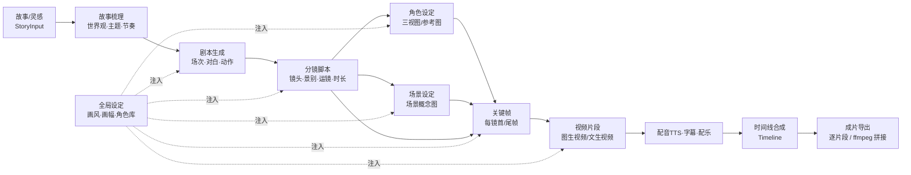
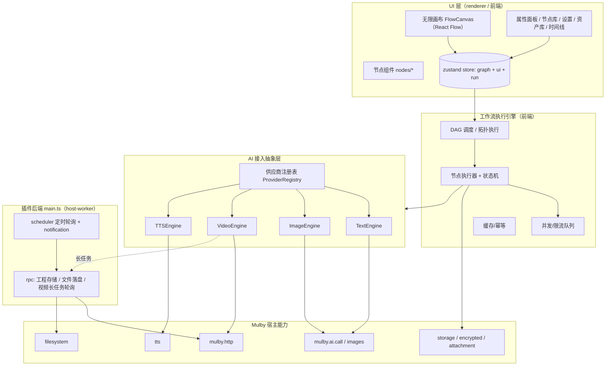

# AI 影视工作流插件 — 详细设计方案

> 无限画布 · 故事到影片 · 多模态 AI 工作流

| 项 | 内容 |
|---|---|
| 文档版本 | v0.10（M0–M7 + M8 素材解耦/首尾帧已落地） |
| 日期 | 2026-06-17 |
| 作者 | 资深全栈架构师 |
| 状态 | **M0–M6 全链路 + M7 一致性与扇出已完成**（自动 N→N 扇出：N 角色→N 三视图、N 镜头→N 关键帧→N 视频；项目级全局设定贯穿所有生成节点并决定尺寸；Inspector 重做为输入/输出结构化卡片+媒体画廊）；宿主侧已支持 API 级结构化输出 |
| 目标插件目录 | `mulby-plugins/plugins/ai-film-studio/` |

---

## 1. 背景与目标

### 1.1 问题陈述
用户希望在 Mulby 中拥有一个**无限画布**插件，把"一段话 / 一个故事"通过可视化的**节点工作流**逐步加工，最终产出**短片**：

```
故事 → 剧本 → 拍摄脚本（分镜） → 角色图（三视图）/场景图 → 关键帧 → 视频片段 → 配音/字幕/配乐 → 合成成片
```

其中文本、图像可复用 Mulby 内置 AI；**视频生成 Mulby 不提供，必须由插件自行接入**。用户可自定义大模型供应商与 API Key，甚至所有模型都由插件自管、不依赖 Mulby AI。

### 1.2 目标用户与场景
- 短视频 / 自媒体创作者：把脚本快速转成分镜与视频草样。
- 独立动画 / 漫画作者：角色设定（三视图）+ 场景图 + 关键帧 + 图生视频。
- 编剧 / 策划：故事 → 剧本 → 分镜的结构化创作。
- AI 创作爱好者：像 ComfyUI 一样自由编排多模态工作流。

### 1.3 设计原则
1. **零配置可用**：文本/图像默认复用 Mulby 已配置的 Provider/模型/Key，开箱即用。
2. **可自管可扩展**：任何模型都能换成用户自定义供应商（OpenAI 兼容端点 / fal / Replicate / 直连厂商）。
3. **节点即能力**：每个能力是一个画布节点，连线即数据流；非线性、可分支、可重跑、可锁定。
4. **复用现有资产**：画布直接沿用本仓库 `ai-flowchart` 的 React Flow 架构与 AI 流式封装。
5. **创作一致性**：把"画风 / 角色"做成全局节点注入下游，保证跨镜一致。
6. **渐进交付**：先打通主链路（文本→图像→视频），后期再做合成与后期。

### 1.4 调研结论摘要（关键约束）
| 维度 | 结论 | 依据 |
|---|---|---|
| 文本 AI | `window.mulby.ai.call(option, onChunk)` 流式，支持多模型/工具/视觉附件 | `apis/ai.md` |
| 图像 AI | `mulby.ai.images.generate / generateStream / edit`，返回 base64；用 `ai.allModels({endpointType:'image-generation'})` 过滤图像模型 | `apis/ai.md`、`mulby-ai-image` |
| 视频 AI | **Mulby 无视频 API**，需插件自管（HTTP 调第三方） | `apis/ai.md` 全文无 video |
| 画布 | `ai-flowchart` 已用 `@xyflow/react`(React Flow v12)+`@dagrejs/dagre`+`zustand` 实现节点画布 | `ai-flowchart/package.json` |
| 存储 | `storage`(KV/工程) + `storage.encrypted`(Keychain，存 Key) + `storage.attachment`(≤50MB 二进制) + `filesystem`(大文件) | `apis/storage.md` |
| AI 调用位置 | `ai-flowchart` 注释明确"AI 调用移至前端避免 IPC 超时" | `ai-flowchart/src/main.ts` |
| 视频 API 形态 | 业界统一**异步三段式**：submit→poll(≈2s)→fetch；图片以 base64 dataURL 传 `image_url`；fal.ai 一个 Key 聚合 Kling 3.0 / Veo 3.1 / Sora 2 / Seedance 2.0 等 | 联网调研（fal.ai 文档、社区实现） |

---

## 2. 产品概述

### 2.1 一句话定位
**"在无限画布上把故事一步步生成成片"** —— 面向"故事 → 影片"的节点式多模态 AI 创作工作站。

### 2.2 核心创作流水线（DAG）



每个方框 = 一个/一组画布节点；箭头 = 端口数据流（文本 / JSON / 图片 / 视频 / 音频）。全局设定节点把画风与角色一致性注入下游所有生成节点。

### 2.3 关键差异化
- 不是"对话框生成器"，而是**可视化、可回溯、可分支**的工作流。
- 深度整合 Mulby 宿主 AI（文本/图像零配置），又能完全自管（视频/自定义供应商）。
- 把"角色一致性 / 风格统一"做成一等公民（全局节点 + 参考图 + seed 注入）。

---

## 3. 总体架构

### 3.1 分层架构



### 3.2 进程划分（前端 vs 后端）
| 职责 | 位置 | 理由 |
|---|---|---|
| 画布 / 节点 / 交互 / 状态 | 前端 renderer | UI 密集 |
| AI 文本、图像调用 | **前端** | 沿用 `ai-flowchart`：放前端避免 IPC 超时；可流式更新 UI |
| 视频"提交+轮询" | **后端优先**（前端可兜底） | 视频任务长（数十秒~数分钟），后端轮询 + scheduler，避免窗口关闭丢任务 |
| 工程结构 / Key / 媒体落盘 | 后端 + 前端混合 | 结构小走前端 storage；大文件（视频）走后端 filesystem |
| 通知 / 任务恢复 | 后端 | 长任务完成通知、重启恢复 |

### 3.3 数据流
1. 用户在画布编排节点与连线 → 写入 `store.graph`。
2. 点击"运行/运行选中" → 引擎对子图做拓扑排序。
3. 逐节点执行：读取上游端口产物 → 调对应 Engine → 写回本节点 outputs → 通知 UI。
4. 文本：流式 onChunk 实时渲染；图像：generateStream 出预览；视频：提交后转后端轮询，进度回推 UI。
5. 产物落盘：结构→storage，图→attachment，视频→filesystem(userData)。

---

## 4. 技术选型

### 4.1 依赖清单
| 库 | 版本（参考 ai-flowchart） | 用途 |
|---|---|---|
| react / react-dom | ^18.3 | UI |
| @xyflow/react | ^12.x | 无限画布 / 节点 / 连线 / 缩放平移 |
| @dagrejs/dagre | ^2.x | 可选自动布局（一键整理分镜流） |
| zustand | ^5.x | 全局状态（graph / run / ui） |
| nanoid | ^5.x | 节点/边/资产 ID |
| lucide-react | ^0.5x | 图标 |
| html-to-image | ^1.x | 画布/节点快照导出 |
| tailwindcss + postcss + autoprefixer | 与现有一致 | 样式 |
| esbuild + vite + typescript | 与现有一致 | 后端打包 + 前端构建 |

> 视频/图像第三方调用走 `mulby.http` 或浏览器 `fetch`，**不引入** provider SDK（保持轻量、避免打包原生依赖问题）。ffmpeg 合成走 `mulby.ffmpeg`（宿主能力），不打包二进制。

### 4.2 与现有插件一致性
脚手架、构建脚本、目录结构、`useMulby` hook、AI 流式封装均对齐 `ai-flowchart` / `mulby-ai-image`，降低维护成本与评审成本。

---

## 5. 画布与节点体系

### 5.1 节点通用模型
```ts
// 端口类型系统
type PortType = 'text' | 'json' | 'image' | 'video' | 'audio' | 'any';

interface Port {
  id: string;
  name: string;          // 显示名
  type: PortType;
  multiple?: boolean;    // 是否允许多连入（如合并节点）
}

// 节点产物（运行后写回）
interface PortValue {
  type: PortType;
  // 文本/json
  text?: string;
  json?: unknown;
  // 媒体：用资产引用，避免在 graph 里塞大 base64
  assetId?: string;      // 指向 storage.attachment / filesystem 的资产
  url?: string;          // 临时可访问 URL（blob: / file:）
  meta?: Record<string, unknown>; // 宽高、时长、seed、模型、耗时、token、费用估算
}

type NodeRunStatus = 'idle' | 'queued' | 'running' | 'done' | 'error' | 'cancelled';

interface FilmNode {
  id: string;
  type: NodeKind;                 // 见 5.3
  position: { x: number; y: number };
  data: {
    title?: string;
    params: Record<string, unknown>;     // 节点参数（模型/尺寸/数量/温度/时长…）
    providerOverride?: ProviderSelector;  // 覆盖默认供应商/模型（见 §6）
    inputsSpec: Port[];
    outputsSpec: Port[];
    outputs?: Record<string, PortValue>;  // 运行产物（按 port.id）
    status: NodeRunStatus;
    progress?: number;            // 0-100
    error?: string;
    locked?: boolean;             // 锁定：不参与重算
    inputHash?: string;           // 幂等缓存键
  };
}

interface FilmEdge {
  id: string;
  source: string; sourceHandle: string;  // 源节点 + 源端口
  target: string; targetHandle: string;  // 目标节点 + 目标端口
}
```

连线校验规则：`sourcePort.type` 与 `targetPort.type` 相同，或任一端为 `any`。

### 5.2 节点分类总览
| 分类 | 作用 | 调用能力 |
|---|---|---|
| 输入节点 | 提供原始素材 | 无 / 文件读取 |
| 文本 AI 节点 | 文字加工与结构化 | `ai.call`（默认 Mulby） |
| 图像 AI 节点 | 生成/编辑图片 | `ai.images`（默认 Mulby） |
| 视频 AI 节点 | 生成视频 | 自管 VideoProvider（HTTP） |
| 音频/后期节点 | 配音/字幕/配乐 | `tts` / 自管 |
| 控制节点 | 批量/合并/变量/条件 | 引擎内置 |
| 输出节点 | 预览/时间线/导出 | `ffmpeg` / `filesystem` |

### 5.3 节点目录（详表）

**输入类**
| 节点 | 输入 | 输出 | 关键参数 |
|---|---|---|---|
| 故事输入 StoryInput | — | text | 多行文本 |
| 文本片段 TextNode | — | text | 文本 |
| 参考图 ImageInput | — | image | 上传（buffer→attachment） |
| 音频素材 AudioInput | — | audio | 上传本地配乐/音效，作为成片音轨 |
| **人物 Character** | — | json + image | 角色**资产**：「运行此节点」文字生成三视图 **或** 「上传图片」用本地图（二者并存）；身份(JSON)+参考图，直连关键帧 `chars`/`ref` 口保持跨镜一致 |
| **场景 Scene** | — | json + image | 场景**资产**：「运行此节点」文字生成概念图 **或** 「上传图片」；设定(JSON)+参考图，直连关键帧 |

> 全局画风/画幅由**顶栏 🎨「全局设定」**（项目级 `get().globals`）统一注入所有生成节点并决定尺寸——M9 起移除了画布上的「全局设定」节点（半残：仅 char-image 有 style 口）。人物/场景图带 `name`+`kind` 元信息供关键帧按名匹配；已有参考图（上传或已生成）时全图重跑复用、不覆盖，「运行此节点」`force` 才按文字重画。

**文本 AI 类**（统一：`ai.call` 流式 + 可编辑 System Prompt 模板 + 纯 JSON 输出；鲁棒解析（`jsonParse`）+ 宿主 `response_format`/JSON Schema 结构化输出 + 校验/「带错误反馈」修复重试）
| 节点 | 输入 | 输出 | 说明 |
|---|---|---|---|
| 故事梳理 StoryDev | text(+globals) | json{logline,theme,tone,beats} | 世界观/主题/节奏梳理 |
| 剧本生成 ScriptGen | json/text | json{scenes:[{slug,desc,dialogues,actions}]} | 分场剧本 |
| 分镜脚本 Storyboard | json(script) | json{shots:[{id,scene,desc,shotSize,camera,duration,chars,location}]} | 镜头表（核心） |
| 角色设定 CharSheet | json/text | json{characters:[{name,desc,appearance,refPromptTriple}]} | 生成角色描述 + 三视图提示词 |
| 提示词扩写/翻译 PromptFx | text | text | 扩写/中英互译/风格化 |

**图像 AI 类**（`ai.images`；模型来自 `allModels({endpointType:'image-generation'})`）
| 节点 | 输入 | 输出 | 说明 |
|---|---|---|---|
| 角色三视图 CharImage | json(role,可多角色) | image（按角色扇出 N 张） | 多角色批量三视图，统一画风（取项目全局）；输出带 `kind:'character'` |
| 场景概念图 SceneImage | json/text | image（按场景扇出） | 场景设定图；输出带 `kind:'scene'` |
| 分镜关键帧 Keyframe | shot(any)+chars(json,可选)+ref(image) | image（按镜头扇出） | 单镜首帧；参考图选择 `selectRefs`：角色按出场名匹配、场景图全收作附加参考 |
| 图生图/重绘 ImageEdit | image(原图)+ref(image,可选)+prompt(text) | image（按原图逐张扇出） | `images.edit` 重绘/风格迁移/局部改；多参考图条件生成 |
| 高清重绘 Upscale | image | image | 按原内容重绘并增强细节（经图像模型 `images.edit`，非纯像素放大） |

**视频 AI 类**（自管 VideoProvider）
| 节点 | 输入 | 输出 | 说明 |
|---|---|---|---|
| 图生视频 I2V | image(首帧)[+image尾帧]+text | video | 主力：关键帧→动起来 |
| 文生视频 T2V | text(+globals) | video | 纯文本生成片段 |
| 视频续写 VideoExtend | video+text | video | 片段延长（供应商支持时） |

**音频 / 后期类**（分期）
| 节点 | 输入 | 输出 | 说明 |
|---|---|---|---|
| 配音 TTS | text | audio | OpenAI 兼容 `/audio/speech`（Key 加密存储）；按对白/旁白 |
| 配乐 BGM | text | audio | ✅ 已实现：复用异步供应商框架（需 custom-http 音乐端点 / fal 音乐模型）|
| 字幕 Subtitle | text/json | json(srt) | （未实现）字幕目前由 compose 按分镜 JSON + 片段时长自动生成 |

**控制 / 工具类**
| 节点 | 作用 |
|---|---|
| 合并/收集 Merge | ✅ 已实现：把多路同类产物收集为一个多项输出，喂下游（compose 等） |
| 批量 ForEach | （未实现）当前为**隐式自动扇出**（N 角色→N 图、N 镜→N 帧→N 视频），已覆盖主链路 |
| 变量 Variable / 条件 Switch | （未实现，可后置） |

**输出类**
| 节点 | 作用 |
|---|---|
| 预览 Preview | 文本/图/视频/音频内联预览 |
| 时间线 Timeline | 按顺序排列片段+音轨+字幕，预览整片 |
| 导出 Export | 逐片段下载，或 `ffmpeg` 拼接 + 混音 + 烧字幕 → 成片 |

---

## 6. AI 接入抽象层（核心）

目标：**文本/图像默认零配置（走 Mulby），视频必须自管，全部都可被用户自定义供应商覆盖**。

### 6.1 两层模型：引擎（能力） + 供应商（实例）
```ts
type Capability = 'text' | 'image' | 'video' | 'tts';
type ProviderKind =
  | 'mulby'          // 复用宿主 AI（仅 text/image）
  | 'openai-compat'  // 自定义 OpenAI 兼容端点（text/image）
  | 'fal'            // fal.ai 聚合（image/video）
  | 'replicate'      // replicate（image/video）
  | 'kling' | 'runway' | 'minimax' | 'vidu'  // 直连厂商（video）
  | 'custom-http';   // 完全自定义 HTTP 模板

interface ProviderConfig {
  id: string;                 // 实例 ID（nanoid）
  kind: ProviderKind;
  label: string;              // 显示名
  baseURL?: string;
  apiKeyRef?: string;         // 指向 storage.encrypted 的键名（不在结构里存明文）
  headers?: Record<string, string>;
  capabilities: Capability[];
  models: ProviderModel[];    // 该供应商可用模型
  enabled: boolean;
}

interface ProviderModel {
  id: string;                 // 调用用的模型标识
  label: string;
  capability: Capability;
  // 视频专用元信息
  videoMeta?: { maxDuration?: number; sizes?: string[]; supportImage?: boolean; supportLastFrame?: boolean };
}

interface ProviderSelector { providerId: string; modelId: string; }
```

### 6.2 引擎接口
```ts
interface TextEngine {
  call(req: {
    messages: AiMessage[];
    model?: string;
    onChunk?: (c: AiChunk) => void;
  }, sel?: ProviderSelector): Promise<{ content: string; usage?: TokenUsage }>;
}

interface ImageEngine {
  generate(req: { prompt: string; size?: string; count?: number; refImageAssetId?: string },
           sel?: ProviderSelector): Promise<{ images: AssetRef[]; tokens?: TokenUsage }>;
  edit(req: { imageAssetId: string; prompt: string }, sel?: ProviderSelector): Promise<{ images: AssetRef[] }>;
  listModels(): Promise<ProviderModel[]>;
}

interface VideoEngine {
  generate(req: VideoGenRequest, sel: ProviderSelector,
           onProgress?: (p: { status: string; progress: number }) => void): Promise<{ video: AssetRef }>;
}

interface VideoGenRequest {
  mode: 'text-to-video' | 'image-to-video';
  prompt?: string;
  firstFrameAssetId?: string;
  lastFrameAssetId?: string;
  duration?: number;
  size?: string;       // 如 1280x720 / 9:16
  seed?: number;
}
```

### 6.3 默认实现（Mulby 引擎，零配置）
- `MulbyTextEngine` → `window.mulby.ai.call(option, onChunk)`，`model` 取自 `ai.allModels()`。
- `MulbyImageEngine` → `window.mulby.ai.images.generate / edit`，模型取自 `ai.allModels({endpointType:'image-generation'})`。
- 用户不配置任何供应商即可使用文本/图像节点（复用其在 Mulby 设置里的 Provider 与 Key）。

### 6.4 媒体供应商（视频 / 配乐 / 语音，M11 统一）
一个 `MediaProviderConfig` 用 `capabilities: ('video'|'music'|'tts')[]` + `mode` 描述能力与调用方式：
```ts
interface MediaProviderConfig {
  id; label; kind: 'fal' | 'custom-http'
  capabilities: ('video' | 'music' | 'tts')[]   // 一个供应商可多能力
  mode: 'async-poll' | 'sync-binary'             // 视频/音乐异步轮询；语音同步返回二进制
  model?; baseURL?; headers?; submitUrl?; pollUrl?; taskIdPath?; statusPath?; videoUrlPath?; voices?; enabled
}
interface VideoProviderAdapter {            // async-poll：视频/音乐共用
  submit(req, cfg, apiKey): Promise<VideoHandle>
  poll(handle, cfg, apiKey): Promise<{ status; progress?; videoUrl?; error? }>  // videoUrl 也承载音频地址
}
```
- **async-poll**（视频/音乐）：`submit` → 每 ~2s `poll`（退避上限，超时默认 300s）→ `completed` 取结果 URL → 下载落盘为资产。图片入参以 base64 dataURL 放 `image_url`。内置 `fal`（一个 Key 覆盖 Kling/Veo/Sora/Seedance；结果解析含 video.* 与 audio.* 路径）+ `custom-http`（填 submit/poll URL 与结果 JSON 路径，兜底任意供应商）。
- **sync-binary**（语音 TTS）：经后端 `synthSpeech` 调 OpenAI 兼容 `/audio/speech`，直接返回音频字节落盘（规避 CORS/截断）。
- **预设**（`providers/presets.ts`）：fal 视频 / fal 配乐 / OpenAI 语音 / 自定义视频 / 自定义音乐 —— 选预设 + 贴 Key 即用（声明式，对齐 Toonflow per-vendor 模块但不执行用户 TS）。
- **每能力默认供应商**（`defaults`）：`getActiveFor(cap)`；节点可用 `providerOverride` 覆盖。

> 逃生口（未做）：`kind:'custom-js'` 用户自写适配器（沙箱 `new Function`）。

### 6.5 Key 管理与安全
- API Key 一律存 `storage.encrypted`（Keychain/DPAPI 加密），供应商结构里只存键名引用（`provider.id`），不落明文。
- 「模型供应商」面板集中管理：预设填充、增删、能力勾选、填 baseURL/Key、连通性自测（async 供应商发最小任务）、设每能力默认。
- 节点级可 `providerOverride` 覆盖默认供应商/模型；未覆盖则用该能力的"默认供应商"。

---

## 7. 工作流执行引擎

### 7.1 图执行
- 触发：运行全部 / 运行选中节点（含其上游依赖）/ 运行单节点。
- 拓扑排序（Kahn）得到执行序；检测环并报错。
- 仅执行"脏"节点：输入哈希 `inputHash` 变化或未缓存才跑；`locked` 节点跳过。

### 7.2 节点状态机
```
idle → queued → running → done
                     ↘ error
running → cancelled（用户中止）
done/error/cancelled → queued（重跑/上游变更）
```
UI 以节点描边颜色 + 进度条 + 角标呈现状态。

### 7.3 流式 / 异步 / 轮询统一
| 能力 | 进度来源 |
|---|---|
| 文本 | `ai.call` 的 `onChunk('text'/'reasoning')` 累积 |
| 图像 | `images.generateStream` 的 `status/preview` chunk |
| 视频 | 后端轮询任务进度回推前端（IPC/事件） |

### 7.4 并发、限流、队列
- 全局与"按供应商"并发上限（默认：文本 4、图像 2、视频 1~2），可在设置调整。
- 任务进入队列，受限流令牌控制，避免触发供应商 429。

### 7.5 缓存 / 幂等 / 锁定
- `inputHash = hash(nodeType + params + provider + 上游产物指纹)`；命中则复用上次产物（省钱）。
- 节点可"锁定"：满意的镜头锁住，重跑整图不会覆盖。

### 7.6 错误处理与重试
- 分类：参数错误（不可重试，提示用户）/ 限流·网络（指数退避自动重试 N 次）/ 余额·鉴权（提示去设置）。
- 视频超时：保留 taskId，支持"恢复轮询"。

### 7.7 一致性策略（创作质量关键）
- **全局设定节点**输出风格 Token / 画幅 / 调色，注入所有生成节点的 prompt 前缀。
- **角色库**：每个角色绑定参考图(assetId) + 描述 + 固定 seed；下游关键帧/视频通过参考图 + 描述保持同一角色形象。
- 视频 I2V 用"首帧/尾帧"控制镜头起止，跨镜衔接更稳。

---

## 8. 数据模型与持久化

### 8.1 工程模型
```ts
interface FilmProject {
  id: string;
  name: string;
  graph: { nodes: FilmNode[]; edges: FilmEdge[] };
  viewport: { x: number; y: number; zoom: number };
  globals: {
    aspectRatio: '16:9' | '9:16' | '1:1' | string;
    style?: string;            // 全局画风
    characters: CharacterRef[]; // 角色库
    defaults: Partial<Record<Capability, ProviderSelector>>; // 各能力默认供应商
  };
  createdAt: number;
  updatedAt: number;
}

interface CharacterRef { id: string; name: string; desc: string; refAssetId?: string; seed?: number; }
interface AssetRef { id: string; kind: 'image'|'video'|'audio'; mime: string; size?: number; storage: 'attachment'|'file'; path?: string; }
```

### 8.2 存储映射
| 数据 | 介质 | API |
|---|---|---|
| 工程结构（graph/globals） | KV | `storage.set('projects', {...})` |
| 供应商配置（无明文 Key） | KV | `storage.set('providers', [...])` |
| API Key | 加密 KV | `storage.encrypted.set(ref, key)` |
| 生成图片（≤50MB） | 附件 | `storage.attachment.put(id, buf, mime)` |
| 生成视频（大文件） | 文件系统 | 后端 `filesystem.writeFile(userData/ai-film-studio/<proj>/<asset>.mp4)` |

### 8.3 自动保存 / 快照 / 导入导出
- 防抖自动保存（节点/边/参数变更后 1s）。
- 手动快照（命名版本）。
- 工程 JSON 导入导出（媒体可选打包）。

---

## 9. Prompt 工程

### 9.1 文本节点
每个文本节点一套角色化 System Prompt + 严格 JSON 输出。**纯 JSON 输出**（不再依赖自然语言+围栏），由 `jsonParse`（多重围栏/最大平衡块扫描/容尾逗号）鲁棒解析，并叠加三重保障：
1. **可编辑模板**：角色 + 创作指导 + JSON 结构外置为「提示词模板」（`promptTemplates.ts` 默认值 + `promptStore` 全局覆盖，顶栏面板编辑、跨工程生效；类似 Toonflow 的可编辑技能文件）。
2. **固定输出契约**：`JSON_CONTRACT`（只输出合法 JSON、不要围栏…）由引擎统一追加，用户改模板也不破坏解析。
3. **宿主结构化输出**：可走 Mulby `ai.call` 的 `response_format` / JSON Schema（`feat/ai-structured-output`），失败再「带错误反馈」修复重试（`buildRepairPrompt`）。
- **分镜脚本**关键字段：`shotSize`(远/全/中/近/特)、`camera`(推/拉/摇/移/固定)、`duration`(秒)、`characters`(出场角色)、`location`(场景)、`mood`、`prompt`(给图像/视频用的英文提示词)。
- 强约束：每镜必须可独立生成图像与视频（自带完整画面描述）。

### 9.2 图像 prompt 组装
`最终 prompt = fillTemplate(可编辑图像模板, 动态变量) + 全局风格后缀`（风格来自项目全局设定，模板里不写死）。角色/场景一致性靠**参考图条件生成**：`images.edit` 的 `imageAttachmentId`(主参考) + `referenceAttachmentIds`(附加参考)，在多图模型（如 Gemini）上实现 IP-Adapter 式「按参考图生成」；关键帧用 `selectRefs` 选参考图（角色按出场名匹配、场景图全收）。图像模板同样可在「提示词模板」面板编辑。

### 9.3 视频 prompt
`运镜描述 + 画面变化 + 时长 + 首/尾帧`；I2V 以关键帧为首帧，prompt 只描述"如何运动/变化"。

---

## 10. 插件契约（manifest 与结构）

### 10.1 manifest.json（草案）
```json
{
  "id": "ai-film-studio",
  "name": "ai-film-studio",
  "displayName": "AI 影视工坊",
  "version": "0.1.0",
  "author": "mulby",
  "type": "ai",
  "description": "无限画布 AI 影视工作流：故事→剧本→分镜→角色/场景图→关键帧→视频→成片",
  "main": "dist/main.js",
  "ui": "ui/index.html",
  "icon": "icon.png",
  "permissions": { "clipboard": true, "notification": true },
  "pluginSetting": { "single": true },
  "window": { "type": "default", "width": 1400, "height": 900, "minWidth": 1100, "minHeight": 720 },
  "features": [
    { "code": "open", "explain": "打开 AI 影视工作流画布",
      "mode": "detached",
      "cmds": [ {"type":"keyword","value":"故事画布"}, {"type":"keyword","value":"AI视频"}, {"type":"keyword","value":"分镜"} ] }
  ]
}
```

### 10.2 后端 main.ts 职责（rpc）
| 方法 | 作用 |
|---|---|
| `saveProject / listProjects / deleteProject` | 工程结构存取（沿用 ai-flowchart） |
| `saveProviders / listProviders` | 供应商配置存取（Key 用 encrypted） |
| `videoSubmit / videoPoll / videoCancel` | 视频任务后端代理（HTTP + 轮询，规避窗口关闭与 CORS） |
| `saveVideoAsset` | 下载视频流落盘到 userData |
| `exportFile` / `ffmpegConcat` | 导出 / 片段拼接合成 |

> AI 文本/图像调用放前端（避免 IPC 超时、便于流式）。视频因长任务 + 可能的跨域，走后端。

### 10.3 前端文件树（实际）
```
src/
  main.ts                  # 后端：视频下载落盘 / 配音合成 / 文件导出 RPC
  types/mulby.d.ts         # 宿主 API 类型
  ui/
    index.html  main.tsx  App.tsx  styles.css
    nodes/nodeDefs.ts      # 节点定义（端口/参数/图标）
    store/
      graphStore.ts        # 图 + 运行(execNode/runAll/runFrom/cancelRun) + 持久化 + 全局设定
      providerStore.ts     # 视频供应商
      promptStore.ts       # 提示词模板覆盖（全局明文 KV，跨工程）
    components/            # FlowCanvas / Toolbar / NodeLibrary / Inspector / inspectorViews
                           # ProviderSettings / GlobalSettings / PromptSettings / FilmNode
    services/
      textEngine.ts        # ai.call 流式（可中断 + jsonMode→response_format）
      imageEngine.ts       # ai.images.generate/edit（含 referenceAttachmentIds 多参考图）
      prompts.ts           # prompt 组装（读 promptStore 模板）
      promptTemplates.ts   # 可编辑模板默认值 + JSON_CONTRACT + fillTemplate
      executor.ts          # 拓扑排序 + 输入收集 + 按口派生输出
      models / jsonParse / keys(encrypted) / assets(attachment) / download / templates
      providers/           # fal / customHttp / http / test / index(runVideo)
```

---

## 11. UI / UX 设计要点
- 布局：顶栏（运行/保存/导出/缩放/项目切换）+ 左侧节点库（拖拽添加）+ 中央画布 + 右侧属性面板（选中节点参数/供应商覆盖）+ 底部时间线/资产抽屉。
- 交互：拖拽连线带类型校验高亮；节点上"运行/重跑/锁定/预览"快捷键；批量运行带整体进度。
- 预览：图片缩略图 + 灯箱；视频内联播放器；文本/JSON 折叠展示。
- 主题：暗色优先（创作向），对齐 Mulby 主题变量。

---

## 12. MVP 分期与任务拆解

| 里程碑 | 交付物 | 关键任务 | 验收 |
|---|---|---|---|
| **M0 脚手架** ✅ | 可加载的空画布插件 | CLI create(react) + manifest + React Flow 画布 + 节点拖拽/连线/保存/缩放 | 在 Mulby 打开，能加增删节点并保存工程 |
| **M1 文本链路** ✅ | 故事→剧本→分镜 | StoryInput/ScriptGen/Storyboard 节点 + textEngine(ai.call 流式) + JSON 解析 | 输入一句话产出结构化分镜表 |
| **M2 图像链路** ✅ | 角色/场景/关键帧 | CharImage/SceneImage/Keyframe + imageEngine(ai.images) + 资产库(storage 命名空间) | 由分镜批量出关键帧图 |
| **M3 视频链路** ✅ | 关键帧→视频 | I2V/T2V 节点 + videoEngine + falAdapter/customHttp + 前端 submit/poll + 远程 URL 预览 | 选一镜关键帧生成视频片段并预览 |
| **M4 供应商管理** ✅ | 多供应商可配 | 设置面板增强 + 节点级 override + 连通性自测 + 视频落盘 filesystem + 图像 img2img(ai.images.edit) | 用户自定义供应商并跑通；节点覆盖/自测/落盘/img2img 可用 |
| **M5 合成导出** | 成片 | Timeline + ffmpegConcat + 字幕/配音(TTS) + 一致性增强(角色库/seed) | 多片段拼成一条带字幕的成片 |
| **M6 打磨** | 可发布 | 工作流模板、批量 ForEach、错误体验、图标(assets/icon.svg→icon.png)、README、`mulby pack` | 通过 skill handoff checklist，产出 .inplugin |

> 主链路 = M0→M3（故事→剧本→分镜→图→图生视频），建议优先打通。

---

## 13. 风险与对策

| 风险 | 影响 | 对策 |
|---|---|---|
| 视频 API 碎片化、字段不统一 | 适配成本高 | 统一 submit/poll/fetch 适配器 + `custom-http` 模板；先用 fal.ai 聚合覆盖主流 |
| 长任务 / 窗口关闭丢任务 | 体验差、产物丢失 | 后端轮询 + scheduler + 通知 + taskId 持久化可恢复 |
| 附件 50MB 上限放不下视频 | 存储失败 | 视频走 filesystem 落 userData，仅图走 attachment |
| 费用 / 限流 | 烧钱、429 | 并发上限 + 缓存幂等 + 费用估算 + 用户自带 Key |
| 角色跨镜不一致 | 成片质量 | 角色库参考图 + 固定 seed + 全局风格注入 + I2V 首尾帧 |
| 跨域(CORS)调用第三方 | 前端调用失败 | 视频/自定义 HTTP 走后端 `mulby.http` 代理 |
| esbuild 打包原生依赖 | 构建失败 | 不引入 provider SDK；必要时 `--external:pkg` |
| 文生视频 JSON/响应解析脆弱 | 运行报错 | 适配器内做容错 + 路径可配（custom-http 的 JSON path 映射） |

---

## 14. 验收清单（对齐插件开发规范）
- [ ] `manifest.json` 必填字段齐全，`features[].code` 均有处理逻辑。
- [ ] `main` / `ui` 路径指向真实文件；前端构建产出 `dist/main.js` 与 `ui/index.html`，`file://` 下资源可用（`base: './'`）。
- [ ] 文本/图像默认走 Mulby AI，可零配置使用。
- [ ] 至少一个视频供应商（fal）跑通 submit→poll→fetch→落盘→预览。
- [ ] API Key 走 `storage.encrypted`，结构无明文。
- [ ] 工程可保存/读取/导入导出；图存 attachment、视频存 filesystem。
- [ ] `npm run build` 成功；需要时 `npm run pack` 产出 `.inplugin`。
- [ ] `assets/icon.svg` → 512×512 `icon.png`（功能与主题稳定后再定稿）。
- [ ] `README.md` 含功能、用法、供应商配置说明。
- [ ] 提供 Mulby 内手动验收清单。

---

## 15. 附录

### 15.1 视频供应商对照（2026，调研）
| 供应商 | 接入方式 | 覆盖模型 | 模式 | 推荐场景 |
|---|---|---|---|---|
| fal.ai | 聚合 / 队列 API | Kling 3.0、Veo 3.1、Sora 2、Seedance 2.0、LTX… | T2V / I2V / V2V | 首选，一个 Key 覆盖最广 |
| Replicate | 聚合 / predictions | 多家开源+商用 | T2V / I2V | 备选聚合 |
| 可灵 Kling | 直连 | 可灵 | T2V / I2V | 国内、效果好 |
| MiniMax 海螺 | 直连 | Hailuo | T2V / I2V | 国内 |
| Runway | 直连 | Gen 系列 | T2V / I2V | 海外、运镜强 |
| Vidu | 直连 | Vidu | T2V / I2V / 参考生视频 | 国内、角色一致 |
| OpenAI Sora | 直连/经 fal | Sora 2 / Pro | T2V / I2V | 高质量、带音频 |

### 15.2 关键调用样例
```ts
// 文本（前端，流式）
const req = window.mulby.ai.call(
  { model, messages: [{role:'system',content: STORYBOARD_PROMPT},{role:'user',content: script}] },
  (chunk) => { if (chunk.chunkType==='text') append(chunk.content); }
);
const final = await req;

// 图像（前端）
const { images } = await window.mulby.ai.images.generate({ model, prompt, size:'1024x1024', count:1 });

// 视频（后端 main.ts，fal 适配器三段式）
const { taskId } = await falSubmit(req, cfg, key);   // POST baseURL/model
let r; do { await sleep(2000); r = await falPoll(taskId, cfg, key); } while (r.status!=='completed' && r.status!=='failed');
const out = await falFetch(taskId, cfg, key);        // { url }
await filesystem.writeFile(localPath, await download(out.url), 'base64');
```

### 15.3 参考
- 本仓库：`plugins/ai-flowchart`（画布/AI 流式封装）、`plugins/mulby-ai-image`（图像生成）、`plugins/mulby-ai-chat`（流式对话）。
- Mulby API：`apis/ai.md`、`apis/storage.md`、`apis/http.md`、`apis/manifest.md`。
- 视频：fal.ai Model APIs（队列 submit/poll/fetch）、社区 FalVideoProvider 实现（三段式 + base64 image_url）。

---

## 16. 实现进度日志（Changelog）

### M0 — 脚手架 + 可用画布 ✅（2026-06-16）

**目标**：交付一个可在 Mulby 加载的插件，画布能拖拽/连线/缩放/平移，能增删节点、编辑参数、保存/切换工程。

#### 16.1 已交付内容
| 模块 | 文件 | 说明 |
|---|---|---|
| 插件配置 | `manifest.json` / `package.json` / `vite.config.ts` / `tsconfig.json` / `tailwind.config.js` / `postcss.config.js` | type=ai、detached 1400×900、single；构建脚本对齐 `ai-flowchart` |
| 后端入口 | `src/main.ts` | 生命周期 + 启动通知；预留 `rpc.exportToFile`（M5 用） |
| 类型 | `src/types/mulby.d.ts` | 与宿主一致的完整 Mulby API 类型 |
| 节点定义 | `src/ui/nodes/nodeDefs.ts` | 端口类型系统 + 5 大类 15 个节点定义（输入/文本/图像/视频/输出），含图标/端口/参数表单元数据 |
| 状态管理 | `src/ui/store/graphStore.ts` | zustand：nodes/edges + React Flow 回调 + **连线类型校验** + 工程 CRUD + **防抖自动保存**（storage 命名空间持久化） |
| 画布 | `src/ui/components/FlowCanvas.tsx` | React Flow 封装：拖拽落点 `screenToFlowPosition`、连线校验、选中、Background/Controls/MiniMap |
| 节点组件 | `src/ui/components/nodes/FilmNode.tsx` | 按分类着色的头部 + 多端口 Handle/标签 + 状态点 + 内容摘要 |
| 节点库 | `src/ui/components/NodeLibrary.tsx` | 左栏分类列表，拖拽或点击添加 |
| 属性面板 | `src/ui/components/Inspector.tsx` | 右栏：编辑标题/参数（text/textarea/number/select）、查看端口、删除节点 |
| 工具栏 | `src/ui/components/Toolbar.tsx` | 工程切换/重命名/新建/保存/导入导出 JSON/适应画布/删除工程；运行按钮占位（M1 起开放） |
| 布局 | `src/ui/App.tsx` / `styles.css` | 三栏布局 + 主题跟随宿主（CSS 变量，暗/亮）+ Cmd/Ctrl+S、Delete 快捷键 |

实际文件树（与 §10.3 设计基本一致，节点组件置于 `components/nodes/`）：
```
src/
  main.ts
  types/mulby.d.ts
  ui/
    index.html  main.tsx  App.tsx  styles.css
    store/graphStore.ts
    nodes/nodeDefs.ts
    hooks/useMulby.ts
    components/
      FlowCanvas.tsx  Toolbar.tsx  NodeLibrary.tsx  Inspector.tsx
      nodes/FilmNode.tsx
```

#### 16.2 关键实现决策
- **单一自定义节点类型** `film`：所有节点共用 `FilmNode` 组件，按 `data.kind` 查 `nodeDefs` 渲染端口/参数，新增节点只改数据表，零组件成本（为 M1+ 扩展铺路）。
- **连线类型校验**：`isValidConnection` 比对源/目标端口 `PortType`，相同或任一为 `any` 才允许，实时高亮非法连线。
- **持久化**：工程结构存 `storage`（命名空间 `ai-film-studio`），key `projects`（全量）+ `currentProjectId`；结构性变更（增删/拖动结束/连线/参数）防抖 800ms 自动落盘，叠加手动保存。
- **进程划分**：M0 仅前端；后端只保留生命周期与导出预留，符合"AI 调用放前端"的既定方针。

#### 16.3 修复记录
- 移除 `nodeDefs.ts` 中未使用的 `FileText` 导入（前任遗留的 `export { FileText }` 兜底 hack）。
- 修正 `FilmNode` 端口 Handle 垂直定位：Handle 与标签同属 `position:relative` 的 `__body`，统一以 body 为基准定位，去掉多余的 `HEADER_H` 偏移。

#### 16.4 验收（已通过）
- `npx tsc --noEmit` 类型检查通过；`pnpm run build` 成功，产出 `dist/main.js` + `ui/index.html`（`base:'./'` 相对路径，`file://` 可用）。
- 待人工在 Mulby 内验证：拖拽/点击增节点 → 连线（类型校验）→ 拖动/缩放/平移 → 编辑参数 → 自动/手动保存 → 切换/新建/导入导出工程 → 重开恢复。

> 备注：`manifest.json` 仍引用 `icon.png`（占位，M6 定稿图标）；Mulby 内将显示默认图标，不影响 M0 加载与功能验证。

#### 16.5 下一步（M1 文本链路）
StoryInput/ScriptGen/Storyboard 节点 + `textEngine`（`mulby.ai.call` 流式）+ 结构化 JSON 解析 + 模型选择，跑通"一句话 → 剧本 → 分镜表"。

---

### M1 — 文本链路（故事→剧本→分镜）✅（2026-06-16）

**目标**：让画布"跑起来"——文本 AI 节点接入 `mulby.ai.call`（流式），按拓扑顺序执行工作流，把一句话变成结构化剧本与分镜表。

#### 16.6 已交付内容
| 模块 | 文件 | 说明 |
|---|---|---|
| 模型服务 | `services/models.ts` | `ai.allModels()` 过滤出文本模型（排除 image-generation/rerank），供顶栏选择；零配置复用宿主模型 |
| 文本引擎 | `services/textEngine.ts` | 封装 `ai.call({messages,model}, onChunk)` 流式：累积 `text`/`reasoning`、捕获 `error`、支持 `abort` 中断 |
| JSON 解析 | `services/jsonParse.ts` | 稳健提取：```json 代码块 / 裸 JSON / 前后夹带说明；带括号配平扫描 + 去围栏 |
| Prompt 工程 | `services/prompts.ts` | 4 个文本节点的角色化 System Prompt（剧本/分镜/角色设定/提示词处理）+ 输入组装（JSON 产物优先结构化传递）|
| 执行引擎 | `services/executor.ts` | 纯函数：Kahn 拓扑排序、按端口收集上游产物、输入节点参数即时派生 |
| 运行状态 | `store/graphStore.ts` | 新增 `models/selectedModel/isRunning/runningNodeId` + `loadModels/setSelectedModel/runNode/runAll/cancelRun`；产物写回 `node.data.outputs`、运行后落盘 |
| 节点展示 | `components/nodes/FilmNode.tsx` | 底部状态摘要：运行中(流式尾串)/出错(红)/完成(剧本N场·分镜N镜·角色N个) |
| 属性面板 | `components/Inspector.tsx` | "运行此节点"按钮 + 运行结果（文本/JSON）/流式预览/错误展示 |
| 顶栏 | `components/Toolbar.tsx` | 文本模型下拉选择 + 运行/停止（运行中切换为停止） |

#### 16.7 执行模型
- **运行全部**：对全图拓扑排序，依次执行——输入节点按参数派生输出；文本节点调 AI；`preview` 节点展示上游；图像/视频/导出 M1 跳过。
- **运行单节点**：解析其上游（输入节点即时派生，AI 节点取已运行产物）后执行；缺输入则提示。
- **流式**：`onText` 增量写入 `node.data.stream`，节点与属性面板实时刷新；完成后 JSON 端口解析为结构化产物，文本端口去围栏。
- **中断**：停止按钮 `abort` 当前请求并复位状态。
- **数据流**：上游 JSON 产物以结构化 JSON（而非含前言的原始文本）注入下游 Prompt，保证分镜读取干净剧本。

#### 16.8 验收（已通过）
- `npx tsc --noEmit` 通过；`pnpm run build` 成功。
- 待人工在 Mulby 内验证主链路：故事输入 → 剧本生成 → 分镜脚本 连线后点"运行"，得到结构化剧本与分镜表（可在属性面板查看 JSON），并可切换文本模型 / 中途停止。

> 说明：文本/图像默认复用 Mulby 宿主模型；若宿主未配置任何文本模型，下拉显示"默认模型"，运行时由宿主决定或提示不可用。

#### 16.9 下一步（M2 图像链路）
CharImage/SceneImage/Keyframe 节点 + `imageEngine`（`ai.images.generate`）+ 资产库（`storage` 命名空间），由分镜批量产出角色三视图 / 场景图 / 关键帧。

---

### M2 — 图像链路（角色三视图 / 场景图 / 关键帧）✅（2026-06-16）

**目标**：把文本产物变成画面——图像节点接入 `mulby.ai.images`，由角色设定/分镜/场景批量生成图像，并落入资产库持久化。

#### 16.10 已交付内容
| 模块 | 文件 | 说明 |
|---|---|---|
| 图像引擎 | `services/imageEngine.ts` | 封装 `ai.images.generateStream`（可中断 + 生成预览），回退 `generate`；返回 base64 |
| 资产库 | `services/assets.ts` | 媒体走 `storage.attachment`（二进制附件，宿主按插件隔离），工程只存 `assetId`；对外仍以 base64 进出（内部 base64↔Uint8Array 转换），`toDataUrl`/`fromDataUrl` 互转；保留旧版 KV 读兼容 |
| 图像 Prompt | `services/prompts.ts` | 新增 `buildImagePrompt`：角色三视图 turnaround / 场景概念图 / 镜头电影感关键帧，注入全局画风 |
| 模型服务 | `services/models.ts` | 新增 `listImageModels`（`endpointType==='image-generation'`） |
| 运行/持久化 | `store/graphStore.ts` | execNode 新增 image 分支；`runAll` 纳入图像节点；`selectedImageModel` + `setNodeImage`（上传参考图）；保存时 `serializeNodes` 剥离 url、加载时 `hydrateAssets` 补水、导入时 `reimportAssets` 回灌 |
| 节点展示 | `components/nodes/FilmNode.tsx` | 图像产物缩略图 + 生成中预览角标 |
| 属性面板 | `components/Inspector.tsx` | 图像结果大图预览；参考图节点「上传参考图」；图像节点「运行此节点」 |
| 顶栏 | `components/Toolbar.tsx` | 新增图像模型下拉（文本/图像双选择器） |

#### 16.11 执行与数据
- **生成**：图像节点收集上游（角色 json / 分镜 json / 场景文本）→ `buildImagePrompt` 产出英文提示词 + 尺寸 → `ai.images` 生成 → 存资产库 → 写回 `outputs.out = { type:'image', assetId, url }`。
- **预览/中断**：流式 `preview` 回调写 `node.data.previewUrl` 实时显示；停止按钮 `abortImage()`。
- **参考图**：`image-input` 节点本地选图（FileReader→dataURL）→ 资产库 → 作为下游输入。
- **持久化策略**：工程 JSON 只存 `assetId`（剥离 base64/url），避免数据膨胀；加载后按 `assetId` 异步补水 url；导出内嵌 url 便于跨设备移植，导入时重新落库。

#### 16.12 验收（已通过）
- `npx tsc --noEmit` 通过；`pnpm run build` 成功。
- 待人工在 Mulby 内验证：分镜/角色设定 → 角色三视图 / 场景概念图 / 关键帧，选择图像模型后「运行」，节点显示缩略图、属性面板显示大图；刷新后图像仍在（资产库补水）。

> 限制：M2 关键帧暂为「文生图」，参考图（img2img 一致性）将在 M4 通过 `ai.images.edit` 接入；视频生成为 M3。

#### 16.13 下一步（M3 视频链路）
I2V/T2V 节点 + `videoEngine`（自定义供应商，submit→poll→fetch）+ 视频资产入库与播放，由关键帧/提示词生成视频片段。

---

### M3 — 视频链路（关键帧/文本 → 视频片段）✅（2026-06-16）

**目标**：Mulby 不提供视频模型，由插件自管第三方供应商（经 `mulby.http`，主进程代理无 CORS），统一异步三段式 submit→poll→取地址；I2V/T2V 节点跑通并内联预览。

#### 16.14 已交付内容
| 模块 | 文件 | 说明 |
|---|---|---|
| 供应商抽象 | `services/providers/types.ts` | `VideoProviderConfig` / `VideoGenRequest` / `VideoProviderAdapter`（submit/poll）/ `VideoHandle` |
| HTTP 工具 | `services/providers/http.ts` | `httpJson`（mulby.http + 状态码校验 + JSON 解析）、`getPath`/`firstString`（JSON 路径提取） |
| fal 适配器 | `services/providers/fal.ts` | fal 队列 API：POST 模型端点 → 透传 `status_url`/`response_url` → 轮询 `COMPLETED` 取 `video.url`；`Authorization: Key` |
| custom-http 适配器 | `services/providers/customHttp.ts` | 用户填 submit/poll URL + JSON 路径，留空按常见命名自动尝试；`{taskId}` 占位替换；状态归一化 |
| 视频引擎 | `services/providers/index.ts` | `runVideo`：submit→轮询(2s→5s 退避)→取地址；默认 300s 超时；`abortVideo` 轮询间中断；`onProgress` |
| Key 安全 | `services/keys.ts` | `storage.encrypted`（系统 Keychain/DPAPI，宿主按插件隔离）存取，结构只存键名引用 `k_{providerId}`，无明文、无明文回退 |
| 供应商 Store | `store/providerStore.ts` | 供应商 CRUD、默认选择、Key 存取与存在性 |
| 设置弹窗 | `components/ProviderSettings.tsx` | 增删供应商、选默认、填 Key（密文）、fal/custom-http 表单 |
| 运行集成 | `store/graphStore.ts` | execNode 新增 video 分支（首帧 data URL 解析、提示词/运镜回退）；`runAll` 纳入视频；`serializeNodes` 仅剥离 base64 `data:` URL、保留远程视频链接；`cancelRun` 调 `abortVideo` |
| 展示 | `FilmNode.tsx` / `Inspector.tsx` / `Toolbar.tsx` / `App.tsx` | 节点内 `<video>` 缩略、属性面板 `<video controls>`、顶栏「视频供应商」入口、启动加载供应商 |

#### 16.15 执行与数据
- **I2V**：上游关键帧（image）→ 解析为 data URL 作 `image_url` 首帧 + 提示/运镜 → 生成视频。
- **T2V**：上游文本提示 → 生成视频。
- **进度**：轮询状态写 `node.data.stream`（排队中/生成中%）实时显示；停止按钮中断。
- **产物**：`outputs.out = { type:'video', url: 远程地址 }`；URL 体积小，直接随工程持久化并内联播放。

#### 16.16 验收（已通过）
- `npx tsc --noEmit` 通过；`pnpm run build` 成功。
- 待人工在 Mulby 内验证：顶栏「视频供应商」添加 fal（填 model + Key）→ 关键帧接 I2V（或文本接 T2V）→「运行」→ 节点/面板内联播放视频。

> 说明与限制：
> - 视频走**前端 `mulby.http`** 轮询（与文本/图像前端化一致，无 CORS）；窗口关闭会中断轮询，后端 scheduler 续跑 + taskId 持久化恢复留待 M4。
> - M3 保存**远程视频 URL**（可能有有效期）；下载落盘到 `filesystem`（离线 + ffmpeg 合成）为 M5。
> - 内置 `fal` + `custom-http`；fal 适配器按其公开队列 API 实现，需用户用自己的账号/模型核验，`custom-http` 为任意供应商兜底。

#### 16.17 下一步（M4 供应商管理增强）
节点级 `providerOverride` + 连通性自测 + 视频落盘 `filesystem` + 图像 `ai.images.edit`（img2img 一致性），完善多供应商体验。

---

### M4 — 供应商管理增强（节点覆盖 / 连通自测 / 视频落盘 / img2img）✅（2026-06-16）

**目标**：把"能跑"提升到"可控、可靠、可复用"——单节点可覆盖供应商/模型、一键自测连通、视频自动下载到本机防 URL 失效、图像支持参考图（img2img）保持一致性。

#### 16.18 已交付内容
| 模块 | 文件 | 说明 |
|---|---|---|
| 图像编辑引擎 | `services/imageEngine.ts` | 新增 `editImage`：参考图 → `ai.attachments.upload` → `ai.images.edit`（img2img），返回 base64 |
| 视频下载服务 | `services/download.ts` | `downloadVideoToDisk`：前端解析 userData 路径 → 调后端 RPC 下载落盘，返回本地路径；`basename` 工具 |
| 连通性自测 | `services/providers/test.ts` | `testVideoProvider`：fal 探测 `requests/connectivity-test/status`、custom-http 探测 poll/submit 端点；401/403 判 Key 无效，不产生生成费用 |
| 后端下载 RPC | `src/main.ts` | `rpc.downloadVideo`：主进程 `fetch`（规避 CORS）→ base64 写入 `{userData}/ai-film-studio/videos/`（二进制不截断）；`ensureDir` 逐级建目录 |
| 运行集成 | `store/graphStore.ts` | 文本/图像/视频三类节点读取节点级覆盖（`modelOverride`/`imageModelOverride`/`providerOverride`）；图像分支检测上游参考图自动走 img2img；视频成功后**自动落盘**写 `localPath`；新增 `downloadVideo(id)` 手动下载动作；`PortValue` 增 `localPath`（持久化） |
| 属性面板 | `components/Inspector.tsx` | 文本/图像「模型（覆盖顶栏）」、视频「供应商（覆盖默认）」下拉；视频结果区「下载到本地 / 打开文件夹」 |
| 供应商弹窗 | `components/ProviderSettings.tsx` | 每个供应商行新增「测试连接」按钮 + 结果（连通/Key 无效/无法连接） |
| 样式 | `styles.css` | 测试按钮/结果配色、视频结果操作区、mini 按钮、本地路径省略 |

#### 16.19 执行与数据
- **节点级覆盖**：覆盖值存于 `node.data.params`（随工程持久化）。留空＝跟随顶栏/默认；视频覆盖的供应商若已删除则运行时报错提示。
- **img2img 判定**：图像节点收集上游后，若存在 `image` 端口产物且宿主支持 `ai.images.edit`，则上传该参考图走 edit；否则回退 `generate`（文生图）。关键帧的 `ref`、场景图的图像输入均可触发。
- **视频落盘**：生成成功（拿到远程 URL）后立即尽力下载（失败不影响 `done`）；用户也可在属性面板手动「下载到本地」。落点 `{userData}/ai-film-studio/videos/`，节点保存 `localPath`，可一键「打开文件夹」。
- **连通自测**：用 `mulby.http`（拿到任意状态码不抛错）做一次 GET 探测，区分"可连通/Key 无效/无法连接"；fal 用 `Key xxx`、custom-http 用 `Bearer xxx` + 自定义头。

#### 16.20 验收（已通过）
- `npx tsc --noEmit` 通过；`pnpm run build` 成功（后端 `dist/main.js` 含下载 RPC，UI 正常产出）。
- 待人工在 Mulby 内验证：① 节点上切换覆盖模型/供应商并运行；② 供应商弹窗点「测试连接」看连通结果；③ 参考图→关键帧 走 img2img；④ 视频生成后自动落盘 + 「打开文件夹」。

> 说明与限制：
> - 连通自测为**轻量探测**（不提交生成任务），只校验端点可达与 Key 是否被接受；最终可用性仍以实际生成为准。
> - 自动落盘依赖后端 `fetch`（Node 18+）；若宿主后端无 `fetch` 或目录不可写，下载失败但不影响视频在线播放，可稍后手动重试。
> - img2img 需所选图像模型支持 `images.edit`；不支持时按文生图回退。

#### 16.21 下一步（M5 时间线合成 + 导出）
视频/音频时间线、`ffmpeg` 拼接多片段为成片、TTS 配音与字幕、批量对每镜循环生成，产出可导出的完整短片。

---

### 存储 API 对齐修订 ✅（2026-06-16）

**背景**：核对发现代码的存储实现与设计文档（§6.5/§8.2）不符——Key 用 `mulby.security` 原语 + 普通 KV（且加密不可用时回退明文），图像用普通 KV 存 base64。经核宿主源码（`mulby/src/main/ipc/storage.ts`），文档主张的 `storage.encrypted` 与 `storage.attachment` 均真实暴露给插件、且 `storage.attachment` 正是同类插件 `mulby-ai-image` 的惯例做法，故以设计文档为准修正代码。

| 项 | 改前 | 改后 |
|---|---|---|
| Key | `security.encryptString` + `storage.set(base64)`，有明文回退 | `storage.encrypted.set/get/has/remove`（键 `k_{providerId}`），无明文回退 |
| 图像 | `storage.set({base64,mime})` 普通 KV | `storage.attachment.put/get/getType/remove`，内部 base64↔Uint8Array 转换 |

- 改动仅限 `services/keys.ts`、`services/assets.ts` 与 `types/mulby.d.ts`（补 `storage.encrypted`/`storage.attachment` 类型）；两个 service 导出签名不变，18 个调用点零改动。
- `assets.loadAsset` 保留旧版 KV 读兼容，迁移前已生成的图不丢；`deleteAsset` 一并清旧 KV 残留。
- 附带修正：宿主对插件强制忽略自定义 namespace（`storage.ts:30-39`），原 `ai-film-studio-keys/-assets` 命名空间本就未生效；新方案各自独占 `_encrypted_:`/`_attachment_meta_:` 键空间。
- 验收：`npx tsc --noEmit` 通过；`npm run build` 通过。

---

### M5 — 时间线合成 + 导出 ✅（2026-06-16）

**目标**：把此前已写好但未接线的合成/配音/字幕/落盘服务真正接入执行引擎——配音(TTS)、多片段 ffmpeg 合成（归一化+拼接+字幕+配音）、成片导出，打通"片段 → 成片 → 落盘"。

#### 16.22 已交付内容
| 模块 | 文件 | 说明 |
|---|---|---|
| 配音节点 | `store/graphStore.ts`（execNode `audio` 分支） | 文本 → `services/tts.synthSpeech`（后端 OpenAI 兼容 `/audio/speech` 落盘）→ 音频产物；Key 走 `storage.encrypted`（键 `tts:{nodeId}`，不进工程参数） |
| 合成节点 | `store/graphStore.ts`（execNode `compose` 分支） | 多片段 → `resolveLocalVideo` 统一落本地 → `ensureFfmpeg`（按需下载）→ `composeFilm`（scale/pad/setsar/fps 归一 + concat + 可选烧录/软字幕 + 配音 apad 混音）→ 成片 |
| 导出节点 | `store/graphStore.ts`（execNode `export` 分支） | 上游视频 → `dialog.showSaveDialog` 选位置 → 读本地 base64 写入目标 |
| 字幕 | `services/subtitles.buildSrt` | 由分镜 JSON + 各片段 `durationSec` 生成 SRT 时间轴 |
| 落盘辅助 | `services/fsutil`、`services/ffmpeg`、`services/tts` | 此前孤立的 M5 服务全部接线（之前全仓零引用） |
| UI | `components/Inspector.tsx` | audio/compose/export 纳入「运行此节点」；TTS API Key 加密输入框；结果区新增 `<audio>` 播放 |
| 执行集成 | `store/graphStore.ts` | `runAll` 纳入 audio/compose（export 因弹保存框仅手动运行）；`cancelRun` 调 `abortFfmpeg`；视频产物写 `durationSec`；`serializeNodes` 剥离 audio data: URL |

#### 16.23 执行与数据
- **配音**：文本（上游或参数）+ 加密 Key → 后端合成落盘 `{userData}/ai-film-studio/audio/`，返回 base64 供会话内播放、`localPath` 供合成复用。
- **合成**：每个 `clips` 端口产物（可连多个视频节点）解析为本地文件（本地优先 / 远程下载 / data 落盘）；`subs` 端口接分镜 JSON 生成字幕；`audio` 端口接配音；`ffmpeg` 首次自动下载；进度回推节点 `stream`。
- **导出**：保存对话框选目标 → 复制成片。
- **持久化**：成片/导出产物保存 `localPath`（随工程持久化），属性面板可「打开文件夹」。

#### 16.24 审查与修复（对抗式 review 确认）
- 🔴 单片段 `concat=n=1` 非法 → `buildConcatArgs` 单片段跳过 concat、仅归一化。
- 🔴 `escapeSubPath` 误转义 Windows 盘符冒号 → 保留 `C:`，仅转义其余冒号。
- 🟡 `export` 补 `runningNodeId` + `finally`；`resolveLocalAudio` 补远程 URL 下载；字幕模式改显式映射；`fmtTime` 修毫秒进位（避免非法 SRT）。
- 误报已剔除：`apad`+`-shortest` 是补静音到视频等长的官方惯用法（正确）；`mov_text` 是 MP4 软字幕标准编码（正确）。

#### 16.25 验收（已通过）
- `npx tsc --noEmit` 通过；`npm run build` 通过（M5 服务已打包，bundle 398KB→409KB）。
- 待人工在 Mulby 内验证：多个视频片段 + 分镜(字幕) + 配音 → 合成节点「运行」得到带字幕/配音的成片并播放/打开文件夹；导出节点另存到指定位置。

> 说明与限制：
> - 合成成片内联播放用 `file://`（取决于宿主 webSecurity），无论能否内联播放，`localPath` 的「打开文件夹」始终兜底可用。
> - 字幕时长按各视频节点 `duration` 参数估算，与实际生成时长可能略有出入。
> - `audio-input`（本地导入音频）节点尚未接线，配音目前由 TTS 节点产出。

#### 16.26 下一步（M6 打磨）
工作流模板、批量 ForEach、错误体验完善、图标定稿（已出 `assets/icon.svg`→`icon.png`）、README（已交付）、`mulby pack` 产出 `.inplugin`。

---

### M6 — 打磨（模板 / 音频导入 / 错误体验 / 打包）✅（2026-06-16）

**目标**：把插件从"功能可跑"打磨到"可发布"——降低上手门槛（模板）、补齐 M5 遗留缺口（音频导入）、完善错误反馈，并产出可分发的 `.inplugin`。

#### 16.27 已交付内容
| 模块 | 文件 | 说明 |
|---|---|---|
| 工作流模板 | `ui/templates.ts`（新增） | 声明式定义 3 套流水线（故事→分镜 / 完整影视流水线 / 片段→成片配乐）+ `instantiateTemplate`（生成新 id 节点/边，默认参数取自 nodeDefs） |
| 模板载入 | `store/graphStore.ts`（`loadTemplate`） | 从模板**新建工程**（不覆盖当前画布）；切换前先保存当前工程防丢失 |
| 模板入口 | `components/Toolbar.tsx` | 顶栏「＋模板…」下拉，一键载入 |
| 音频素材导入 | `store/graphStore.ts`（`setNodeAudio`）+ `Inspector.tsx` | `audio-input` 节点上传本地配乐 → 资产库 → 音频产物（接通 M5 遗留缺口）；`hydrateAssets`/`serializeNodes` 支持 audio 往返 |
| 错误体验 | `store/graphStore.ts`（`runAll`） | 运行全部结束后汇总出错节点并通知（前 3 个节点名） |
| 健壮性 | `store/graphStore.ts`（`loadTemplate`/`newProject`） | 切换/新建前 `if (dirty) saveProject()`，对齐 `switchProject`，避免未保存编辑丢失 |
| 图标 | `assets/icon.svg` → `icon.png` | 512×512（M6 前已定稿） |
| 文档 | `README.md` | 功能/用法/供应商/验收清单（M6 前已交付，本次补模板与音频说明） |
| 打包 | — | `mulby pack` 产出 `ai-film-studio-0.1.0.inplugin`（`*.inplugin` 已加入 `.gitignore`） |

#### 16.28 验收（已通过）
- `npx tsc --noEmit` 通过；`mulby pack` 成功产出 `.inplugin`（@vercel/nft 分析后端依赖通过）。
- 对抗式审查（单 agent）确认模板连线 handle 全部对齐 nodeDefs、对象形状一致、无循环依赖、音频资产往返正确；修复了「loadTemplate/newProject 切换前未保存当前工程」的数据丢失风险。
- 待人工在 Mulby 内验证：顶栏选模板一键起步；audio-input 上传配乐接入 compose；runAll 出错有汇总提示；安装 `.inplugin` 到 Mulby。

#### 16.29 未完成（明确留待后续）
- **批量 ForEach / Merge / Variable / Switch 控制流**：需要给执行引擎引入"子图/扇出"语义（一个节点对数组逐项跑下游、产出 N 份产物），是独立的架构级改造，不纳入本打磨包，留作后续里程碑。

#### 16.30 人工验收修复（2026-06-16）
首次在 Mulby 内实跑后发现并修复 3 个问题：
1. **文本节点流式后"未能解析 JSON 输出"**（根因）：`runText` 用 `await ai.call(...)` 的 `result.content` 作为最终文本，但**流式调用下该值可能为空/不完整**（对照 `mulby-ai-chat` 一律手动累积 `accContent`）。修复：`textEngine` 自行累积 text 增量，`content = 累积值 || result.content`，确保 `extractJson` 拿到完整文本。
2. **流式时节点忽长忽短/被撑宽**：`.afs-node` 仅有 `min-width` 无固定宽度，宽度随流式 tail 变化。修复：固定 `width:200px` + `.afs-node__summary` 三行钳制（`-webkit-line-clamp`）。
3. **上游失败后下游仍盲跑连环报错**：`runAll` 不分上游成败。修复：级联阻断——某节点的全部上游均失败/跳过时跳过该节点并标注"已跳过：上游未成功产出"，结束时汇总出错/跳过数。

#### 16.31 JSON 解析二次修复（2026-06-16）
上轮的"累积流式文本"是必要的健壮性改进但**非根因**；二次排查发现真正原因：① 文本节点 Prompt 要求模型"先写思路 + ```json 围栏"，prose 前言 / 未闭合围栏 / 尾随逗号 / prose 里夹假 `{}` 都会让旧 `extractJson` 失败；② 报错时 UI 不显示模型原文，无法排查。三项修复：
1. **Prompt 改为强制纯 JSON**：剧本/分镜/角色设定 System Prompt 要求"只输出合法 JSON 对象本身，首字符 {、末字符 }，禁止前言/注释/围栏/尾随逗号/中文引号"。
2. **`extractJson` 大幅增强容错**：支持多个 ```fenced``` 块、整体解析、扫描所有 `{`/`[` 起点的配平子串（**最长优先**，规避 prose 里的假括号）、**尾随逗号自动剔除**、未闭合围栏；并用一组 10 个真实场景单测验证全部通过。
3. **报错时显示模型原始输出**：Inspector 在 error 状态新增"模型原始输出（供排查）"区，便于定位是模型未按格式还是解析问题。

#### 16.32 结构化输出策略（调研结论 + 落地，2026-06-16）
针对"纯 prompt 约束是否明智"的疑问，做了联网调研（约束解码 / provider 原生 / schema 校验修复 / XML 标签）+ 核查宿主能力，结论与取舍：

**保证强度三档：**
| 档位 | 方案 | 本插件可用性 |
|---|---|---|
| 硬保证（解码级 100%） | 受约束解码：llama.cpp GBNF / Outlines / XGrammar / Guidance（vLLM·SGLang 内置） | ❌ 需自托管、控制 logit；插件调抽象网关，用不了 |
| 中等保证（API 级） | provider 原生：OpenAI `response_format:json_schema(strict)` / Anthropic `output_format` / Gemini `responseSchema` / 函数调用 | ⚠️ 经核宿主源码（`ai.ts` 参数白名单仅 temperature 等 + `provider-call-orchestration.ts`），`mulby.ai.call` **不暴露** response_format/json_schema；**仅 `tools` 可用**，但 Mulby 工具是 agentic 自动执行，强制/捕获参数需真机 spike，暂不盲做 |
| 软/无保证（prompt 级） | 纯 JSON prompt / XML 信封标签 | ✅ 可用，但**无任何保证**，必须配校验 |

**业界对"无硬保证"场景的共识（Instructor/BAML/LangChain/Vercel AI SDK + zod/ajv）**：`validate-then-repair-then-retry` 管道——schema 校验 → 程序化修复（jsonrepair：尾随逗号等）→ 有限次（1–2）带错误反馈的重试。XML 信封（`<output>…</output>`）在纯 prompt 下比裸 JSON 更易稳健截取（尤其 Claude），属可选增强。

**本轮落地（app 层管道，对齐共识）：**
1. **Prompt 纯 JSON 化**（§16.31）+ **健壮 `extractJson`**（多围栏/配平最长/尾随逗号/未闭合，10 单测过）。
2. **新增 schema 校验** `validateNodeJson`：剧本/分镜/角色设定须含非空 `scenes/shots/characters`，捕获"合法 JSON 但结构不符"。
3. **新增带错误反馈的修复重试** `buildRepairPrompt`：解析或校验失败时，把错误原因 + 上次原文回灌给模型，重试 1 次（共 2 次）；仍失败则报错并展示原文。

**后续可选升级（需真机验证，非本轮）：** ① `tools` 函数调用作为强约束（Mulby 唯一强机制，待 spike tool_choice 强制 + 从 tool-call chunk 取 args）；② XML 信封增强；③ 直连第三方 SDK 拿 response_format（违背"零配置复用宿主 AI"设计，不推荐）。

#### 16.33 宿主级结构化输出（升级 Mulby AI 网关，2026-06-16）
经用户授权，直接增强 **Mulby 宿主**（`mulby/` 仓库），让 `ai.call` 支持 API 级结构化输出——把保证从"软（prompt）"提升到"API 级"。

**宿主改动（`mulby/src/`）：**
| 文件 | 改动 |
|---|---|
| `shared/types/ai.ts` | `AiModelParameters` 新增 `responseFormat: 'json_object'\|'json_schema'`、`jsonSchema`、`jsonSchemaName`、`strict` |
| `main/ai/service/utils.ts` | `normalizeModelParams` 放行新字段；`stripReasoningParams` 一并剥离（避免误当顶层 SDK 参数）；新增 `openAiCompatJsonBody()`（直连 body 注入 `response_format`）与 `buildSdkStructuredOutput()`（AI SDK `Output.object`/`Output.json`） |
| `main/ai/service/openai-compat-stream.ts` | 两处 chat body 注入 `response_format`（覆盖 OpenAI/兼容/ollama/deepseek/openrouter/azure 等直连路径） |
| `main/ai/service/provider-{call,stream}-orchestration.ts` | `generateText`/`streamText` 注入 `output`（无工具时），覆盖走 AI SDK 的 provider（Google 等）；SDK 自动适配各家（OpenAI response_format / Anthropic structuredOutputMode / Gemini responseSchema） |

- 复刻现有 reasoning 参数的成熟模式（`providerOptions` + 直连 body 双通道 + strip），**纯增量、零回归**（不设置时返回 {}）。
- 验收：宿主 `pnpm run typecheck` 通过、`eslint`（改动文件）通过；Vercel AI SDK v6.0.67 的 `Output.object/json` API 经类型校验。
- 限制：Anthropic **原生 fetch** 分支未注入（其原生 API 结构化字段支持不稳，避免 400），走 SDK 分支或 app 层兜底；真正的解码级约束仍需自托管模型，不在网关范围。

**插件改动：** `textEngine` 新增 `jsonMode`，JSON 文本节点（剧本/分镜/角色）调用时传 `params.responseFormat='json_object'`，从源头约束合法 JSON；旧宿主忽略该参数自动回退到 prompt+校验+重试。

> ⚠️ 宿主源码改动需**重新构建/重启 Mulby**（`pnpm dev` 或 `pnpm electron:build`）才生效；仅重装插件 `.inplugin` 不够。

---

### M7 — 一致性与扇出（2026-06-17）

人工验收发现三个问题，深挖为三个系统性缺陷并整体重构：

**根因 → 修复**
1. **数组坍缩（最致命）**：每个生成节点只取数组第 0 项——3 个角色只出 1 张图、8 个镜头只出 1 个关键帧，多镜头主链路从根上跑不通。
   → **自动 N→N 扇出**：`PortValue` 增 `items?: PortValue[]` + `meta`；`buildImagePrompts` 返回 job 数组（角色/镜头/场景逐项）；execNode image 分支循环生成 N 张、video(i2v) 按上游关键帧 items 逐帧扇出 N 段、compose `flatMap(expandItems)` 收齐所有片段；serialize/hydrate/reimport 递归处理 items。
2. **全局设定不贯穿**：仅角色三视图有 style 入口，关键帧/场景/视频拿不到画风、画幅被忽略。
   → **项目级全局设定**（`ProjectGlobals` + 顶栏「全局设定」面板）：画风/画幅自动注入所有生成节点（execNode 传 `get().globals` 给 buildPrompt/buildImagePrompts），画幅经 `sizeFromAspect` 决定图像/视频尺寸；full-pipeline 模板移除 global-style 节点改用项目全局，避免割裂。
3. **跨镜角色不一致**：关键帧不引用对应角色图。
   → 角色图产物带 `meta.name`，关键帧按镜头 `characters[0]` 经 `pickRef`（精确优先、≥2 字子串）匹配对应角色图走 img2img。
4. **Inspector 简陋**：只甩 JSON 源码 / 单图。
   → 重做为 **输入区**（各端口连接状态 + 上游产物摘要 `InputSummary`）+ **输出区**（剧本/分镜/角色**卡片化**、媒体**画廊** `OutputView`、原始 JSON 折叠）；新增 `components/inspectorViews.tsx`；FilmNode 节点显示扇出数量角标。

**对抗式审查修复（24 agent）**：resolveStyle 不再把画幅混进风格；compose 补 isRunning 中断检查；JsonView 改用 JSX 组件；卡片/画廊改稳定 key；OutputView 过滤无 url 项；pickRef 分级匹配；globals 向后兼容 `{...defaultGlobals(), ...g}`（旧工程不崩）。

**验收**：`tsc` 通过、`build` 通过、`mulby pack` 出包。待人工验证：3 角色出 3 图、N 镜头出 N 关键帧/视频、全局画风/画幅贯穿、Inspector 卡片与画廊。

> 留待后续：scene-image 的 scenes/shots 优先级提示、ForEach/Merge/Variable 等显式控制流（当前扇出为隐式自动，已覆盖主链路）。

---

### M8 — 素材节点解耦 + 首尾帧（2026-06-17）

调研了 ComfyUI（子图/IP-Adapter 素材节点）、TwitCanva（多参考槽 / Previous-Scene 衔接）、InvokeAI/Krea（参数暴露/App Mode）、Natron（时间线关键帧）、WAN FLF2V / Kling 起止帧等开源方案后，针对两个痛点重构：

**痛点①「角色/场景只能走固定链路」** → **独立素材节点 + 放宽连接**
- 新增 **「人物」「场景」输入节点**（`character`/`scene`）：可独立创建、填名称/外貌/描述/英文提示词，输出标准 json（`{characters:[...]}` / `{scenes:[...]}`），由 `executor.resolveOutput` 即时派生（无需运行）。
- 可**直连**下游：人物 → 角色三视图 / 关键帧（chars 口）；场景 → 场景概念图。星型复用，不再依赖「分镜→角色设定」唯一链路。
- `prompts.collectJsonArray`：char-image / scene-image **合并所有连入的同类素材**（多个人物节点 + 角色设定一起扇出）。
- keyframe 的 `shot` 端口放宽为 `any`（接 storyboard JSON 或自由文本），新增可选 `chars` 输入注入人物外貌 + 按角色名匹配参考图。

**痛点②「只生成首图、无尾帧」** → **i2v 首尾帧**
- `VideoGenRequest` 新增 `lastImageUrl`；fal / custom-http 适配器透传 `tail_image_url`（对齐 WAN FLF2V / Kling 起止帧；不支持的模型忽略）。
- i2v 节点新增可选 **「尾帧」输入**；按首帧逐帧 index 配对（单尾帧则对所有片段复用）。连尾帧即首尾帧约束补间，运镜/变化更可控。

**验收**：`tsc` 通过、`build` 通过、`mulby pack` 出包；专项审查确认字段映射/合并/配对/类型校验均正确。

> 留待后续（调研发现、未实现）：多参考槽权重、角色 LoRA、角色/场景资产库的版本管理、App/参数暴露模式、Node Agent 自动规划、时间线关键帧动画、摄像机/灯光参数节点、跨镜尾帧→首帧自动衔接轨道。

---

### M9 — 强一致（参考图条件生成）+ 资产节点生成/上传 + 提示词外置（2026-06-17）

承接 M8 的「角色/场景资产」，从宿主到插件打通**强一致性**，并把提示词做成可编辑。

**① 宿主：`ai.images.edit` 支持多参考图（按参考图条件生成 / IP-Adapter 式）** — Mulby PR
- 新增可选 `referenceAttachmentIds: string[]`，附加参考图拼到主图之后（`images:[主图, ...参考图]`），复用图像管道既有的多图通道（`{text, images[]}` → `files[]` → `model.doGenerate({files})`），零破坏。
- 在支持多图输入的模型（如 Google Gemini 图像模型）上实现跨镜角色/场景强一致——真正的「按参考图生成」。
- 同步：`docs/apis/ai.md`、mulby-cli react 模板类型（独立 PR）。

**② 插件：关键帧多参考图一致性**
- `imageEngine.editImage` 支持 `extraRefs[]`（上传为附件 → `referenceAttachmentIds`）。
- 图像产物带 `kind`（`character`/`scene`）：关键帧用 `selectRefs` 选参考图——**角色按出场名匹配**（`ImageJob.refNames`，扇出时不混入无关角色）、**场景图全收**作附加参考。

**③ 人物/场景：从「纯文本」升级为「可生成/可上传」资产节点**
- 两种产参考图方式**并存、随时可用**（无隐藏模式开关）：「运行此节点」按文字生成（人物三视图 / 场景概念图，`buildAssetImageJob`），或「上传图片」用本地图（`setNodeImage` 写 `image` 口）。
- 节点新增 `image` 输出口（角色图/场景图，带 `name`+`kind`），`out`(JSON 身份) 仍保留；`executor.resolveOutput` 按口派生（`image` 口取产物、其余取身份）。
- **带缓存**：已有参考图（上传或已生成）时全图重跑复用（保跨镜一致、不覆盖上传图），「运行此节点」`force` 才强制按文字重画。
- 新增模板「素材 → 关键帧（人物/场景）」。

**④ 提示词外置 / 可编辑（借鉴 Toonflow 的「技能文件」）**
- `promptTemplates.ts`：所有文本节点 System Prompt（剧本/分镜/角色设定/提示词处理 4 模式）与图像模板（角色三视图/场景图/关键帧/人物·场景资产）抽为带默认值的模板；图像模板用 `{占位符}`（`fillTemplate`）注入动态内容。
- `JSON_CONTRACT`（硬输出契约）由引擎统一追加，**不可编辑**——用户改模板也不破坏 JSON 解析。
- `promptStore`：编辑保存为全局覆盖（plugin 隔离的明文 KV，跨工程生效）；顶栏新增「提示词模板」面板（`PromptSettings`，分组编辑 + 单条/全部恢复默认）。

**验收**：宿主 `tsc` 通过；插件 `tsc` + `build` 通过。强一致效果依赖所选图像模型支持多图参考（推荐 Gemini 图像模型 / nano-banana）。

> 留待后续：参考图权重/IP-Adapter scale 等供应商专有参数透传、角色 LoRA、资产库版本管理、提示词模板的工程级（非全局）覆盖与导入导出。

---

### M10 — 节点库审查：新增 4 节点 + 移除半残节点 + 上传修复（2026-06-17）

逐节点审查后，修了一个发现的 bug 并按取舍调整节点库：

**Bug 修复**
- **人物/场景无法上传**：上传按钮原被「参考图来源」下拉（默认=文字生成）挡住，看起来不能上传。改为**移除隐藏的来源开关**——节点同时常驻「上传图片」与「运行此节点」（文字生成）；已有图全图重跑复用、不覆盖，「运行此节点」才强制按文字重画。

**新增节点**
- **图生图/重绘 `image-edit`**（图像）：原图 + 可选参考图 + 指令 → 重绘/风格迁移/局部改；复用 `editImage` 的多参考图条件生成；原图多张则逐张扇出。补上设计文档早列但缺失的节点。
- **高清重绘 `upscale`**（图像）：按原内容重绘并增强细节（经 `images.edit`，非纯像素放大）。
- **配乐 BGM `bgm`**（音频）：复用异步供应商框架（`runVideo`）生成音乐 → 落盘音频，接入 compose 混音；需 music-capable 供应商（custom-http 音乐端点 / fal 音乐模型）。
- **合并/收集 `merge`**（输出/工具）：把多路同类产物（视频/图/音频）按连入顺序收成一个多项输出，喂 compose 等下游。

**移除 / 简化**
- 移除画布上的**全局设定 `global-style` 节点**（半残：仅 char-image 有 style 输入口，其余生成节点连不上它）；全局画风/画幅统一走顶栏 🎨 项目级设定。
- 去掉 `char-image` 的 `style` 输入口（统一用项目全局）。

**关系澄清（保留两者）**：`人物/场景`=单个可生成或上传的资产，直连关键帧；`角色三视图/场景概念图`=从角色设定/剧本批量扇出。二者可连通混用（`人物.out → 角色三视图.role`）。

**验收**：`tsc` 通过、`build` 通过。`refsFromValues` 抽出供 image-edit/merge/keyframe 共用；连线类型校验 `any` 兼容（merge.out → compose.clips 可用）。

**提示词模板工程级覆盖**：模板解析升级为两层 + 默认——**本工程覆盖 > 全局覆盖 > 内置默认**。工程级覆盖存在工程 JSON（`ProjectData.promptOverrides`，跟随导入导出/切换工程，由 `graphStore` 拥有并经 `promptStore.setProjectLayer` 推送快照供 `prompts.ts` 解析）；全局覆盖仍存明文 KV 作跨工程基线。「提示词模板」面板加「本工程 / 全局默认」作用域切换。

> 留待后续：Upscale 走专用超分供应商；提示词模板的导出/导入分享。

---

### M11 — 统一「媒体供应商」（视频 / 配乐 / 语音）+ 预设（2026-06-17）

调研 Toonflow 的供应商体系后（每供应商一个 TS 适配器模块 `data/vendor/*.ts`，统一 `textRequest/imageRequest/videoRequest/ttsRequest` 接口，`vendor` 声明凭证字段 + 模型目录 + modes/约束，`vendor2json.ts` 编译成注册表；另有 `data/modelPrompt/video/*.md` 外化每模型调用模式、`data/skills/` 外化画风），把我们碎片化的供应商配置统一。

**痛点**：视频走 `VideoProviderConfig`、TTS 逐节点配 baseURL/Key、BGM 借用视频供应商 —— 三套不一致。

**改动**：务实裁剪 Toonflow（不在沙箱跑用户 TS，改**声明式预设 + 通用适配器**）：
- `VideoProviderConfig → MediaProviderConfig`：新增 `capabilities: ('video'|'music'|'tts')[]` + `mode: 'async-poll'|'sync-binary'`（旧数据归一化为 video+async-poll，别名保留兼容）。一个供应商可多能力（对齐 Toonflow 一个 vendor 覆盖多类）。
- `providerStore`：多能力 + **每能力默认供应商**（`defaults`，迁移旧 `selectedVideoProvider`）；`getActiveFor(cap)` / `providersFor(cap)` / `setDefault(cap,id)`。
- 适配器：`async-poll`（fal/custom-http，视频/音乐共用 `runVideo`，fal 结果解析补 `audio.url` 等使音乐可用）；`sync-binary`（语音，复用后端 `synthSpeech`）。
- **预设注册表** `providers/presets.ts`：fal 视频 / fal 配乐 / OpenAI 语音 / 自定义视频 / 自定义音乐 —— 选预设+贴 Key 即用（声明式 JSON，非可执行 TS，沙箱安全）。
- 迁移：**TTS 不再逐节点配 Key**，改用 tts 能力供应商（节点仅留 voice/speed + 可选 model 覆盖）；**BGM** 用 music 能力供应商；视频用 video 能力。节点属性面板供应商选择器按能力过滤。
- UI：顶栏「视频供应商」→「模型供应商」；面板加预设选择 + 能力勾选 + 语音同步字段 + 每能力默认。

> 逃生口（未做）：`kind:'custom-js'` 用户自写适配器（沙箱 `new Function`），覆盖极端供应商 —— 声明式预设已覆盖约 90%，按需再加。

---

### M12 — 国内供应商预设 + 声明式请求体模板（2026-06-17）

fal.ai 大陆无法充值。为接入国内供应商，给 `custom-http` 加**声明式请求体模板**，并补国内预设：
- **`bodyTemplate`**：各家 body 结构不同（火山方舟 `content[]`、通义万相 `input{}`），加模板字段，占位符 `{prompt}{imageUrl}{lastImageUrl}{model}{duration}{size}` + 条件块 `{?imageUrl}…{/imageUrl}`（变量非空才保留），渲染后 `JSON.parse` 作 body；留空走通用默认 body（向后兼容）。
- **预设**（国内优先）：
  - **火山方舟 Seedance/豆包**（`ark.cn-beijing.volces.com/api/v3/contents/generations/tasks`，Bearer，`content[]` body，结果 `content.video_url`）✅ 可直连/人民币
  - **阿里百炼 通义万相**（`dashscope.../video-synthesis`，Bearer + `X-DashScope-Async`，`input{}` body，`output.task_id/task_status/video_url`）✅
  - **聚合平台**（302.AI / 云雾 / 硅基流动）通用 custom-http 预设 —— 可拿可灵/海螺/Veo/Seedance 等（人民币、国内可用）
  - **OpenAI 兼容语音**（含国内中转）、**fal 视频/配乐**（海外）
- ProviderSettings 的 custom-http 增加「模型」与「请求体模板」字段（预设已填好火山方舟/通义万相模板）。

> 未直连：**可灵 Kling**（开放平台需 JWT 自签名，当前 Bearer 适配器不签 JWT）、**海螺 MiniMax**（3 步：submit→query→retrieve file，当前 2 步轮询拿不到下载地址）—— 二者建议走聚合平台预设。后续可加 `kling-jwt` 鉴权与「结果取回步骤」直连支持。

---

### M13 — OpenAI 兼容视频聚合预设（toapis：Sora2 / Veo3 / Grok）（2026-06-17）

接「omini=Google omni + Sora」需求。调研结论：OpenAI Sora 官方 API 是 **multipart + 三段式（提交→轮询→/content 取二进制）**，不直连本插件；Gemini Omni 经 kie.ai（结果 URL 埋在 `resultJson` 字符串里需二次 parse）也不完全贴合。用户指定的 **toapis 是 OpenAI 兼容聚合**，形态干净、贴合现有适配器，遂以其落地：

- 统一接口（已核实官方文档）：`POST https://toapis.com/v1/videos/generations`（Bearer，JSON body `{model,prompt,…}`，返回 `id`+`status`）→ 轮询 `GET /v1/videos/generations/{id}`（`status` ∈ queued/in_progress/completed/failed）→ 结果 `result.data[0].url`（`getPath` 支持 `result.data.0.url` 数字段）。
- 各模型 body 字段不同，用 `bodyTemplate` 分别适配：**Sora2**(`sora-2`/`sora-2-vvip`，`image_urls`)、**Veo3**(`veo3.1-fast`，`image_urls`)、**Grok**(`grok-video-3`，`images`)，另加**通用 OpenAI 兼容视频**预设（改 baseURL/model 接同构平台，覆盖 Kling/Hailuo/Seedance/Omni 等 40+ 模型）。
- ⚠️ 已知限制：toapis 图生视频**仅接受公开图片 URL，不支持 base64**；本插件关键帧为本地图（data URL），故 toapis **t2v（文生视频）开箱即用，i2v 暂不适用**（需先把帧托管到公开 URL）。已在预设 hint 标注。

> 后续：为 i2v 加「帧公开托管」或选支持 base64/multipart 的供应商；Sora 官方直连需扩展适配器（multipart 提交 + /content 二进制取回）。
