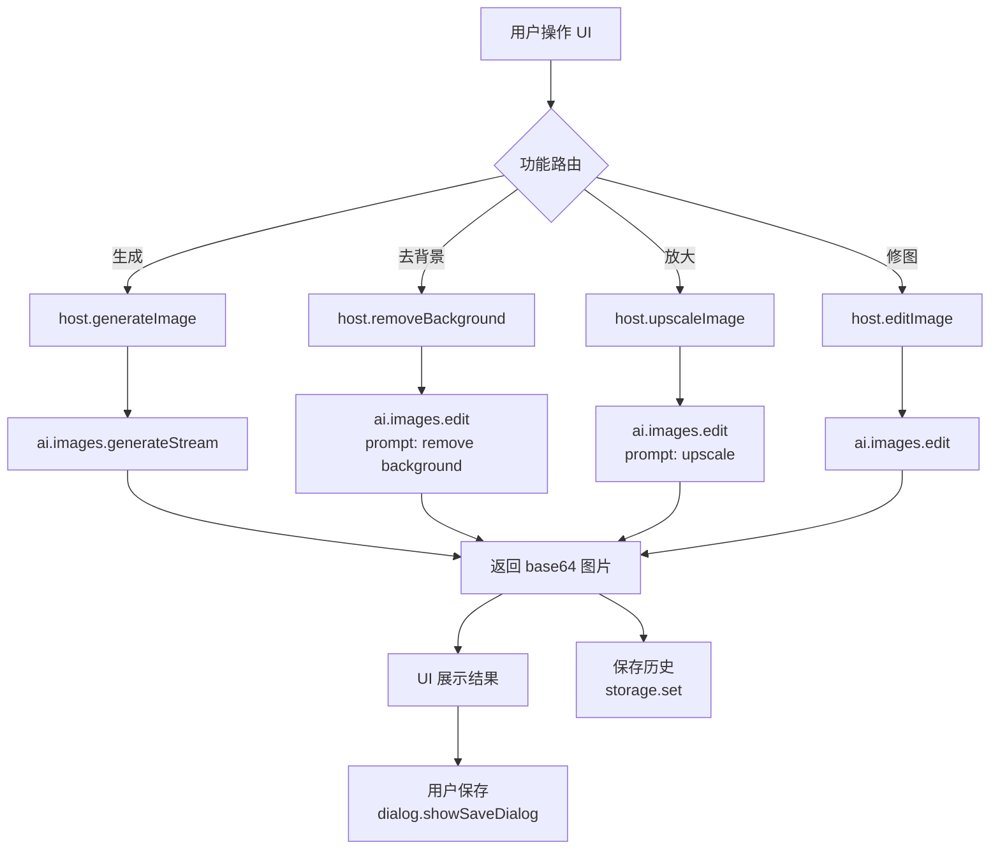

# AI 图像处理插件 (mulby-ai-image)

基于 Mulby 平台构建的一站式 AI 图像处理插件，整合 Mulby 内置的 AI 图片生成/编辑能力和 Sharp 图像处理引擎，提供文字生图、智能去背景、无损放大、AI 修图和历史记录等功能。

## User Review Required

> [!IMPORTANT]
> **AI 模型依赖**：插件使用 Mulby 内置的 `ai.images.generate`/`ai.images.edit` API 调用用户已配置的图像生成模型（如 `openai:gpt-image-1`）。用户需要在 Mulby AI 设置中配置至少一个支持图像生成的 Provider。

> [!IMPORTANT]
> **去背景实现方式**：Mulby 没有内置的专用抠图 API。方案如下：
> - **主方案**：使用 `ai.images.edit` API，通过 prompt 指令让 AI 模型去除背景并返回透明 PNG。
> - **辅助方案**：使用 Sharp API 进行基于颜色阈值的简单背景移除（适合纯色背景）。

> [!WARNING]
> **无损放大**：同样依赖 AI 图像编辑能力。使用 `ai.images.edit` 配合"upscale"类指令来实现 AI 超分辨率放大，同时提供 Sharp `resize` 作为基础放大的回退方案。

## Open Questions

> [!IMPORTANT]
> 1. 插件是否需要打包为 `.inplugin` 发布包？还是仅做开发阶段？（不用）
> 2. 历史记录最大保存数量？建议默认 100 条，使用 `storage` API 持久化。（100）
> 3. 是否需要暴露 AI 工具给 Mulby Agent（即 `manifest.tools` 声明）？目前方案仅作为独立插件使用。（独立使用）

## Proposed Changes

### 插件脚手架与配置

使用 `react` 模板（因为需要丰富的交互 UI），通过 Mulby CLI 创建。

#### [NEW] [manifest.json](file:///Users/zhuanz/workspace/other/mulby/plugins/mulby-ai-image/manifest.json)

核心 manifest 定义：
```json
{
  "name": "mulby-ai-image",
  "displayName": "AI 图像处理",
  "version": "1.0.0",
  "description": "AI 驱动的一站式图像处理工具：文字生图、智能去背景、无损放大、AI 修图",
  "type": "media",
  "main": "dist/main.js",
  "ui": "ui/index.html",
  "icon": "icon.png",
  "permissions": {
    "notification": true,
    "clipboard": true
  },
  "window": {
    "type": "default",
    "width": 1100,
    "height": 750,
    "minWidth": 900,
    "minHeight": 600
  },
  "pluginSetting": {
    "single": true,
    "defaultDetached": true
  },
  "features": [
    {
      "code": "ai-image-generate",
      "explain": "AI 生成图片 - 输入文字描述生成高质量图片",
      "mode": "detached",
      "cmds": [
        { "type": "keyword", "value": "生图" },
        { "type": "keyword", "value": "ai画" }
      ]
    },
    {
      "code": "ai-image-remove-bg",
      "explain": "智能去背景 - 自动移除图片背景",
      "mode": "detached",
      "cmds": [
        { "type": "keyword", "value": "去背景" },
        { "type": "img", "label": "AI 去背景" }
      ]
    },
    {
      "code": "ai-image-upscale",
      "explain": "无损放大 - AI 提升图片分辨率",
      "mode": "detached",
      "cmds": [
        { "type": "keyword", "value": "放大图片" },
        { "type": "img", "label": "AI 无损放大" }
      ]
    },
    {
      "code": "ai-image-edit",
      "explain": "AI 修图 - 通过文字指令修改图片内容",
      "mode": "detached",
      "cmds": [
        { "type": "keyword", "value": "修图" },
        { "type": "img", "label": "AI 修图" }
      ]
    }
  ]
}
```

**设计决策**：
- `defaultDetached: true`：图像处理需要较大画布，独立窗口体验更好
- 多个 feature code 对应不同功能入口，同时支持关键词触发和图片拖入触发
- `img` 类型 cmd 让用户可以直接拖拽图片到 Mulby 触发对应功能

---

### 后端逻辑 (src/main.ts)

#### [NEW] [main.ts](file:///Users/zhuanz/workspace/other/mulby/plugins/mulby-ai-image/src/main.ts)

后端入口文件，负责：
- `run(context)` 根据 `context.featureCode` 路由到不同功能
- `host` 对象导出以下方法供 UI 调用：
  - `generateImage(context, { prompt, model?, size?, count? })` — 调用 `ai.images.generate` 或 `ai.images.generateStream`
  - `editImage(context, { attachmentId, prompt, model? })` — 调用 `ai.images.edit`
  - `removeBackground(context, { attachmentId })` — 通过 AI edit + prompt "remove background, output transparent PNG"
  - `upscaleImage(context, { attachmentId, scale? })` — 通过 AI edit + upscale prompt
  - `getModels(context)` — 调用 `ai.allModels()` 过滤出支持 `image-generation` 的模型
  - `uploadImage(context, { buffer, mimeType })` — 调用 `ai.attachments.upload` 上传用户选择的图片
  - `processWithSharp(context, { buffer, operations })` — 使用 `sharp.execute` 做本地图像处理
  - `saveHistory(context, { record })` — 使用 `storage.set` 保存历史记录
  - `getHistory(context)` — 使用 `storage.get` 读取历史记录
  - `deleteHistory(context, { id })` — 删除指定历史记录
  - `saveFile(context, { base64, format })` — 通过 `dialog.showSaveDialog` + `filesystem.writeFile` 保存文件

---

### 前端 UI (src/ui/)

使用 React + TypeScript 构建，采用深色主题的现代 UI 设计。

#### [NEW] [App.tsx](file:///Users/zhuanz/workspace/other/mulby/plugins/mulby-ai-image/src/ui/App.tsx)

主应用组件，包含：
- **侧边导航栏**：5 个功能模块切换（生成、去背景、放大、修图、历史）
- **路由管理**：基于 React state 的简单路由
- **全局状态**：当前选中功能、加载状态、错误信息

#### [NEW] [pages/GeneratePage.tsx](file:///Users/zhuanz/workspace/other/mulby/plugins/mulby-ai-image/src/ui/pages/GeneratePage.tsx)

AI 图片生成页面：
- 文字输入区域（支持多行）
- 模型选择下拉（从 `getModels` 获取可用模型）
- 尺寸选择（1024x1024, 1024x1536, 1536x1024 等）
- 生成数量选择（1-4）
- 生成结果展示区域，支持预览、下载、复制
- 流式生成时显示进度和预览

#### [NEW] [pages/RemoveBgPage.tsx](file:///Users/zhuanz/workspace/other/mulby/plugins/mulby-ai-image/src/ui/pages/RemoveBgPage.tsx)

智能去背景页面：
- 图片上传区域（支持拖拽、点击选择、粘贴）
- 左右对比视图（原图 vs 去背景结果）
- 导出按钮（透明 PNG）
- 棋盘格背景展示透明区域

#### [NEW] [pages/UpscalePage.tsx](file:///Users/zhuanz/workspace/other/mulby/plugins/mulby-ai-image/src/ui/pages/UpscalePage.tsx)

无损放大页面：
- 图片上传区域
- 放大倍数选择（2x, 4x）
- 放大前后对比视图
- 分辨率信息展示
- 导出按钮

#### [NEW] [pages/EditPage.tsx](file:///Users/zhuanz/workspace/other/mulby/plugins/mulby-ai-image/src/ui/pages/EditPage.tsx)

AI 修图页面：
- 图片上传区域
- 文字指令输入框（如"调整为暖色调"、"添加模糊背景"）
- 预设常用修改建议（风格转换、色调调整等）
- 修改结果展示 + 原图对比

#### [NEW] [pages/HistoryPage.tsx](file:///Users/zhuanz/workspace/other/mulby/plugins/mulby-ai-image/src/ui/pages/HistoryPage.tsx)

历史记录页面：
- 瀑布流/网格布局展示历史图片
- 每条记录显示：缩略图、操作类型标签、时间、原始 prompt
- 支持点击查看大图、重新编辑、下载、删除
- 按操作类型筛选

#### [NEW] [components/](file:///Users/zhuanz/workspace/other/mulby/plugins/mulby-ai-image/src/ui/components/)

公共组件：
- `ImageUploader.tsx` — 统一的图片上传组件（拖拽/点击/粘贴）
- `ImagePreview.tsx` — 图片预览组件（缩放、拖动）
- `CompareView.tsx` — 左右/滑动对比视图
- `LoadingOverlay.tsx` — 生成/处理中的加载覆盖层（带进度）
- `ModelSelector.tsx` — AI 模型选择器
- `Sidebar.tsx` — 侧边导航栏

#### [NEW] [hooks/useMulby.ts](file:///Users/zhuanz/workspace/other/mulby/plugins/mulby-ai-image/src/ui/hooks/useMulby.ts)

Mulby API hooks 封装。

#### [NEW] [styles.css](file:///Users/zhuanz/workspace/other/mulby/plugins/mulby-ai-image/src/ui/styles.css)

全局样式，设计风格：
- **深色主题**：`#0a0a0f` 背景，渐变紫蓝色强调色 (#6366f1 → #8b5cf6)
- **玻璃态效果**：半透明卡片 + backdrop-filter
- **现代排版**：Google Fonts Inter
- **流畅动画**：过渡效果和微交互
- **棋盘格**：透明图片展示背景

---

### 构建配置

#### [NEW] [package.json](file:///Users/zhuanz/workspace/other/mulby/plugins/mulby-ai-image/package.json)

依赖项：
- `react`, `react-dom` — 前端框架
- `typescript` — 类型系统
- `vite` — 前端构建
- `@vitejs/plugin-react` — Vite React 插件
- `esbuild` — 后端打包

#### [NEW] [vite.config.ts](file:///Users/zhuanz/workspace/other/mulby/plugins/mulby-ai-image/vite.config.ts)

Vite 配置，`base: './'`，输出到 `ui/` 目录。

#### [NEW] [tsconfig.json](file:///Users/zhuanz/workspace/other/mulby/plugins/mulby-ai-image/tsconfig.json)

TypeScript 配置。

---

### 数据流架构



### 历史记录数据结构

```typescript
interface HistoryRecord {
  id: string;           // UUID
  type: 'generate' | 'remove-bg' | 'upscale' | 'edit';
  prompt?: string;      // 生成/编辑时的文字描述
  model?: string;       // 使用的模型
  thumbnail: string;    // 缩略图 base64（压缩到 150x150）
  resultAttachmentId: string;  // 使用 storage.attachment 存储完整图片
  originalAttachmentId?: string; // 编辑类操作的原图
  createdAt: number;    // 时间戳
  metadata?: {          // 额外信息
    size?: string;
    scale?: number;
    dimensions?: { width: number; height: number };
  };
}
```

历史图片的完整数据使用 `storage.attachment` 存储（单文件最大 50MB），元数据列表使用 `storage.set/get` 存储。

---

## Verification Plan

### Automated Tests

```bash
# 1. 安装依赖
cd plugins/mulby-ai-image && npm install

# 2. 后端构建
npm run build:backend

# 3. 前端构建
npm run build:ui

# 4. 完整构建
npm run build
```

### Manual Verification

在 Mulby 中加载插件后验证：
1. 输入关键词"生图"能正确触发插件
2. 拖拽图片到 Mulby 显示"AI 去背景"/"AI 修图"等选项
3. 图片生成流程正常：输入 prompt → 点击生成 → 显示加载 → 展示结果
4. 去背景功能：上传图片 → 自动处理 → 显示对比 → 导出透明 PNG
5. 无损放大：上传图片 → 选择倍数 → 处理 → 导出
6. AI 修图：上传图片 → 输入指令 → 处理 → 对比展示
7. 历史记录：操作后自动保存，可浏览、查看大图、删除
8. 导出功能：各模块的"保存"按钮能弹出系统保存对话框
9. 最终 icon.png 不是脚手架默认图标
