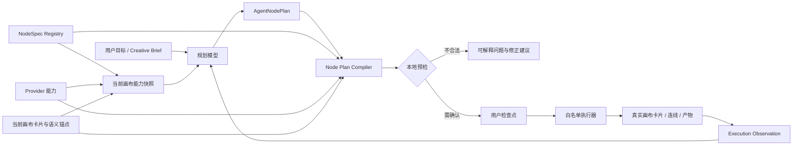

# Agent 节点能力注册表与受控编排方案

日期：2026-08-14
适用范围：AI 创意画布 Agent、节点创建、生成计划、Provider 能力校验
状态：设计完成，待分阶段实施
关联方案：`2026-08-libtv-inspired-semantic-agent-roadmap.md`、`2026-08-product-visual-continuity-hardening.md`

## 1. 执行摘要

当前 Agent 并不是“理解画布节点后自主调用工具”。规划模型只生成剧本或产品广告 Creative Brief，本地固定执行器再依次创建视觉设定、静帧、视频和时间线。节点知识已经存在，但分散在不同模块：

- `nodeCapabilities.ts` 知道节点接受哪些媒体输入和数量上限。
- `paramSchema.ts` 知道节点参数、默认值和 UI 选项。
- `providers/config.ts` 知道视频 Provider 的文生视频、图生视频、首尾帧、画幅、时长和分辨率能力。
- `generate.ts` 知道如何执行节点、发送参数并把真实结果写回卡片。
- `generationPlan.ts` 知道部分执行前校验、任务数和费用信息。
- `workflowPlanner.ts` 只把创作 Brief Schema、少量画布上下文和配方提示词交给模型，没有节点目录。

这种分裂导致模型会把“轻快通勤节拍”误认为图片身份、无法提前理解视频输入上限，也无法表达“创建音频、全景、分组”等节点意图。继续增加提示词只能缓解单个案例，不能形成稳定能力边界。

本方案新增四层：

1. **NodeSpec Registry**：所有节点用途、输入、参数、输出和 Agent 权限的唯一真相来源。
2. **Capability Snapshot**：按当前画布和 Provider 动态裁剪、供规划模型阅读的能力快照。
3. **Node Plan Compiler**：把模型节点意图编译成本地白名单操作，完成类型、参数、依赖、画布、费用和权限校验。
4. **Execution Observation**：执行后把真实卡片、实际参数、产物、错误和可重试性结构化回传。

模型仍不获得任意画布修改、任意 MCP 或任意脚本执行能力。最终决策权属于本地注册表、编译器和用户检查点。

## 2. 目标与非目标

### 2.1 目标

- Agent 能准确知道每种节点的用途、适用场景、输入和输出。
- Agent 只能选择当前 Provider 和当前画布真正支持的参数。
- 节点计划在创建卡片前即可发现输入类型、数量、比例、时长和费用问题。
- 同一能力声明同时服务连线校验、参数面板、Agent 规划、执行预检和测试。
- 保留现有 Creative Brief、故事板、连续性锚点、固定检查点与可恢复执行能力。
- 后续增加新节点或 Provider 时，只需扩展注册表和执行适配器，不再同步修改多套提示词。

### 2.2 非目标

- 第一阶段不让模型直接调用 `graphStore` 或任意宿主 API。
- 不允许 Agent 删除、覆盖用户已有卡片，除非用户明确选择目标并在检查点确认。
- 不立即支持所有节点的自动创建；先覆盖当前真实工作流中的图片、视频和文本，再逐步开放全景与音频。
- 不把画布改造成通用节点编程 IDE。
- 不在模型上下文中暴露 API Key、完整本地路径或无关画布内容。

## 3. 核心设计原则

1. **注册表是唯一真相来源**：输入策略、参数 UI、预检和 Agent 能力快照从同一 `NodeSpec` 派生。
2. **模型表达意图，本地代码决定实现**：模型写“需要一张角色设定图”，编译器决定卡片类型、默认参数和实际引用。
3. **动态能力晚绑定**：视频画幅、时长、分辨率、首尾帧能力必须根据执行时 Provider 解析。
4. **画布隔离**：自动检索和输入解析严格限制在工作流 `sourceBoardId`。
5. **输入有语义槽位**：不只知道“能接两张图”，还要知道第一张是产品主参考、第二张是角色或尾帧。
6. **实际结果高于计划结果**：执行记录保存 Provider 实际采用的参数和真实产物，而不是重复模型预期。
7. **失败可解释、可重试**：编译错误、Provider 错误、媒体缺失和生成失败必须分开表达。
8. **幂等与可恢复**：每个计划节点和本地卡片建立稳定映射，重试不重复创建或计费。

## 4. 目标架构



第一阶段仍保留现有固定工作流命令。`AgentNodePlan` 先作为 Creative Brief 与执行器之间的中间表示，由本地代码确定性生成；稳定后再允许模型直接输出受限节点计划。

## 5. NodeSpec Registry

### 5.1 数据结构

建议新增 `src/ui/services/nodeSpecs.ts`：

```ts
type AgentNodeAction =
  | 'reference'
  | 'create'
  | 'update-owned'
  | 'generate'
  | 'inspect-output'

interface NodeInputSlotSpec {
  id: string
  label: string
  accepts: MaterialKind[]
  min: number
  max?: number
  ordered: boolean
  orderMeaning?: string[]
  requiredWhen?: NodeCondition
  description: string
}

interface NodeParamSpec {
  key: string
  label: string
  type: 'string' | 'number' | 'boolean' | 'enum'
  required: boolean
  default?: unknown
  enum?: Array<{ value: string | number; label: string }>
  min?: number
  max?: number
  description: string
  providerBound?: 'aspects' | 'durations' | 'resolutions' | 'voices'
  visibleWhen?: NodeCondition
}

interface NodeOutputSpec {
  materialKind?: MaterialKind
  cardinality: 'none' | 'one' | 'parameter'
  cardinalityParam?: string
  cardFields: Array<'text' | 'assetUrl' | 'assetLocalPath' | 'mime'>
  supportsVersions: boolean
  description: string
}

interface NodeSpec {
  version: 1
  kind: CardKind
  label: string
  purpose: string
  suitableFor: string[]
  unsuitableFor: string[]
  agent: {
    actions: AgentNodeAction[]
    defaultEnabled: boolean
    requiresApproval: AgentNodeAction[]
  }
  inputs: NodeInputSlotSpec[]
  params: NodeParamSpec[]
  output: NodeOutputSpec
  lifecycle: {
    generatable: boolean
    terminalStatuses: CardStatus[]
    retryableStatuses: CardStatus[]
  }
}
```

`NodeCondition` 只允许本地可解释条件，如 `param.refMode === 'keyframe'`、`provider.imageToVideo === true`，不能保存任意代码。

### 5.2 动态解析

静态注册表描述产品语义，`resolveNodeSpec` 合并运行时能力：

```ts
interface NodeSpecContext {
  boardId: string
  provider?: ProviderConfig
  videoCapabilities?: VideoProviderCapabilities
  projectDefaults: {
    textModelId?: string
    imageModelId?: string
    panoModelId?: string
  }
}

function resolveNodeSpec(kind: CardKind, context: NodeSpecContext): ResolvedNodeSpec
```

例如视频节点：

- Provider 不支持图生视频时，移除图片输入槽和 `refMode`。
- 支持首帧但不支持尾帧时，图片上限为 1，`refMode` 只显示“首帧”。
- 支持尾帧且 `refMode=keyframe` 时，输入顺序固定为 `[首帧, 尾帧]`。
- 画幅、时长和分辨率枚举由 Provider 能力覆盖通用默认值。

### 5.3 节点目录

| 节点 | 主要用途 | 输入 | 核心参数 | 输出 | 首期 Agent 权限 |
| --- | --- | --- | --- | --- | --- |
| `text` | 提示词、脚本、分析、导演增强 | 文本、图片 | temperature、shotCount | 文本 | 引用、读取；N3 开放创建/生成 |
| `image` | 角色、产品、场景、静帧、编辑 | 文本、多张图片 | aspect、resolution、count、seed | 1–4 张图片，主图 + 结果集 | 创建、生成、读取结果 |
| `pano` | 360 环境与导演台背景 | 文本、图片 | 固定 2:1、resolution、seed | 单张全景图片 | N3 开放 |
| `video` | 文生视频、图生视频、首尾帧 | 文本、0–2 张图片 | aspect、resolution、duration、camera、motion、refMode、seed | 单个视频 | 创建、生成、读取结果 |
| `audio` | TTS 配音 | 文本 | voice、speed、format | 单个音频 | N3 开放 |
| `source` | 用户导入的只读媒体 | 无 | 无 | 已有图片/视频/音频/文本 | 只引用，禁止生成和覆盖 |
| `group` | 空间组织和阶段分区 | 无 | color、collapsed | 无媒体 | N3 可由布局器创建，不由模型直接创建 |
| `note` | 用户便签 | 无 | 无 | 无媒体 | 默认不创建，防止 Agent 制造无效卡片 |

### 5.4 与现有模块的收敛

- `nodeCapabilities.ts` 改为调用 `resolveNodeSpec`，保留现有公开函数作为兼容包装。
- `paramSchema.ts` 从 `ResolvedNodeSpec.params` 转换 UI 字段，不再维护第二份参数枚举。
- `generationPlan.ts` 使用同一注册表验证输入、参数和预计输出数量。
- `generate.ts` 在提交前再次用注册表校验，形成最后一道防线。
- `workflowPlanner.ts` 使用注册表生成模型可读能力快照。

## 6. Agent Capability Snapshot

### 6.1 快照结构

规划模型不需要完整内部类型，只接收压缩后的可执行能力：

```ts
interface AgentCapabilitySnapshotV1 {
  version: 1
  registryVersion: string
  board: {
    id: string
    aspect?: string
    style?: string
  }
  nodes: Array<{
    kind: CardKind
    purpose: string
    agentActions: AgentNodeAction[]
    inputs: Array<{
      slot: string
      accepts: MaterialKind[]
      min: number
      max?: number
      orderMeaning?: string[]
    }>
    params: Array<{
      key: string
      required: boolean
      default?: unknown
      allowed?: Array<string | number>
    }>
    output: {
      kind?: MaterialKind
      cardinality: string
    }
  }>
  providers: Array<{
    kind: 'image' | 'video' | 'audio' | 'text'
    available: boolean
    modelId?: string
    capabilities?: Record<string, unknown>
  }>
  currentBoardResources: Array<{
    id: string
    kind: CardKind
    title: string
    outputKind?: MaterialKind
    outputAvailable: boolean
    semanticRole?: AssetRole
    locked?: boolean
  }>
  limits: {
    maxPlannedNodes: number
    maxGenerationTasks: number
    crossBoardAutomaticReferences: false
  }
}
```

### 6.2 裁剪规则

- 只包含当前 `sourceBoardId` 的卡片和锚点。
- 只包含当前配方允许使用的节点类型。
- 不传 API Key、本地绝对路径、完整媒体二进制或其他画布内容。
- 大画布优先传选中源卡、上游连接、锁定锚点和标题摘要；其余资源按相关性截断。
- 只传 Provider 能力，不传请求头和请求体模板中的秘密。
- 快照带 `registryVersion` 和哈希，执行时能力变化必须重新编译计划。

## 7. AgentNodePlan

### 7.1 计划数据模型

```ts
interface AgentNodePlanV1 {
  version: 1
  id: string
  boardId: string
  goal: string
  capabilitySnapshotHash: string
  nodes: AgentPlannedNode[]
  checkpoints: AgentPlanCheckpoint[]
}

interface AgentPlannedNode {
  id: string
  kind: CardKind
  intent: string
  semanticRole?: AssetRole
  semanticSubjectKind?: WorkflowContinuitySubjectKind
  title: string
  prompt: string
  params: Record<string, unknown>
  inputs: AgentPlannedInput[]
  expectedOutput: {
    materialKind?: MaterialKind
    quantity: number
    purpose: string
  }
  generationPolicy: 'materialize-only' | 'generate-after-approval' | 'reuse-if-ready'
  dependsOn: string[]
}

interface AgentPlannedInput {
  slot: string
  sourceType: 'card' | 'anchor' | 'planned-node'
  sourceId: string
  priority: number
  purpose: string
}
```

模型不能提交 `x/y`、本地路径、Provider URL、API Key 或任意命令。卡片坐标由现有避让布局器计算，Provider 由策略解析，媒体路径由执行结果产生。

### 7.2 产品广告示例

```json
{
  "id": "plan-node-action",
  "kind": "image",
  "intent": "生成产品一手开盖动作设定",
  "semanticRole": "prop",
  "semanticSubjectKind": "product-action",
  "title": "设定·一手开盖动作",
  "prompt": "同一只手握住产品并由拇指开盖，另一只手完全离开画面",
  "params": { "aspect": "1:1", "resolution": "1K", "count": 1 },
  "inputs": [
    { "slot": "identity-primary", "sourceType": "planned-node", "sourceId": "product-master", "priority": 0, "purpose": "产品身份主参考" },
    { "slot": "identity-secondary", "sourceType": "planned-node", "sourceId": "character-master", "priority": 1, "purpose": "人物身份次参考" }
  ],
  "expectedOutput": { "materialKind": "image", "quantity": 1, "purpose": "动作连续性基准" },
  "generationPolicy": "generate-after-approval",
  "dependsOn": ["product-master", "character-master"]
}
```

编译器会检查图片节点能消费这两个输入，并保持输入优先级；不会因为模型把音乐写入 `anchorNames` 就创建额外图片。

## 8. Node Plan Compiler

### 8.1 编译阶段

1. **Schema 校验**：严格 JSON Schema，所有字段完整且无额外属性。
2. **权限校验**：节点类型和动作必须在当前配方及 `NodeSpec.agent.actions` 中。
3. **画布校验**：所有现有卡片和锚点必须属于 `boardId`；禁止隐式跨画布引用。
4. **参数归一化**：补默认值、限制范围、删除未知参数、解析 Provider 动态枚举。
5. **输入槽校验**：检查媒体类型、数量、顺序、可用性和条件要求。
6. **输出校验**：检查上游节点输出是否能满足下游输入。
7. **依赖校验**：检测不存在的节点、循环依赖和未完成前置节点。
8. **Provider 校验**：模型、图生视频、尾帧、画幅、时长、分辨率和 TTS 能力。
9. **资源校验**：任务数量、预计时长、已知费用、确认阈值和并发限制。
10. **编译操作**：生成本地稳定 ID、幂等键和白名单操作，不立即执行。

### 8.2 编译结果

```ts
interface CompiledAgentPlanV1 {
  version: 1
  sourcePlanId: string
  registryVersion: string
  boardId: string
  operations: CompiledAgentOperation[]
  issues: GenerationPlanIssue[]
  taskCount: number
  estimatedCost?: number
  currency?: string
  requiresApproval: boolean
}

type CompiledAgentOperation =
  | CreateOwnedCardOperation
  | UpdateOwnedCardOperation
  | BindReferenceOperation
  | GenerateCardOperation
  | LockAnchorOperation
  | OpenTimelineOperation
```

首期不提供删除操作。`UpdateOwnedCardOperation` 只能修改同一工作流创建的卡片；修改用户卡片必须生成单独检查点。

### 8.3 错误与自动修正

错误分为：

- `plan-invalid`：模型输出字段或依赖不合法，重新规划不产生费用。
- `capability-mismatch`：Provider 不支持参数，允许编译器安全降级或要求用户选择。
- `input-missing`：上游结果未生成、文件缺失或类型不匹配。
- `approval-required`：计划合法但涉及批量生成、费用或用户卡片修改。
- `execution-error`：实际 Provider、网络、下载或媒体保存失败。

只有以下情况允许自动修正：

- 缺省参数补充注册表默认值。
- `plannedDuration` 映射到能覆盖它的 Provider 原始时长，并明确显示裁切。
- 参数值大小写或等价格式规范化。
- 删除模型输出的未知参数。

以下情况必须暂停：

- 不支持的画幅且无法无损映射。
- 视频需要图片但没有可用首帧。
- 需要尾帧但 Provider 不支持。
- 输入引用其他画布。
- 预计费用达到用户阈值。
- 要修改用户已有卡片。

## 9. 安全执行器

### 9.1 执行边界

- 执行器只接受 `CompiledAgentOperation`，不接受模型原始 JSON。
- 创建卡片使用现有图事务和避让布局算法。
- 生成继续调用 `generateCard`，不建立第二套 Provider 请求链。
- 每个操作带 `idempotencyKey`；重启、重试或恢复不会重复创建卡片。
- 工作流只操作 `sourceBoardId`，切换活动画布不改变任务归属。
- 用户卡片默认只读；Agent 创建的卡片通过 `meta.workflowOwnershipV1` 标识。
- 每个批量生成阶段继续经过 Generation Plan 和用户检查点。

### 9.2 所有权元数据

```ts
interface WorkflowOwnershipV1 {
  version: 1
  runId: string
  planNodeId: string
  operationId: string
  createdBy: 'agent'
  boardId: string
}
```

它用于幂等查找、允许更新、历史记录定位和删除 Agent 历史时保留画布产物。

## 10. Execution Observation

### 10.1 结构化结果

```ts
interface AgentExecutionObservationV1 {
  version: 1
  runId: string
  operationId: string
  planNodeId: string
  cardId?: string
  status: 'created' | 'queued' | 'running' | 'completed' | 'failed' | 'skipped' | 'stale'
  resolvedInputs: Array<{
    slot: string
    sourceCardId?: string
    anchorId?: string
    materialKind: MaterialKind
  }>
  resolvedParams: Record<string, unknown>
  output?: {
    materialKind: MaterialKind
    quantity: number
    assetAvailable: boolean
    mime?: string
  }
  provider?: {
    id: string
    modelId?: string
  }
  error?: {
    category: string
    message: string
    retryable: boolean
  }
  inputFingerprint: string
  completedAt?: number
}
```

Observation 不复制 Base64、完整路径或媒体内容。需要模型复盘时只传“结果可用、尺寸、时长、类型、错误类别、用户是否锁定”等摘要。

### 10.2 反馈策略

- 正常完成：固定工作流继续下一步，不重新调用模型。
- 可重试 Provider 错误：保留卡片，允许用户或 Runner 原位重试。
- 能力变化：计划标记 `stale`，重新编译而不是重新创作全部 Brief。
- 用户编辑上游：比较输入指纹，只标记受影响的派生节点。
- 视觉质量问题：由用户在检查点拒绝特定结果，Agent 仅重规划相关节点。

## 11. UI 方案

### 11.1 生成计划卡片

每个计划节点展示：

- 节点图标、类型和用途。
- 将创建或复用的卡片。
- 输入来源及其语义槽位，例如“产品身份主参考”“角色次参考”“首帧”“尾帧”。
- Prompt 摘要。
- Provider、模型、画幅、分辨率、数量、时长。
- 预期输出类型和数量。
- 依赖节点和预计执行顺序。
- 费用状态、警告和阻塞原因。

非法节点不显示为可执行任务，而是在计划中标红并解释，例如：“轻快通勤节拍属于音乐信息，不能创建图片身份节点”。

### 11.2 执行状态

- Agent 历史中的每个计划节点可定位真实卡片。
- 失败项显示“修改参数”“更换 Provider”“补充输入”“重试”四类可用动作。
- 输出被用户编辑后显示“上游已变化，2 个派生节点待更新”。
- 计划中被本地编译器修正的参数必须显示“计划值 → 实际值”。

## 12. 持久化与兼容

### 12.1 注册表

`NodeSpec` 是代码资产，不进入工程 JSON。保存：

- `registryVersion`
- `capabilitySnapshotHash`
- `AgentNodePlanV1`
- `CompiledAgentPlanV1` 的最小恢复信息
- `AgentExecutionObservationV1`

### 12.2 WorkflowRun V2

建议新增可选字段，不立即破坏 V1：

```ts
interface WorkflowRunV2Extension {
  capabilitySnapshotHash?: string
  nodePlan?: AgentNodePlanV1
  compiledPlan?: CompiledAgentPlanV1
  observations?: AgentExecutionObservationV1[]
}
```

- 旧 V1 工作流继续走固定 `AgentCommandName` 执行器。
- 新计划先生成同等固定步骤，同时附带节点计划。
- 当节点计划编译和执行稳定后，再把固定步骤改为节点计划的高层检查点投影。
- 读取工程时对外部计划数据做 Schema 清理，不信任持久化文件中的操作权限。

## 13. 实施路线

### N0：注册表收敛，不改变行为

目标：建立唯一真相来源，现有 UI 和生成链保持不变。

- 新增 `nodeSpecs.ts` 和 `resolveNodeSpec`。
- 覆盖 8 种 `CardKind`。
- `nodeCapabilities.ts` 改为兼容包装。
- `paramSchema.ts` 从注册表生成字段。
- 建立注册表完整性、输入策略和参数等价测试。

验收：现有全量测试不变，所有节点 UI 参数与当前一致。

### N1：能力快照进入 Planner

目标：模型明确知道可用节点、输入、参数和输出。

- 生成板级 `AgentCapabilitySnapshotV1`。
- 按配方裁剪节点目录。
- 将 Provider 动态能力纳入快照。
- Planner 提示改为引用能力快照，不再手写节点规则。
- 增加快照脱敏、画布隔离和 token 大小测试。

验收：模型不能规划不存在的比例、时长、节点或输入类型。

### N2：节点计划与编译器覆盖现有工作流

目标：产品广告和剧本短片都先形成可见、可校验的节点计划。

- 定义严格 `AgentNodePlanV1` Schema。
- 实现参数、输入槽、依赖、Provider 和费用编译校验。
- 把现有连续性、静帧和视频步骤投影为节点计划。
- UI 生成计划展示输入、参数和输出。
- 执行仍映射到当前 `prepareWorkflowContinuity`、`materializeStoryboardShots`、`shotToVideo` 和 `generateCard`。

验收：现有工作流产物不变，但每个节点创建原因、输入和实际参数都可解释。

### N3：受控开放更多节点

目标：在注册表和编译器保护下扩展能力。

- 文本节点：摘要、导演增强、提示词中间产物。
- 音频节点：旁白与角色配音，进入时间线。
- 全景节点：环境设定和 3D 导演台背景。
- 分组节点：由本地布局器按阶段整理 Agent 产物。
- 仍不让模型创建便签和素材节点。

验收：音频不会被接入图片节点，全景固定 2:1，视频首尾帧顺序正确。

### N4：结果反馈与局部重规划

目标：Agent 基于真实执行结果处理失败和用户编辑。

- 持久化 Observation。
- Provider 能力变化只触发重新编译。
- 上游编辑基于指纹传播 `stale`。
- 检查点支持拒绝单个计划节点并局部重规划。
- 对重复失败设置重试上限，避免自动消耗额度。

验收：编辑产品主设定只重做包装、动作、品牌和相关镜头，不重建无关场景。

### N5：评估有限模型工具调用

只有 N0–N4 稳定后，才评估给模型开放只读工具，如“查询当前计划状态”和“读取节点能力”。创建、更新、生成仍必须经过编译器和用户检查点。

## 14. 测试矩阵

### 14.1 注册表测试

- 8 种 `CardKind` 均有且只有一个 NodeSpec。
- 每个可生成节点都有输入、参数、输出和生命周期声明。
- `source/group/note` 不可生成。
- 参数默认值与当前 UI 完全一致。
- 注册表与 `generate.ts` 支持类型一致。

### 14.2 编译器测试

- 音频不能接入图片节点。
- 普通视频最多消费一张图，首尾帧模式严格消费两张且顺序正确。
- Provider 不支持尾帧时拒绝 `keyframe`。
- 不支持的画幅或分辨率阻止执行。
- 计划时长映射到可覆盖的 Provider 时长并显示裁切。
- 未知参数被删除并产生提示。
- 跨画布输入被拒绝。
- 循环依赖被拒绝。
- 任务数和费用阈值触发检查点。

### 14.3 工作流回归

- 音乐节拍、旁白和“无人出镜”不创建图片节点。
- 产品主设定是唯一根节点。
- 包装只引用产品；动作引用产品和角色；品牌引用产品和包装。
- 风格图片不污染镜头主体。
- 用户编辑并锁定设定后，静帧使用新版本。
- Agent 在画布 3 不引用画布 1 的同名卡片。
- 重启后恢复不会重复创建或重复计费。

### 14.4 输出测试

- 文本节点完成后 `text` 可用。
- 图片多结果保存在结果集，主图与数量一致。
- 全景输出保持 2:1 和全景元数据。
- 视频保存实际 Provider、模型、时长、画幅和本地媒体引用。
- 音频保存真实 MIME 和格式。
- Observation 与真实卡片状态一致，不伪造完成。

## 15. 代码落点

| 模块 | 计划改动 |
| --- | --- |
| `src/ui/services/nodeSpecs.ts` | 新增统一注册表和动态解析器 |
| `src/ui/services/nodeCapabilities.ts` | 改为 NodeSpec 兼容包装 |
| `src/ui/services/paramSchema.ts` | 从 NodeSpec 生成 UI 字段 |
| `src/ui/services/agentCapabilitySnapshot.ts` | 新增板级能力快照与脱敏 |
| `src/ui/services/agentNodePlan.ts` | 计划类型、Schema、清理和指纹 |
| `src/ui/services/agentPlanCompiler.ts` | 参数、输入、依赖、权限和 Provider 编译 |
| `src/ui/services/agentPlanExecutor.ts` | 白名单操作、幂等和所有权 |
| `src/ui/services/agentObservations.ts` | 真实执行结果与错误分类 |
| `src/ui/services/workflowPlanner.ts` | 注入能力快照并逐步输出 NodePlan |
| `src/ui/services/agentCommands.ts` | 兼容映射到编译计划与执行器 |
| `src/ui/services/generationPlan.ts` | 展示 NodePlan 任务、输入、参数和费用 |
| `src/ui/components/AgentDrawer.tsx` | 展示节点计划、依赖、修正和结果 |
| `src/ui/types.ts` | WorkflowRun 可选 V2 扩展类型 |
| `test/nodeSpecs.test.ts` | 注册表完整性和兼容测试 |
| `test/agentPlanCompiler.test.ts` | 编译器与安全边界测试 |
| `test/workflowAgent.test.ts` | 现有工作流端到端回归 |

## 16. 验收标准

完成 N0–N2 后必须满足：

- Agent 规划上下文明确包含允许创建的节点、输入、参数和输出。
- UI、Agent、预检和执行不再各自维护不同的节点能力表。
- 模型不能直接创建卡片；所有计划都经过本地编译器。
- 每个拟创建节点都能回答“为什么创建、输入是什么、参数是什么、会输出什么”。
- Provider 不支持的时长、画幅、分辨率、图生视频或尾帧计划在付费前被发现。
- 任何自动引用都严格限制在任务发起画布。
- 错误的音乐、旁白、否定角色不会产生图片任务。
- 生成计划与实际提交参数的差异对用户可见。
- 全量测试、生产构建和 Mulby Verify 通过。

## 17. 推荐实施顺序

下一步直接进入 N0，不先扩展 Agent 自主能力。N0 的价值是把当前散落的节点知识收敛为稳定契约，同时保持行为不变；它是后续能力快照和节点计划编译器的必要基础。

N0 完成后进入 N1，让模型第一次真正“知道”节点；N2 再让节点知识影响计划和执行。这样可以分别验证“注册表是否准确”“模型是否理解”“本地编译器是否安全”，避免三层同时变化后难以定位问题。
