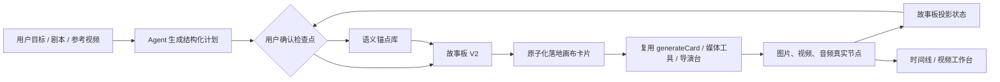

# AI 创意画布 · 语义素材、故事板与 Agent 工作流详细方案

> 日期：2026-08-13
> 状态：实施中；M0–M5 已完成代码和自动化测试，M4 仍待真实 Agent / Provider 全链路验收，M5 仍待真实视频 Provider 的局部重拍质量验收
> 适用版本：`ai-creative-canvas 0.7.x` 之后
> 参考对象：LibTV 无限画布、LibTV Skill / Agent 公开创作项目，以及本插件当前实现
> 与既有计划的关系：本方案不替代 `2026-07-stabilization-and-convergence-plan.md`。稳定性清单已完成的部分继续作为质量基线；其中尚未实施的“两套时间线收敛”保留为独立工作流，并与本方案共享镜头元数据。

---

## 0. 执行摘要

本插件已经具备较完整的自由画布、卡片生成、媒体后期、分镜扇出、3D 导演台、视频工作台、任务续跑和 Provider 诊断能力。当前主要问题不是工具数量不够，而是这些能力仍然主要由用户逐个入口操作，缺少以下三层组织能力：

1. **语义素材层**：系统知道某张图是什么格式，却不知道它是“角色、场景、道具、声音还是风格锚点”。
2. **结构化创作层**：现有分镜表能生成和落地卡片，但缺少稳定镜头 ID、双向同步和画布外的全局故事板视图。
3. **可控编排层**：没有一个能读取现有画布、提出计划、等待用户确认、分阶段执行并在重启后恢复的 Agent 工作流。

LibTV 最值得借鉴的是“Agent 提计划、Skill 约束方法、素材作为锚点、每一步落实为可见节点”的组合，而不是复制其模型商城、积分体系或黑盒一键出片。

本方案推荐按以下顺序推进：

1. 语义素材与 AutoLink-lite。
2. 故事板 V2 与“画布 / 故事板”双视图。
3. 视频视觉拉片与结构化镜头报告。
4. 生成计划、成本保护和可恢复 Agent。
5. 局部重拍、通用多版本比较。
6. 最后再评估 Skill 分享、Blender 交换和团队协作。

Provider 设置不是当前主线。它已有能力声明、请求预览、诊断和安全存储；本阶段只补充 Agent 所需的价格元数据、能力快照和执行前校验。

---

## 1. 调研结论与证据边界

### 1.1 已直接验证的产品行为

本次实际操作了 LibTV 官网、Skill 详情和一个公开创作项目。未登录状态下新建私人画布需要微信或手机号登录，因此没有执行上传、付费或真实生成；以下结论来自公开可操作项目而非仅凭宣传页：

- Agent 先输出包含原文、引用锚点、景别、运镜、镜头描述和时长的结构化分镜。
- Agent 会按视频模型时长限制重新组合镜头，而不是把原表原样提交。
- 遇到创意分歧时暂停，要求用户选择结尾或字幕方案。
- 角色模卡、场景、道具、Moodboard、音乐、视频片段和最终合成都落实为画布节点。
- “故事板”是画布的结构化投影视图，按关键元素、角色、场景、道具、音频和视频重新组织内容。
- 完整流程包含素材生成、分段视频、视频拼接、字幕和音乐合成，并保留中间结果。

可复查来源：

- [LibTV 官网](https://www.liblib.tv/)
- [公开创作项目：是枝裕和风格短片制作](https://www.liblib.tv/canvas/chat-share?shareId=Q7P1BiwUdF)
- [LibTV 官方 Skills 仓库](https://github.com/libtv-labs/libtv-skills)
- [LibTV 产品实测](https://www.woshipm.com/ai/6361430.html)
- [LibTV 3D 导演台实测](https://watermelonwater.tech/insights/libtv%E8%A7%A3%E5%86%B3ai%E8%A7%86%E9%A2%91%E7%AB%99%E4%BD%8D%E5%AE%9E%E6%B5%8B/)
- [第三方产品介绍与用户评价](https://watcha.cn/products/libtv)

### 1.2 应借鉴的能力

| 能力 | 借鉴原因 | 本插件落点 |
|---|---|---|
| 角色 / 场景 / 道具等语义锚点 | 让一致性引用从“文件引用”升级为“创作对象引用” | 语义素材元数据、锚点库、AutoLink 建议 |
| Agent 分阶段执行 | 降低长工作流的操作成本，同时保留人工创意决策 | 工作流计划、检查点、可恢复执行器 |
| Skill 约束方法 | 将专业方法复用到分镜、广告、拉片等任务 | 复用 Mulby `ai.skills`，不另造 Skill 运行时 |
| 工作流 / 故事板双视图 | 大画布下按空间浏览和按镜头管理各有所长 | `CanvasStage` 与 `StoryboardWorkspace` 切换 |
| 逐帧拉片 | 把参考视频转为可研究、可复用的结构化镜头 | 当前场景检测之上的视觉拉片报告 |
| 锚点锁定的局部重拍 | 视频出错时只替换问题片段 | 视频工作台区间选择、首尾帧约束和无损回填 |
| 可见的执行过程 | 提升信任感，便于局部重做 | 每一步产出真实卡片和诊断记录 |

### 1.3 不应直接复制的部分

- 不复制模型商城和积分体系；继续保持 Mulby 原生模型与外部 Provider 并存。
- 不做完全黑盒的一句话出片；任何批量生成前必须展示计划，关键步骤必须可暂停。
- AutoLink 不静默自动连接；只给出建议、匹配原因和置信度，由用户确认。
- 不把社区 Feed、云端团队空间或 Skill 市场放在近期主线。
- 不因参考产品使用某种 UI 就替换当前自研画布引擎。
- 不让 Agent 直接执行任意模型工具调用；模型只能提出结构化计划，实际修改由本地白名单命令执行。

---

## 2. 当前项目基线

### 2.1 已具备且应继续复用的能力

| 领域 | 当前实现 | 结论 |
|---|---|---|
| 画布 | 自研 DOM 卡片、SVG 连线、无限缩放、多画布、分组、对齐、虚拟化、小地图 | 不重做引擎 |
| 引用 | `refIds`、连线、`@名称`、输入能力过滤、失效引用提醒、改名联动 | AutoLink 应建立在 `references.ts` 上 |
| 分镜 | `Shot`、`generateShots`、镜头表编辑、CSV、批量落地图片卡、图片转视频卡 | 升级数据模型和同步，不重写生成逻辑 |
| 图片 | 文 / 图生图、多图、局部重绘、箭头文字标注、扩图、抠像、放大、宫格 | Agent 只负责调度现有动作 |
| 视频 | Provider submit/poll、断点续跑、首尾帧、视频工作台、抽帧、场景检测、合成 | 可支持拉片和局部重拍 |
| 3D 导演台 | 人物与道具摆位、姿势、机位、连续性、全景环境、take、批量生成 | 已形成差异化优势 |
| 视频导演增强 | 读取真实上游文本、参考图、风格包、时长、画幅和 Provider 能力 | 可作为 Agent 的单镜头规划器 |
| Provider | 能力声明、请求体映射、诊断、请求预览、密钥加密保存 | 仅做增量扩展 |
| Mulby AI | `ai.call`、结构化输出、附件、图片任务、token estimate、`ai.skills` | 足以实现第一版 Skill + Agent |

关键代码位置：

- 领域模型：`src/ui/types.ts`
- 图状态与撤销：`src/ui/store/graphStore.ts`
- 引用解析：`src/ui/services/references.ts`
- 分镜服务：`src/ui/services/storyboard.ts`
- 分镜界面：`src/ui/components/StoryboardModal.tsx`
- 生成总入口：`src/ui/services/generate.ts`
- 视频导演增强：`src/ui/services/directorPrompt.ts`
- 视频本地工具：`src/ui/services/mediaVideo.ts`、`mediaOps.ts`
- 持久化与迁移：`src/ui/services/persistence.ts`
- 工程媒体收集：`src/ui/services/projectMedia.ts`
- Mulby API 类型：`src/types/mulby.d.ts`

### 2.2 当前缺口

1. `Material` 只有媒体类型，没有角色、场景、道具等业务身份。
2. `@` 仍以当前显示名称匹配，不能根据别名、角色身份和上下文提出建议。
3. `Shot` 没有稳定 ID；镜头落地后主要通过 `meta.shot` 副本关联，无法可靠双向同步。
4. 分镜是文本卡的模态窗口，不是大项目的常驻组织视图。
5. 场景检测只产代表帧，没有时间段、景别、运镜、人物、台词和声音结构。
6. `taskStore` 只记录全局活动数量，不足以表达多步骤、检查点和可恢复工作流。
7. 批量生成前没有统一的任务数、模型、能力和费用预览。
8. 图片多结果和导演台 take 已各自实现，但没有跨卡片通用的版本选择模型。

### 2.3 约束

- 工程数据采用分片持久化，卡片与连线位于画布分片；新增项目级元数据不能破坏增量保存。
- 媒体文件不进入工程 JSON；任何新锚点如持有媒体路径，必须接入导出、导入重映射和未引用媒体清理。
- 视频 Provider 能力和价格不可假设统一；费用只能在有可靠数据时显示金额，否则显示任务数量和“未知”。
- 当前没有稳定的语音转写 API；视频拉片 V1 只保证视觉分析，可合并用户提供的 SRT / 文本，不能承诺自动听写。
- 生成链路已有 runId、取消和视频任务续跑机制，新 Agent 必须复用，不能绕过。

---

## 3. 产品目标与原则

### 3.1 产品目标

让用户从“在画布上逐张操作卡片”升级到“用结构化计划管理一组仍然可独立编辑的卡片”。

典型成功路径：

1. 用户输入故事、脚本、广告需求或导入参考视频。
2. 系统识别或建议角色、场景、道具、声音和风格锚点。
3. Agent 提出阶段计划、预计任务和需要用户决定的问题。
4. 用户确认后生成可编辑故事板。
5. 用户可在故事板或画布中修改任一镜头。
6. Agent 分批生成素材、静帧和视频，并在每个阶段停留检查。
7. 失败时只重做受影响的镜头或视频片段。

### 3.2 设计原则

1. **画布仍是真实工作现场**：Agent 不能只在聊天里声称完成，产物必须有节点或结构化文档。
2. **结构化数据优先**：镜头、锚点、工作流步骤都有稳定 ID，标题仅用于展示。
3. **建议而非替用户决定**：自动引用、改写和批量生成都先预览。
4. **模型只规划，本地代码执行**：LLM 输出 JSON；本地验证器和白名单命令修改工程。
5. **可恢复、可重放、幂等**：关闭插件或 Provider 超时后可以继续，不重复计费。
6. **局部重做**：数据带依赖和输入指纹，变化时只标记相关步骤过期。
7. **能力诚实**：未知费用、缺少语音识别、Provider 不支持尾帧等情况必须明确显示。
8. **复用 Mulby 能力**：专业知识使用 `window.mulby.ai.skills`；插件只维护画布工作流配方。

### 3.3 非目标

- 近期不做实时多人协作和云端权限系统。
- 不建设独立模型商城、积分和支付系统。
- 不把当前画布改造成节点式编程 IDE。
- 不在第一版开放任意脚本、任意 MCP 或任意宿主工具给 Agent。
- 不承诺跨工程素材库；第一阶段只做工程内锚点库。

---

## 4. 目标信息架构

### 4.1 三个主要工作面

1. **画布**：自由探索、节点关系、空间分组、局部编辑。
2. **故事板**：按镜头和关键元素查看大项目，批量检查缺失产物与生成状态。
3. **Agent 抽屉**：提出目标、选择 Skill、预览计划、回答检查点、查看执行日志。

顶栏增加“画布 / 故事板”切换。Agent 以右侧抽屉存在，不替换节点编辑面板；选中节点时仍使用现有编辑面板。

### 4.2 数据与执行关系



### 4.3 真相来源

| 数据 | 唯一真相来源 | 其他视图的处理 |
|---|---|---|
| 素材身份、别名、用途 | 工程级语义锚点 | 节点显示徽标；引用建议读取索引 |
| 镜头描述、顺序、时长 | `StoryboardDocV2` | 画布镜头卡保存稳定 backlink |
| 媒体产物、任务状态 | 卡片 | 故事板按 backlink 实时投影，不复制状态 |
| 节点依赖 | `edges` / `refIds` | Agent 不维护第二套依赖图 |
| Agent 步骤状态 | `WorkflowRun` | Task Center 和 Agent 抽屉共同展示 |
| 单卡生成详情 | 现有 generation meta | Agent 只保存相关 cardId / taskId 摘要 |

---

## 5. 数据模型方案

### 5.1 工程级语义锚点

在 `ProjectDoc` 增加可选的 `assetAnchors`。第一版限定工程内使用：

```ts
type AssetRole =
  | 'character'
  | 'scene'
  | 'prop'
  | 'voice'
  | 'style'
  | 'music'
  | 'reference'

interface AssetAnchor {
  id: string
  role: AssetRole
  name: string
  aliases: string[]
  description: string
  tags: string[]
  mediaKind: MaterialKind
  source?: { boardId: string; cardId: string; resultIndex?: number }
  pinnedMedia?: {
    assetUrl?: string
    assetLocalPath?: string
    mime?: string
    text?: string
    thumbUrl?: string
  }
  revision: number
  locked: boolean
  createdAt: number
  updatedAt: number
}

interface AnchorReference {
  anchorId: string
  mention: string
  acceptedAt: number
}
```

在 `Card` 增加可选 `anchorRefs?: AnchorReference[]`。它与现有 `refIds` 分工如下：

- `refIds` / 连线：当前画布中节点对节点的直接引用。
- `anchorRefs`：工程内稳定语义对象引用，不依赖卡片标题。
- `@名称`：输入层的可读语法，继续兼容；确认锚点后由 `anchorRefs` 保持稳定绑定。

实现要求：

- 锚点名称变更时更新显示 mention，但绑定仍使用 `anchorId`。
- 锚点源卡删除后，如果存在 `pinnedMedia`，引用仍可用；没有固定媒体时标为“需重新关联”。
- `projectMedia.ts` 必须扫描锚点媒体，确保工程导出、导入重映射和媒体清理不会漏掉。
- 锚点只保存必要媒体引用，不复制大文件或 Base64。
- 同一源卡可以创建多个语义锚点，但 UI 默认提示用户避免重复身份。

### 5.2 故事板 V2

现有 `Shot` 继续兼容，但新增稳定镜头模型。第一阶段仍以来源文本卡为故事板所有者，存入其 `meta.storyboardV2`，避免新建卡片类型或改动分片协议：

```ts
interface StoryboardDocV2 {
  version: 2
  id: string
  ownerCardId: string
  title: string
  sourceFingerprint: string
  shots: StoryboardShotV2[]
  createdAt: number
  updatedAt: number
}

interface StoryboardShotV2 extends Shot {
  id: string
  order: number
  anchorIds: string[]
  imageCardId?: string
  videoCardId?: string
  audioCardId?: string
  sourceRange?: { start: number; end: number }
  version: number
}

interface StoryboardBacklink {
  storyboardId: string
  shotId: string
  stage: 'image' | 'video' | 'audio'
}
```

同步规则：

- 故事板中的描述、时长、镜头顺序是主数据。
- 图片 / 视频 / 音频卡的状态、模型和媒体产物不复制到故事板，通过 cardId 实时读取。
- 修改镜头提示词后，对应卡片标记为“输入已变化”，但不自动重新生成。
- 删除产物卡后不删除镜头，只清除对应 cardId 并显示“未落地”。
- 重复点击“落地镜头”必须幂等：已有有效 cardId 时只更新，不重复创建。
- 每张落地卡写入 `meta.storyboardBacklink`，便于从画布定位故事板行。

### 5.3 工作流运行模型

工作流状态保存于 `ProjectDoc.workflowRuns`，只保留进行中的运行和最近若干次摘要，避免工程无限膨胀：

```ts
type WorkflowStepStatus =
  | 'pending'
  | 'ready'
  | 'waiting-approval'
  | 'running'
  | 'done'
  | 'error'
  | 'canceled'
  | 'stale'

interface WorkflowStep {
  id: string
  kind:
    | 'analyze-brief'
    | 'prepare-anchors'
    | 'prepare-storyboard'
    | 'generate-assets'
    | 'generate-images'
    | 'generate-videos'
    | 'compose'
  title: string
  dependsOn: string[]
  status: WorkflowStepStatus
  requiresApproval: boolean
  inputFingerprint: string
  outputCardIds: string[]
  taskIds: string[]
  error?: string
  startedAt?: number
  completedAt?: number
}

interface WorkflowRun {
  version: 1
  id: string
  boardId: string
  goal: string
  recipeId: string
  skillIds: string[]
  status: 'draft' | 'waiting' | 'running' | 'done' | 'error' | 'canceled'
  steps: WorkflowStep[]
  answers: Record<string, string>
  createdAt: number
  updatedAt: number
}
```

不保存模型的隐藏推理内容，只保存用户可见计划、输入摘要、输出 ID、任务 ID、错误和时间戳。

### 5.4 Mulby Skill 与画布配方的分工

当前 Mulby API 已提供：

- `ai.skills.listEnabled()`
- `ai.skills.preview(...)`
- `AiOption.skills`
- `AiOption.params.responseFormat = 'json_schema'`

因此不建设插件私有 Skill 运行时：

| 概念 | 负责内容 | 示例 |
|---|---|---|
| Mulby Skill | 专业知识、分析方法、提示词约束 | 电影分镜、商业广告、拉片方法 |
| Canvas Recipe | 固定执行步骤、检查点、白名单命令 | 剧本转短片、素材混剪、产品广告 |
| Style Pack | 视觉风格描述 | 胶片、赛博朋克、日系自然光 |
| Provider Capability | 能否执行某类生成 | 图生视频、尾帧、原生音频、时长 |

第一版 Agent 只把 Skill 的系统提示用于规划，不允许 Skill 自动开启 MCP 或内部工具。选择 Skill 时先用 `ai.skills.preview` 展示影响；如果 Skill 依赖 MCP，提示“当前画布 Agent 仅使用其提示知识，不执行外部工具”。

### 5.5 生成计划与费用

新增 `GenerationPlan`，在批量执行前列出：

- 步骤和目标卡片。
- 模型 / Provider。
- 输入素材和锚点。
- 数量、分辨率、时长。
- Provider 能力冲突。
- 预计任务数。
- 可获取时的 token 或金额估算。

ProviderConfig 可选增加价格元数据，例如按请求、秒数或分辨率计价。没有配置或宿主无法估算时显示“费用未知”，绝不伪造金额。Mulby 文本调用可使用 `ai.tokens.estimate`；图片和外部视频以实际返回记录及用户配置为准。

---

## 6. 功能详细设计

### 6.1 语义素材与 AutoLink-lite

#### 用户入口

- 图片、素材、文本、音频卡编辑面板增加“作为锚点”区域。
- 可选择角色、场景、道具、声音、音乐、风格、普通参考。
- 填写名称、别名、描述、标签，并选择是否锁定当前产物。
- 节点卡面只显示一枚紧凑角色徽标，例如“角色·祖父”，不扩大编辑面板高度。

#### 引用建议

当用户编辑图片、视频、全景或文本生成输入时，在输入框下方显示“建议引用”：

- 建议项包含缩略图、锚点角色、名称、匹配原因。
- 点击“引用”才写入 `anchorRefs` 和可读 `@名称`。
- 点击忽略后，本轮编辑不重复出现。
- 已连接或已引用的素材不重复建议。

#### 第一版匹配策略

按确定性规则评分，不先引入 embedding：

1. 名称完全命中。
2. 别名完全命中。
3. 提示词与名称 / 标签的分词重合。
4. 角色词、场景词、道具词等上下文类型提示。
5. 当前故事板镜头显式的 `anchorIds`。

只展示高、中置信度建议；置信度低的结果放入“更多素材”，不主动打扰。后续若确定性召回不足，再增加一次低频 LLM 消歧，且只返回候选 ID，不允许模型直接连接。

#### 验收标准

- 锚点改名后引用不丢失。
- 锚点源卡删除后，锁定产物仍可生成；未锁定则明确提示重新关联。
- AutoLink 永远不静默增加连线或消耗生成额度。
- 建议结果与最终 `resolveGenerationPrompt` 使用的素材一致。
- 旧工程没有锚点也能按原 `@` / 连线方式正常工作。

### 6.2 故事板工作区

#### 布局

- 顶栏：“画布 / 故事板”切换。
- 左侧：当前工程的关键元素筛选，包括角色、场景、道具、声音和风格锚点。
- 中部：镜头表，支持列表密度和缩略图密度两种显示。
- 右侧：当前镜头检查器，编辑描述、图片提示词、视频提示词、对白、音效、时长和引用锚点。

每个镜头行至少显示：

- 镜号、景别和时长。
- 静帧缩略图与图片卡状态。
- 视频缩略图与视频卡状态。
- 角色 / 场景 / 道具锚点。
- 对白、音效摘要。
- “定位画布”“生成缺失”“重做图片”“创建 / 打开视频”的快捷操作。

#### 同步与历史

- 切换视图不复制工程，只是读取相同 graph 和 storyboard 数据。
- 故事板批量修改使用一次图事务，撤销一步还原整个动作。
- 镜头重新排序只改 `order`，不移动画布卡；用户可选择“按镜头顺序重新排版画布”。
- 重新排版只移动关联镜头卡，不改变其他自由节点。
- 50 镜以上使用行虚拟化；媒体预览只用现有缩略图 / poster，不挂载大量视频元素。

#### 验收标准

- 同一镜头可从故事板定位画布卡，也可从画布卡返回故事板行。
- 故事板修改提示词后，卡片显示输入已变化，不自动烧额度。
- 落地操作幂等，重复执行不产生重复卡片。
- 关闭重开后镜头顺序、锚点和关联卡片保持一致。
- 100 镜工程滚动和切换视图无明显卡顿。

### 6.3 视频视觉拉片

#### 第一版范围

第一版定位为“视觉拉片”，不是完整语音转写：

1. 复用 `probeDuration` 获取时长。
2. 扩展场景检测，使其返回切点时间和代表帧，而不只是图片路径。
3. 对过长镜头按最大间隔补采样，对极短镜头合并分析。
4. 每批最多上传有限数量代表帧给视觉模型，避免一次性上下文过大。
5. 输出结构化镜头：时间范围、景别、构图、人物、动作、运镜、场景、色彩、节奏和可学习提示词。
6. 如果用户连接了 SRT / 文本素材，则按时间或顺序合并对白；没有则对白留空并标记“未转写”。
7. 结果可保存为文本报告、故事板 V2，或进一步落地代表帧卡片。

#### 不做的假能力

- 未接入可靠 STT 前不显示“已识别完整对白”。
- 不从单张代表帧断言精确运镜；运镜分析至少读取同镜头首、中、尾帧。
- 不因场景检测失败就生成伪切点；允许用户手工修正时间范围。

#### 验收标准

- 30 秒、2 分钟和 10 分钟视频都能产出有时间范围的报告。
- 切点时间单调递增、不重叠、总范围不越过视频时长。
- 中止分析不会留下 running 状态或孤儿临时帧。
- 相同输入和检测参数可复用切点缓存。
- 拉片结果可一键转换为故事板 V2，且保留来源视频和时间范围 backlink。

### 6.4 可恢复 Agent

#### 第一版配方

只提供一个受控配方：“故事 / 剧本转短片”。固定阶段为：

1. 分析需求。
2. 提取或建议锚点。
3. 生成故事板草案。
4. 用户确认角色、场景、时长和结尾。
5. 落地并生成缺失素材。
6. 生成镜头静帧。
7. 用户选优或修改问题镜头。
8. 生成视频片段。
9. 送入时间线编排；最终合成仍需用户确认。

后续再增加“产品批量广告”“视频拉片复刻”“讲解视频”等配方。

#### 执行机制

- LLM 只能返回符合 JSON Schema 的计划或决策建议。
- `agentCommands.ts` 提供白名单命令，例如创建锚点、保存故事板、批量落地卡片和调用 `generateCard`。
- 每个命令先验证目标 board、card、Provider 能力和输入指纹。
- 批量图修改通过图事务一次提交，避免撤销栈和自动保存被逐卡刷爆。
- 步骤使用 `runId + stepId` 作为幂等键；已有有效输出时跳过。
- 关闭重开后，从 `WorkflowRun`、卡片状态和持久化视频 taskId 恢复。
- 用户修改依赖后，后续步骤变为 `stale`，由用户选择“更新计划”或“仍按旧计划执行”。
- 取消只停止未提交和可取消任务；已在外部 Provider 运行但不可取消的任务标记为“结果将被忽略”，复用现有 runId 门控。

#### 检查点

以下情况必须暂停：

- 目标受众、画幅或总时长不明确。
- 检测到同名或冲突角色锚点。
- 预计生成任务超过用户配置阈值。
- 将要生成视频或执行最终合成。
- Agent 提议覆盖已有故事板或替换用户选中的版本。

#### Skill 选择

- Agent 抽屉列出已启用的 Mulby Skills。
- 用户可不选、手选或使用自动推荐。
- 调用前展示 Skill 名称、选择原因和提示影响。
- 结构化输出仍由插件 JSON Schema 约束，Skill 不能改变命令白名单。

#### 验收标准

- Agent 不经确认不能启动大批量生成。
- 计划中的每个完成步骤都能定位到真实卡片或故事板数据。
- 中途关闭插件后可继续，已完成步骤不重复生成。
- 用户可以只重跑一个失败步骤。
- Agent 日志不保存隐藏推理，也不泄露 Provider API Key。

### 6.5 视频片段局部重拍

建立在视频工作台之上：

1. 用户选择待替换时间范围。
2. 自动提取区间前后的边界帧和问题区间代表帧。
3. 读取原视频关联的镜头、锚点、风格包和导演增强上下文。
4. 创建替换视频卡，首帧 / 尾帧根据 Provider 能力启用。
5. 生成成功后创建新的非破坏式剪辑配方，把新片段拼回原视频。
6. 原视频和原配方保留，新结果成为新卡片。

第一版只支持单区间；多区间在单区间稳定后再做。

### 6.6 通用版本比较

抽象当前图片 `meta.results` 和导演台 `takes` 的共同能力：

- 缩略图横条或接触表。
- A/B 放大比较。
- “设为当前版本”。
- 标星 / 淘汰。
- 查看生成输入与 Provider。
- 从任一版本继续生成。

不要求第一版迁移所有历史结构，可先建立读取适配层，再在新生成时写统一结构。

---

## 7. 技术架构与文件拆分

### 7.1 新增模块建议

| 文件 | 职责 |
|---|---|
| `src/ui/services/semanticAssets.ts` | 锚点 CRUD、索引、匹配、媒体解析、指纹 |
| `src/ui/services/referenceSuggestions.ts` | AutoLink 候选、评分和解释 |
| `src/ui/services/storyboardV2.ts` | 迁移、稳定 ID、双向关联、幂等落地 |
| `src/ui/components/StoryboardWorkspace.tsx` | 故事板主工作区 |
| `src/ui/components/StoryboardShotInspector.tsx` | 镜头详情编辑 |
| `src/ui/services/videoAnalysis.ts` | 切点、采样、视觉分析和报告 |
| `src/ui/store/workflowStore.ts` | Agent UI 会话、运行控制和选择状态 |
| `src/ui/services/workflowPlanner.ts` | Skill 预览、JSON Schema 计划生成 |
| `src/ui/services/workflowRunner.ts` | 状态机、恢复、幂等和取消 |
| `src/ui/services/agentCommands.ts` | 可执行白名单命令 |
| `src/ui/components/AgentDrawer.tsx` | 目标、计划、检查点和日志 |
| `src/ui/components/GenerationPlanDialog.tsx` | 批量任务预览和费用保护 |
| `src/ui/services/mediaVersions.ts` | 图片、视频与导演 Take 的统一版本读取、采用、比较和分支 |
| `src/ui/components/MediaVersionDialog.tsx` | 版本接触表、A/B、标星 / 淘汰和采用 UI |
| `src/ui/services/videoReshoot.ts` | 边界帧、上下文继承、替换卡和自动非破坏回填 |
| `src/ui/components/VideoReshootDialog.tsx` | 视频工作台的单区间局部重拍入口 |

### 7.2 现有模块改动

| 文件 | 主要改动 |
|---|---|
| `src/ui/types.ts` | AssetAnchor、Storyboard V2、WorkflowRun、可选字段；schema 版本 |
| `src/ui/store/graphStore.ts` | 工程级锚点操作、原子批量事务、storyboard backlink 清理 |
| `src/ui/services/references.ts` | 合并锚点素材；稳定绑定优先、旧 `@` 兼容 |
| `src/ui/canvas/NodeEditor.tsx` | 锚点编辑、引用建议、计划入口 |
| `src/ui/canvas/CardView.tsx` | 紧凑语义徽标、过期状态 |
| `src/ui/services/storyboard.ts` | 作为 V1 兼容层，委托给 storyboardV2 |
| `src/ui/components/StoryboardModal.tsx` | 保留快速入口，数据源切换为 V2；主编辑迁到工作区 |
| `src/ui/services/mediaVideo.ts` | 返回切点时间、缓存和中止清理 |
| `src/ui/services/generate.ts` | 接收 generation plan / workflow 上下文；不改变单卡入口 |
| `src/ui/components/TaskCenter.tsx` | 同时展示卡片任务与工作流步骤 |
| `src/ui/store/uiStore.ts` | `workspaceView`、Agent 抽屉和故事板选择状态 |
| `src/ui/App.tsx` | 画布 / 故事板工作区切换、Agent 抽屉挂载 |
| `src/ui/services/persistence.ts` | v2 → v3 迁移、运行记录裁剪、输入校验 |
| `src/ui/services/projectMedia.ts` | 锚点媒体的导出、导入重映射和清理引用 |
| `src/ui/services/providers/types.ts` | 可选价格元数据，不改变旧配置 |

### 7.3 图事务

`graphStore` 已提供原子批量事务，并已用于 Storyboard V2 批量落地：

```ts
applyGraphTransaction(label: string, mutate: (draft: GraphTransaction) => void): void
```

事务要求：

- 只压一次撤销快照。
- 一次不可变更新写回工程。
- 返回创建的 cardId / edgeId 映射。
- 校验 parentId、edge 两端、boardId 和重复 ID。
- 不把外部异步生成放在事务内部；事务只负责创建或更新计划节点。

### 7.4 性能策略

- 语义索引按工程 revision 缓存，不在每次键盘输入时全量扫描所有卡片。
- AutoLink 输入采用 150–250ms debounce，只运行本地评分。
- 故事板超过 50 行启用虚拟化。
- 缩略图复用 `meta.thumb` 和 `meta.poster`，不加载原始 4K 图片和视频元素。
- Agent 日志只存结构化摘要；运行历史默认保留最近 20 次。
- 每次 Agent 批量落地只触发一次 graph 更新，避免自动保存和空间索引反复重建。

---

## 8. 分阶段实施计划

以下估算以单人熟悉当前代码为参考，不包含真实 Provider 等待和产品验收时间。

### M0 · 数据基础与事务（2–4 个工程日）

- [x] 新增可选领域类型与读取守卫。
- [x] graphStore 增加原子批量事务。
- [x] schema v3 / v4 迁移脚手架与旧工程回归夹具。
- [x] 工程导出 / 导入 / 媒体清理识别锚点媒体。
- [ ] 增加 typed meta 访问器，停止新代码继续散用 `(meta as any)`。

出口条件：旧工程无行为变化；批量创建 20 张镜头卡只产生一次 undo；含锚点媒体的工程可跨机导入。

### M1 · 语义锚点与 AutoLink-lite（5–8 个工程日）

- [x] 锚点 CRUD、锁定产物和失效状态。
- [x] 节点编辑面板的紧凑锚点编辑。
- [x] 确定性候选索引和匹配解释。
- [x] 输入框下方建议引用 chips。
- [x] `resolveGenerationPrompt` 接入稳定锚点引用。
- [x] 引用预览与真实生成输入同源。

出口条件：角色、场景、道具三类锚点可完成创建、建议、确认、改名、删除源卡和实际生成全链路。

### M2 · 故事板 V2 与双视图（7–11 个工程日）

- [x] 老 `meta.shots` 迁移到 Storyboard V2，并兼容首次读取。
- [x] 稳定 shotId 和卡片 backlink。
- [x] 幂等落地、重新排序和输入过期标记。
- [x] StoryboardWorkspace、镜头检查器、关键元素过滤。
- [x] 画布双向定位与按镜头重新排版。
- [x] 100 镜虚拟窗口、批量排版与撤销回归验证。

出口条件：同一短片可完全在故事板中检查，并能无损回到自由画布编辑。

### M3 · 视频视觉拉片（6–10 个工程日）

- [x] 场景切点返回时间范围：FFmpeg 场景帧文件名使用毫秒 PTS，不依赖节流进度回调；切点排序、去重、边界过滤，超长无切点区间自动拆分。
- [x] 首 / 中 / 尾帧自适应采样：极短镜头也保证采样时间合法，并可在工作台选择任一帧作为代表帧。
- [x] JSON Schema 视觉分析与分批合并：每批最多 4 镜 / 12 图，按全局镜头索引回填，缺失项不串镜；运镜只允许基于三帧差异谨慎判断。
- [x] 带时间码字幕可选合并：支持 SRT / VTT 区间匹配；普通文本不伪造时间轴，没有字幕时明确标记“未转写”。
- [x] 拉片报告、故事板转换和代表帧落地：报告可逐字段修订；代表帧和故事板转换均幂等、原子提交，故事板镜头保存源视频 `sourceRange`。
- [x] 缓存、中止和临时文件清理：报告缓存于源视频卡；源视频变化会标记过期；FFmpeg 与 AI 均可中止，失败 / 取消立即清理半成品帧与临时附件。
- [x] 便携工程兼容：源视频、全部三帧和代表帧进入媒体收集、跨机路径重映射与缺失媒体审计。

代码出口已满足：短镜头、长无切点视频、切点密集视频的区间 / 采样纯函数测试通过，报告可编辑并可转换故事板。发布前仍需在 Mulby 真实宿主使用三种时长视频和至少一个 Vision 模型做视觉质量验收；自动化测试不对模型审美质量作断言。

### M4 · 生成计划与 Agent V1（10–16 个工程日）

- [x] GenerationPlan 和 Provider 能力预检：批量生成与 Agent 都展示任务规模、模型 / Provider、参数冲突、Token 与费用可知性；不支持的画幅 / 分辨率 / 图生视频能力在提交前拦截。
- [x] Mulby Skill 列表、预览和手选：只使用宿主已启用 Skill，明确展示选择原因；调用时固定关闭 MCP、内部工具和额外 capabilities。
- [x] 计划 JSON Schema、白名单命令和 dry-run：模型只返回严格 `short_film_creative_brief`，本地固定生成六步配方；工程加载时拒绝非固定顺序或未知命令。
- [x] WorkflowRun 状态机、检查点、恢复和取消：步骤、输出卡 ID 和日志随工程持久化；重开将运行态安全降为暂停，视频 Provider 原任务继续按 taskId 恢复；支持暂停、取消、错误重试和从任一步重跑。
- [x] “故事 / 剧本转短片”固定配方：创作规格确认 → 故事板 → 静帧卡 → 静帧生成 → 静帧确认 → 视频卡 → 视频生成 → 时间线。
- [x] Task Center 与 Agent 抽屉联动：任务中心展示工作流状态并可定位到 Agent；抽屉展示计划、语义锚点建议、生成规模、检查点、步骤产物和日志。
- [x] 超阈值批量任务确认：多任务、能力警告 / 错误、十任务以上批次或 Provider 自定义费用阈值会触发确认；未知费用如实标记，不以虚构价格填充。

代码出口已满足：从文本卡到故事板、静帧和视频卡的完整流程可暂停、恢复、取消及从任一步重跑；故事板、静帧卡与视频卡均通过 backlink 幂等复用，生成步骤跳过已完成且输入未失效的卡片。发布前仍需在真实 Mulby 宿主用至少一个文本模型、图片模型和视频 Provider 完成一次全链路费用 / 质量验收。

### M5 · 局部重拍与版本比较（8–13 个工程日）

- [x] 视频工作台区间重拍入口：以播放头为中心给出默认区间，可精确填写起止时间并在生成前经过统一 GenerationPlan 预检。
- [x] 边界帧、锚点和导演方案上下文继承：抽取首 / 中 / 尾三帧，携带原提示、实际发送提示、导演增强、故事板 shot、锚点与画布风格快照；Provider 支持时启用首尾帧模式。
- [x] 替换片段非破坏回填：新增 `replace` 编辑层和 FFmpeg concat 编译；替换片生成后自动输出新成片，原片 / 替换片 / 编辑配方均保留，重开工程可续接未完成回填。
- [x] 图片结果 / 视频结果 / 导演 take 的统一读取适配：`mediaVersionsV1` 对新结果持续追加，旧 `meta.results` / `takes` 由稳定 ID 适配读取；版本媒体进入便携导出、路径重写和引用感知清理。
- [x] A/B、标星、采用版本和分支继续：图片、视频卡与导演 Take 共用版本工作区；采用会同步主媒体并清除派生封面，分支生成独立可编辑卡片。

出口条件：问题视频区间可独立重做，原视频不覆盖；图片与视频都能明确选择当前版本。

代码出口已满足：统一版本、局部重拍区间规范化、替换编译与媒体迁移测试通过。当前 V1 刻意只允许一次创建一个重拍区间；可在新成片上再次局部重拍形成可追踪分支。发布前需在真实 Mulby 宿主分别使用支持首尾帧、仅支持首帧的两个视频 Provider 验证边界衔接质量，并检查一条带音轨视频的原声连续性。

### M6 · 后续评估，不纳入近期承诺

- [ ] 第二、第三个 Canvas Recipe。
- [ ] Skill 配方导出和分享。
- [ ] glTF / Blender 相机交换。
- [ ] 工程间素材库。
- [ ] 团队协作、权限、成本中心。

---

## 9. 详细 Backlog

| ID | 优先级 | 任务 | 依赖 | 主要验收 |
|---|---|---|---|---|
| SEM-001 | P0 | AssetAnchor 类型、校验和工程存储 | M0 | 旧工程可加载，非法字段被清理 |
| SEM-002 | P0 | 锚点锁定当前媒体结果 | SEM-001 | 源卡重生成不改变锁定锚点 |
| SEM-003 | P0 | 锚点媒体进入工程导出 / 导入 | SEM-002 | 跨机导入后仍可引用 |
| SEM-004 | P0 | 本地 AutoLink 索引 | SEM-001 | 名称、别名、标签和角色匹配稳定 |
| SEM-005 | P0 | 引用建议 UI | SEM-004 | 用户确认前不修改图 |
| SEM-006 | P0 | 生成解析接入 anchorRefs | SEM-003 | 预览与实际输入一致 |
| SBD-001 | P0 | Storyboard V2 稳定 ID | M0 | 镜头重排不丢关联 |
| SBD-002 | P0 | 幂等镜头落地 | SBD-001 | 连点两次不重复建卡 |
| SBD-003 | P1 | 画布 / 故事板切换 | SBD-001 | 视图切换不复制数据 |
| SBD-004 | P1 | 关键元素筛选与镜头检查器 | SEM-006 | 可按角色 / 场景定位镜头 |
| SBD-005 | P1 | 批量生成缺失产物 | SBD-002 | 先展示 GenerationPlan |
| ANA-001 | P1 | 带时间切点的场景检测 | 无 | 时间范围合法、可中止 |
| ANA-002 | P1 | 视觉镜头分析 | ANA-001 | JSON Schema 解析稳定 |
| ANA-003 | P1 | 拉片转故事板 | ANA-002, SBD-001 | 保留来源视频时间范围 |
| PLN-001 | P0 | GenerationPlan 与能力校验 | 无 | 不支持的 Provider 在提交前拦截 |
| PLN-002 | P1 | 任务数量和费用估算 | PLN-001 | 未知费用明确显示未知 |
| AGT-001 | P1 | Skill 列表与 preview | 无 | 显示选中理由和 MCP 影响 |
| AGT-002 | P1 | WorkflowPlan JSON Schema | AGT-001 | 非法计划不能执行 |
| AGT-003 | P1 | 本地命令白名单 | M0, AGT-002 | LLM 不能直接修改 store |
| AGT-004 | P1 | WorkflowRun 状态机 | AGT-003 | 暂停、恢复、取消、重跑单步 |
| AGT-005 | P1 | 剧本转短片配方 | SEM, SBD, PLN | 完整 E2E 场景通过 |
| VID-001 | P2 | 单区间局部重拍 | ANA-001 | 原视频不覆盖 |
| VID-002 | P2 | 替换片段回填配方 | VID-001 | 二次打开仍可编辑 |
| VAR-001 | P2 | 通用版本适配层 | 无 | 兼容旧 results / takes |
| VAR-002 | P2 | A/B 选择和采用版本 | VAR-001 | 当前版本切换可撤销 |

---

## 10. 测试与验收方案

### 10.1 单元测试

新增测试建议：

- `test/semanticAssets.test.ts`
  - 名称、别名、标签评分。
  - 同名不同角色消歧。
  - 锚点锁定和源卡失效。
  - 重命名后稳定引用。
- `test/storyboardV2.test.ts`
  - V1 懒迁移。
  - 稳定 shotId。
  - 幂等落地。
  - 删除卡后关系修复。
  - 重排和总时长。
- `test/workflowRunner.test.ts`
  - 状态转移表。
  - 依赖未完成时禁止执行。
  - inputFingerprint 变化后标 stale。
  - 关闭重开恢复。
  - 同一步骤不重复执行。
- `test/storyboardWorkspace.test.ts`
  - 工程级故事板投影与关键元素 / 文本 / 状态筛选。
  - 100 镜虚拟窗口限制实际渲染行数。
  - 100 镜自动排版只产生一次 undo，且不移动无关卡片。
  - 删除镜头保留产物卡并清理失效 backlink。
- `test/videoAnalysis.test.ts`
  - 切点归一化。
  - 首 / 中 / 尾采样。
  - 分批结果合并。
  - 越界和重叠修复。

继续扩展现有：

- `test/references.test.ts`：旧 `@`、anchorRefs、连线和上传素材混用。
- `test/persistence.test.ts`：schema v2 → v3 → v4、旧分镜、分片工程和更高版本保留。
- `test/projectMedia.test.ts`：锚点固定媒体的导出、重映射和清理。
- `test/store/graphStore.test.ts`：事务只产生一次 undo。

### 10.2 集成测试

1. 旧工程打开、编辑、保存、重开。
2. 创建锚点、删除源卡、重新关联、导出、跨机导入。
3. 20 镜故事板批量落地、撤销、重做、重新排序。
4. Agent 在图片生成完成、视频提交后关闭插件，再打开恢复。
5. Provider 不支持尾帧或时长时，执行前阻止而不是提交后报错。
6. 拉片中止后临时帧清理。

### 10.3 视觉与交互验收

- 亮色 / 暗色。
- 1120×720 最小窗口和 1440×960 默认窗口。
- 10、50、100 镜故事板。
- 空工程、单素材、素材同名、素材缺失。
- Agent 抽屉与节点编辑面板同时存在时不遮挡主要操作。
- 锚点与 AutoLink 不把编辑面板再次撑得过高。

### 10.4 真实 Provider 验收

至少覆盖：

- 一个 Mulby 文本 / 视觉模型。
- 一个 Mulby 图片模型。
- 一个文生视频 Provider。
- 一个图生视频且支持尾帧的 Provider。
- 一个不支持尾帧、时长受限的 Provider，用于验证能力拦截。

真实 Provider 结果必须区分“插件接入错误”和“模型输出质量问题”，不能为了让自动化测试通过而把视觉质量判断写成代码断言。

---

## 11. 迁移与兼容策略

### 11.1 Schema v3 / v4

工程级语义锚点已在 v3 引入，Storyboard V2 稳定关联在 v4 引入：

- `assetAnchors` 缺省为 `{}`。
- `workflowRuns` 缺省为 `{}`。
- `Card.anchorRefs` 缺省为 `[]`。
- v4 把旧 `meta.shots` 迁移到 `meta.storyboardV2`，复用现有分镜图片卡并补齐 backlink。
- 仍保留读取旧 `meta.shots` 的兼容逻辑；分片工程即使 manifest 已升级，也会幂等修复旧 card shard。

### 11.2 旧引用兼容

- 现有连线、`refIds`、`@名称` 行为不变。
- 只有用户确认 AutoLink 后才新增 anchorRefs。
- resolver 优先稳定 anchorRefs，再处理旧 `@`；两者冲突时在输入预览中提示，不静默扩大素材集。

### 11.3 导入导出

- 轻量 JSON 保留本机路径语义，与当前行为一致。
- 含媒体导出必须把 `pinnedMedia` 纳入物理文件去重集合。
- 导入包统一重写锚点媒体路径、source boardId / cardId 和 storyboard card backlink。
- 缺失媒体保留元数据并显示“需重新关联”，不删除锚点或镜头。

---

## 12. 安全、隐私与费用保护

- Agent 不读取或记录 Provider API Key。
- 模型输出不能包含可直接执行的本地路径、命令或任意 host.call 方法名。
- 本地命令白名单在 TypeScript 中枚举并逐项校验参数。
- Skill 的 MCP / internalTools 在第一版关闭；只使用其提示知识。
- Agent 日志不保存隐藏 reasoning，只保存面向用户的计划和结果。
- 批量生成默认超过可配置阈值时要求二次确认。
- 最终合成、覆盖故事板、替换当前版本必须确认。
- 费用未知时明确显示未知，不能以 token 数冒充货币金额。
- 每个工作流步骤记录真实 Provider、模型、taskId 和发送内容摘要，便于申诉与排障。

---

## 13. 风险与对策

| 风险 | 影响 | 对策 |
|---|---|---|
| 数据模型一次扩张过大 | 迁移和导出易回归 | M0 先做可选字段、守卫和媒体测试；每个里程碑可独立发布 |
| Agent 造成重复提交 | 费用与信任损失 | 幂等键、input fingerprint、复用卡片状态和 taskId |
| AutoLink 错连 | 生成内容被错误素材污染 | 只建议不自动；显示理由；最终输入预览同源 |
| Storyboard 与画布双向同步循环 | 数据漂移、撤销异常 | 明确真相来源；卡片只保存 backlink；批量事务 |
| 工作流运行记录膨胀 | 工程保存变慢 | 只保留结构化摘要和最近 20 次；不存推理和大响应 |
| 视频拉片上下文过大 | 模型失败或费用过高 | 自适应采样、分批分析、缓存切点 |
| Provider 能力不统一 | 计划执行到中途失败 | GenerationPlan 阶段统一预检，逐卡参数收敛 |
| Skill 改坏 JSON 输出 | 计划无法解析 | `json_schema`、本地 validator、失败只允许重新规划 |
| UI 再次变得拥挤 | 编辑效率下降 | Agent 独立抽屉；锚点用紧凑徽标；诊断默认折叠 |

---

## 14. 产品指标

初期不追求社区规模，重点看可控性和效率：

- 从脚本到第一版可编辑故事板的完成率。
- 故事板落地后手工修正镜头的比例。
- AutoLink 建议接受、忽略和错误反馈率。
- Agent 运行的恢复成功率和重复提交率。
- 批量生成前被能力预检拦截的错误数量。
- 只重做单镜头 / 单片段而非整批重跑的比例。
- 50 / 100 镜项目的视图切换和滚动耗时。
- 用户从计划中取消高成本批量任务的次数，用于评估费用保护价值。

不以“Agent 自动生成了多少节点”作为成功指标；节点越多不等于创作效率越高。

---

## 15. 第一实施切片

正式动工时建议只领取下面这一个可独立交付的切片，不同时启动 Agent 和故事板大改：

### 切片 S1：角色 / 场景 / 道具锚点 + 本地引用建议

范围：

1. `AssetAnchor` 和 `Card.anchorRefs` 类型。
2. ProjectDoc 可选 `assetAnchors`，先不创建 WorkflowRun。
3. 节点编辑面板增加紧凑锚点编辑。
4. 输入框下方显示本地 AutoLink 建议。
5. 确认后稳定引用；生成输入预览和实际生成同源。
6. 工程媒体导出 / 导入 / 清理支持锁定锚点。
7. 单元测试、迁移测试和 1120×720 视觉验收。

明确不含：

- LLM 语义消歧。
- 跨工程素材库。
- Agent。
- 故事板工作区。
- 视频拉片。

该切片完成后再根据真实使用反馈确定 M2 的故事板布局，避免同时引入多个新交互范式。

### S1 手工验收剧本

1. 导入两张人物图和一张房间图。
2. 分别标记为“角色·祖父”“角色·孙女”“场景·厨房”，给祖父增加别名“爷爷”。
3. 新建视频卡，输入“爷爷在厨房给孙女盛汤”。
4. 确认系统建议三个锚点，并分别显示命中名称 / 别名 / 场景词的原因。
5. 只接受祖父与厨房，确认生成预览仅包含这两个锚点。
6. 把“祖父”改名为“外公”，确认引用不丢失且展示名称更新。
7. 锁定祖父当前图片后删除源卡，确认视频卡仍能使用锚点。
8. 含媒体导出工程并重新导入，确认两个锚点及媒体可用。
9. 撤销 / 重做锚点引用操作，确认图状态和输入预览同步。

---

## 16. 最终决策摘要

| 决策 | 选择 |
|---|---|
| 下一主线 | 语义素材 → 故事板 → 拉片 → Agent |
| 画布引擎 | 保留现有自研实现 |
| Skill | 复用 Mulby `ai.skills`，不另造运行时 |
| Agent 模式 | 结构化计划 + 本地白名单状态机 |
| 自动引用 | 仅建议，用户确认 |
| 故事板存储 | 第一阶段由文本卡 `meta.storyboardV2` 持有 |
| 故事板与卡片关系 | 稳定 shotId + backlink，状态实时投影 |
| Provider 设置 | 支撑性增量，不作为主线重做 |
| 视频拉片 V1 | 视觉分析 + 可选 SRT，不虚构 STT |
| 局部重拍 | 在 Agent V1 稳定后实现 |
| 团队协作 / 市场 | 暂缓 |

本方案的核心不是让插件更像 LibTV，而是吸收其“结构化、可见、可控”的优点，并把它建立在本插件已经更开放的 Provider、更完整的媒体后期和更强的 3D 导演能力之上。
