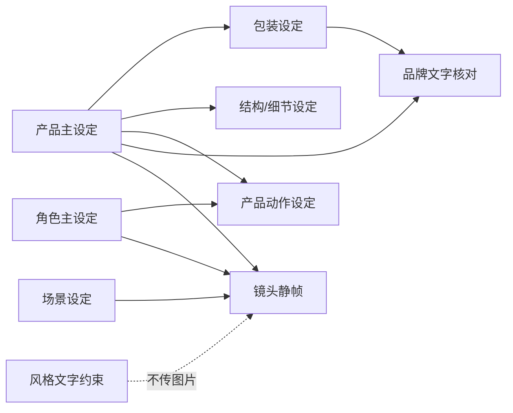

# 产品与角色视觉一致性强化方案

日期：2026-08-14
适用范围：AI 创意画布的 Agent 产品广告工作流
状态：第一阶段已落地

## 1. 问题与日志证据

本方案以导出的 `mulby-ai-image-tasks-20260814-061238.zip` 中 9 个图片任务为回归样本。日志表明任务虽然已经顺序执行，但“先后顺序”并不等于“视觉身份继承”：

- 产品本体、包装、同名产品图分别从零生成，得到 `DILLER`、`Mulby`、`350ml/480mL` 等彼此冲突的文字和结构。
- 一手开盖图只引用了角色图，没有引用产品主设定，杯盖、按钮和服装均发生变化，且画面出现两只手。
- 产品重绘虽引用产品图，但品牌文字从 `DILLER` 漂移为 `Caldo`。
- 品牌/Logo 图一次接入 5 张同级参考，模型无法判断哪张是主产品，输出混合人物、杯子和包装的拼贴图。
- 风格图从零生成了新人物和新产品；若作为普通图片锚点继续传递，会污染后续镜头主体。

根因是连续性系统只有通用的角色/场景/道具角色类型，没有表达“哪个是唯一身份源、哪些是派生结果、不同派生图应该读取哪些输入”。另外，图片模型对精确文字没有确定性保证，单靠“保持一致”不能解决品牌拼写漂移。

## 2. 设计目标

1. 一个广告工作流只有一个产品主设定，其他产品相关图片都必须由它派生。
2. 每张派生图最多接入两张有明确优先级的身份参考，避免无差别拼图。
3. 产品结构、Logo 和品牌文字采用显式约束，并在锁定前要求人工逐字核对。
4. 用户编辑过的产品或角色设定图在再次确认后成为新的锁定快照，下游静帧必须使用该版本。
5. 风格定义只改变色彩、光影和材质语言，不得引入新的角色或产品身份。
6. 旧工作流的同义产品名称可迁移到唯一产品主锚点，不丢失已有镜头引用。

## 3. 视觉主体类型

连续性元数据新增 `subjectKind`，把通用素材角色细分为：

| 类型 | 含义 | 是否是身份根节点 |
| --- | --- | --- |
| `product-master` | 唯一产品主设定 | 是 |
| `character-master` | 唯一角色身份设定 | 是 |
| `product-packaging` | 产品包装派生设定 | 否 |
| `product-action` | 手持、开盖、使用动作设定 | 否 |
| `product-detail` | 结构、材质、局部特写 | 否 |
| `product-brand` | 品牌文字与 Logo 核对图 | 否 |
| `scene` | 无主体场景空镜 | 独立 |
| `style` | 色彩、光影、材质参考板 | 独立且仅文本下传 |
| `prop/reference` | 非产品通用素材 | 按显式名称引用 |

## 4. 有向依赖图

生成与输入规则：

- 产品主设定：无生成依赖；若 Brief 已连接产品图片，优先复用最像“编辑/修订/确认/定稿”的版本。
- 包装与产品细节：只接产品主设定。
- 产品动作：第一输入固定为产品主设定，第二输入为角色主设定。冲突时产品身份以第一张为准。
- 品牌核对：第一输入为产品主设定，第二输入为包装；不接角色、动作和场景。
- 角色、场景：不接入产品参考，避免身份串线。
- 风格：生成时要求纯色彩/光影/材质板；下游不传风格图片，只把描述追加到每个镜头的图片和视频提示词。
- 通用参考：只接显式名称匹配的输入，删除“匹配不到就附加全部基础图”的旧兜底。

## 5. 产品主设定归一化

Planner 要求只返回一个产品主设定。运行时仍做防御性归一化：

- 把“产品本体”“主产品”和与 `productName` 同义的候选折叠为一个 `product-master`。
- 主锚点名称统一为 Brief 的 `product.productName`。
- 被折叠的旧名称保存为锚点别名，使模型已生成的 `anchorNames` 仍能解析到新主锚点。
- 包装、动作、品牌、细节候选保留为各自派生节点。

## 6. 品牌文字约束与锁定

产品 Brief 新增可选字段 `brandText`。Planner 必须逐字抄录用户明确提供的品牌或 Logo 文字，不确定时留空，不能猜测。

对产品主设定及全部产品派生图：

- 提示词明确“可见品牌文字只允许准确显示指定文本”，保持大小写和空格。
- 禁止生成未提供的容量、参数、卖点和近似品牌拼写。
- 连续性元数据保存 `expectedTexts`，供界面展示和未来自动校验。
- Agent 锁定确认区显示品牌文字与结构核对警告。

限制：通用图片模型不能保证像排版引擎一样逐像素复刻文字。本阶段采用“强提示 + 输入层级 + 人工锁定检查”，不能宣称自动消除全部错字。后续可增加 OCR 比对门禁，以及对品牌字标采用 SVG/透明 PNG 后期合成。

## 7. 用户编辑后的版本

视觉锚点锁定的是当前卡片媒体快照，而不是最初生成结果。用户局部编辑或选择其他版本后再次点击“确认并锁定视觉设定”：

1. 解除旧快照；
2. 从当前卡片媒体建立新快照；
3. 标记依赖签名改变的包装、动作、品牌等派生图为过期；
4. 按依赖顺序重新生成过期节点；
5. 镜头静帧读取新的锁定快照。

## 8. 已落地范围

- Planner/Recipe：增加 `brandText`，限制唯一产品主设定，并明确总时长和风格规则。
- Continuity：新增主体分类、主产品折叠、别名迁移、有向依赖、主次输入顺序、产品专用提示词、风格图片隔离、锁定警告。
- Agent：保存故事板时把风格描述写入图片/视频提示词。
- UI：产品摘要显示品牌文字锁；确认视觉设定时展示人工核对项。
- 回归测试：用本次 9 张日志场景验证主产品唯一、拓扑顺序、输入集合、品牌提示、风格隔离和编辑后锁定。

## 9. 验收标准

- 同一工作流中 `product-master` 数量恒为 1。
- 包装输入严格为 `[产品主设定]`。
- 产品动作输入严格为 `[产品主设定, 角色主设定]`。
- 品牌核对输入严格为 `[产品主设定, 包装]`。
- 风格节点输入不含人物或产品图片，镜头静帧也不接风格图片。
- 品牌文字进入 `expectedTexts`，锁定前界面可见核对警告。
- 用户编辑并重新锁定主产品后，派生节点过期且下游静帧引用新快照。
- 全量单元测试、TypeScript 构建与 Mulby 插件校验通过。

## 10. 后续阶段

1. OCR 门禁：生成后识别 `expectedTexts`，不匹配时阻止自动锁定并允许局部重绘。
2. Logo 合成：允许上传透明 Logo/SVG，将品牌字标从生成问题转为确定性排版问题。
3. 结构差异检测：对主产品与派生图做局部特征/轮廓相似度提示，不合格时建议重生成。
4. 参考裁切：动作图输入主产品的产品区域、角色图的人脸/服装区域，减少多主体图片造成的注意力竞争。
5. Provider 能力路由：根据模型的多图编辑、参考权重、文字渲染能力选择最合适的生成通道。
